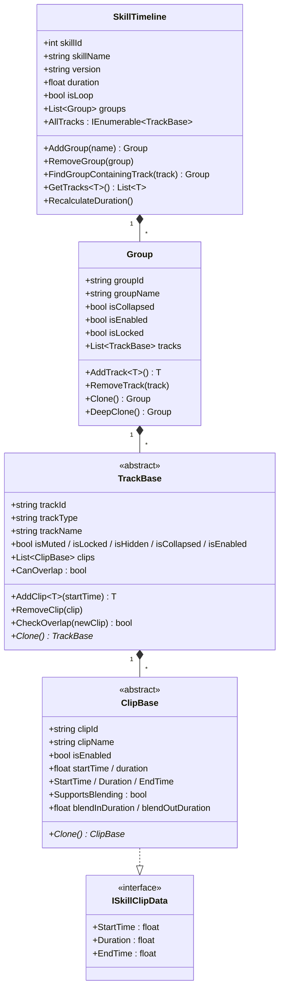
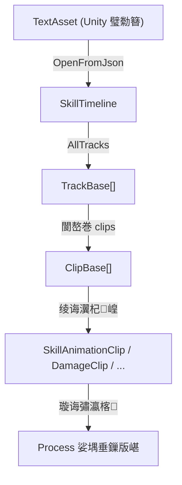

# SkillEditor 杩愯鏃?Data 灞傚垎鏋愭姤鍛?

> **鍒嗘瀽鑼冨洿**: `Runtime/Data/`銆乣Runtime/Enums/`銆乣Runtime/Attributes/`銆乣Runtime/Serialization/`銆乣Settings/`
> **鍒嗘瀽鏃ユ湡**: 2026-02-22
> **鍒嗘瀽缁村害**: 杩愯鏃?脳 Data

---

## 1. 鎬讳綋鏁版嵁鏋舵瀯

SkillEditor 鐨勮繍琛屾椂鏁版嵁閲囩敤 **鍥涘眰鏍戝舰缁撴瀯**锛?

```
SkillTimeline (鏍硅妭鐐? ScriptableObject)
 鈹斺攢 Group[] (鍒嗙粍灞? 鏅€氱被)
     鈹斺攢 TrackBase[] (杞ㄩ亾灞? 澶氭€佹娊璞＄被)
         鈹斺攢 ClipBase[] (鐗囨灞? 澶氭€佹娊璞＄被)
```



### 1.1 璁捐瑕佺偣

| 璁捐鍐崇瓥 | 璇存槑 | 璇勪环 |
|:---------|:-----|:-----|
| `SkillTimeline` 缁ф壙 `ScriptableObject` | 鍒╃敤 Unity 璧勪骇绯荤粺杩涜鎸佷箙鍖栧拰寮曠敤绠＄悊 | 鉁?閫傚悎缂栬緫鍣ㄥ伐浣滄祦 |
| `Group` 涓烘櫘閫?`[Serializable]` 绫?| 涓嶉渶瑕佺嫭绔嬭祫浜х敓鍛藉懆鏈燂紝浣滀负 Timeline 鐨勫瓙鏁版嵁瀛樺湪 | 鉁?鍚堢悊 |
| `TrackBase` / `ClipBase` 浣跨敤 `[SerializeReference]` | 鏀寔澶氭€佸簭鍒楀寲锛屼笉渚濊禆 ScriptableObject | 鉁?姝ｇ‘浣跨敤 Unity 2019.3+ 鐗规€?|
| ID 浣跨敤 `Guid.NewGuid().ToString()` | 淇濊瘉鍞竴鎬э紝鏀寔璺ㄥ簭鍒楀寲鐨勫紩鐢ㄧǔ瀹氭€?| 鉁?鍚堢悊锛屼絾 GUID 瀛楃涓茶緝闀?|
| `ClipBase` 瀹炵幇 `ISkillClipData` 鎺ュ彛 | 閫氳繃鎺ュ彛鏆撮湶鍙鏃堕棿灞炴€э紝渚夸簬杩愯鏃舵秷璐?| 鉁?绗﹀悎 ISP |

---

## 2. 鏍稿績鍩虹被鍒嗘瀽

### 2.1 ClipBase锛堢墖娈靛熀绫伙級

**鏂囦欢**: [ClipBase.cs](file:///D:/Unity/Server_Game/Assets/ATEditor/Runtime/Data/ClipBase.cs)

```csharp
[Serializable]
public abstract class ClipBase : ISkillClipData
{
    [HideInInspector] public string clipId = Guid.NewGuid().ToString();
    [SkillProperty("鐗囨鍚嶇О")] public string clipName = "Clip";
    [SkillProperty("鍚敤")] public bool isEnabled = true;
    [SkillProperty("寮€濮嬫椂闂?)] public float startTime;
    [SkillProperty("鎸佺画鏃堕棿")] public float duration = 1.0f;

    public float StartTime => startTime;
    public float Duration => duration;
    public float EndTime => startTime + duration;

    public virtual bool SupportsBlending => false;
    [SkillProperty("娓愬叆鏃堕暱")] public float blendInDuration;
    [SkillProperty("娓愬嚭鏃堕暱")] public float blendOutDuration;

    public abstract ClipBase Clone();
}
```

**鍒嗘瀽瑕佺偣**:

1. **瀛楁璁捐**: 鎵€鏈夊瓧娈垫爣璁颁负 `public`锛岀敱 `[SkillProperty]` 鐗规€ч┍鍔?Inspector 缁樺埗锛屼笉闇€瑕佺殑瀛楁鐢?`[HideInInspector]` 闅愯棌銆?
2. **鎺ュ彛瀹炵幇**: 閫氳繃琛ㄨ揪寮忎富浣撳睘鎬э紙`=>`锛夋毚闇插彧璇荤殑 `StartTime`/`Duration`/`EndTime`锛屼絾搴曞眰 `startTime`/`duration` 瀛楁浠嶄负 public銆?

> [!WARNING]
> **鏁版嵁瀹夊叏闅愭偅**: `startTime` 鍜?`duration` 浣滀负 `public` 瀛楁鍙澶栭儴鐩存帴淇敼锛岃€?`ISkillClipData` 鎺ュ彛浠呮彁渚涘彧璇诲睘鎬с€傚缓璁繍琛屾椂娑堣垂鏂归€氳繃 `ISkillClipData` 鎺ュ彛璁块棶锛屼笉瑕佺洿鎺ヨ鍐?`ClipBase` 瀛楁銆?

3. **娣峰悎鏀寔**: `SupportsBlending` 涓?`virtual` 灞炴€э紝榛樿 `false`銆傚姩鐢诲拰闊抽绛夊瓙绫昏鍐欎负 `true`銆俙blendInDuration`/`blendOutDuration` 濮嬬粓瀛樺湪锛屽嵆浣垮瓙绫讳笉鏀寔娣峰悎銆?
4. **Clone 妯″紡**: 浣跨敤 **鎶借薄鏂规硶 + 瀵硅薄鍒濆鍖栧櫒** 妯″紡锛屾瘡涓瓙绫昏礋璐ｅ畬鏁寸殑瀛楁鎷疯礉銆?

> [!NOTE]
> Clone 妯″紡娌℃湁浣跨敤 `MemberwiseClone()` 鎴栧簭鍒楀寲鎷疯礉锛岃€屾槸鎵嬪姩瀛楁璧嬪€笺€備紭鐐规槸姣忎釜瀛愮被瀹屽叏鎺у埗娣辨嫹璐濋€昏緫锛涚己鐐规槸鏂板瀛楁鍚庡鏄撻仐婕忋€?

---

### 2.2 TrackBase锛堣建閬撳熀绫伙級

**鏂囦欢**: [TrackBase.cs](file:///D:/Unity/Server_Game/Assets/ATEditor/Runtime/Data/TrackBase.cs)

**鏍稿績瀛楁**:

| 瀛楁 | 绫诲瀷 | 鐢ㄩ€?|
|:-----|:-----|:-----|
| `trackId` | `string` | GUID 鍞竴鏍囪瘑 |
| `trackType` | `string` | 绫诲瀷鍚嶇О瀛楃涓诧紙鍐椾綑瀛樺偍锛?|
| `trackName` | `string` | 鏄剧ず鍚嶇О |
| `isMuted` | `bool` | 闈欓煶锛堢紪杈戝櫒棰勮璺宠繃锛?|
| `isLocked` | `bool` | 閿佸畾锛堢姝㈢紪杈戯級 |
| `isHidden` | `bool` | 闅愯棌锛堣鍥句笉鏄剧ず锛?|
| `isCollapsed` | `bool` | 鎶樺彔锛堣鍥炬姌鍙狅級 |
| `isEnabled` | `bool` | 鍚敤锛堣繍琛屾椂璺宠繃锛?|
| `clips` | `List<ClipBase>` | 鐗囨鍒楄〃锛坄[SerializeReference]`锛?|

**鏍稿績鏂规硶**:

- `AddClip<T>(startTime)`: 娉涘瀷娣诲姞鐗囨
- `RemoveClip(clip)`: 绉婚櫎鐗囨
- `CheckOverlap(newClip)`: 鐗囨閲嶅彔妫€娴?
- `Clone()`: 鎶借薄娣辨嫹璐?+ `CloneBaseProperties()` 杈呭姪鏂规硶

**鍒嗘瀽瑕佺偣**:

1. **`trackType` 鍐椾綑**: `trackType` 鍦ㄦ瀯閫犲嚱鏁颁腑閫氳繃 `GetType().Name` 璁剧疆锛屽弽搴忓垪鍖栧悗涓?`[SerializeReference]` 鐨?`$type` 淇℃伅閲嶅銆傚彲鑳界敤浜?JSON 涓揩閫熺被鍨嬪垽瀹氳€屼笉渚濊禆鍙嶅皠銆?
2. **閲嶅彔妫€娴?*: `CheckOverlap()` 浣跨敤 O(n) 绾挎€ф壂鎻忥紝瀵逛簬灏戦噺鐗囨鏄悎鐞嗙殑銆?
3. **`CloneBaseProperties` 妯℃澘鏂规硶**: 鑹ソ鐨勪唬鐮佸鐢ㄨ璁★紝鎵€鏈?Track 瀛愮被鐨?`Clone()` 鍙渶 `new + CloneBaseProperties(clone)`銆?

---

### 2.3 Group锛堝垎缁勬暟鎹級

**鏂囦欢**: [Group.cs](file:///D:/Unity/Server_Game/Assets/ATEditor/Runtime/Data/Group.cs)

- 闈炴娊璞°€侀潪瀵嗗皝鐨勫叿浣撶被
- 鎻愪緵涓ょ骇 Clone锛歚Clone()`锛堟祬鎷疯礉锛屼笉鍚?tracks锛夊拰 `DeepClone()`锛堝惈 tracks 娣辨嫹璐濓級
- 鍒嗙粍鏄函缁勭粐缁撴瀯锛屼笉褰卞搷杩愯鏃堕€昏緫锛堣繍琛屾椂閬嶅巻鎵€鏈?Track锛屼笉鍏冲績鍒嗙粍锛?

---

### 2.4 SkillTimeline锛堟牴鑺傜偣锛?

**鏂囦欢**: [SkillTimeline.cs](file:///D:/Unity/Server_Game/Assets/ATEditor/Runtime/Data/SkillTimeline.cs)

**鏍稿績璁捐**:

1. **缁ф壙 `ScriptableObject`**: 鍒╃敤 Unity 璧勪骇绯荤粺锛屼絾瀹為檯鎸佷箙鍖栭€氳繃 JSON 鑰岄潪 `.asset` 鏂囦欢銆俙CreateInstance<SkillTimeline>()` 鐢ㄤ簬鍙嶅簭鍒楀寲鏃跺垱寤哄涓诲璞°€?
2. **`AllTracks` 灞炴€?*: 浣跨敤 `yield return` 鎳掕绠楁墎骞冲寲閬嶅巻锛屾€ц兘鍙嬪ソ銆?
3. **`RecalculateDuration()`**: 閬嶅巻鎵€鏈夊惎鐢ㄧ殑 Track 鍜?Clip锛屽彇 `EndTime` 鐨勬渶澶у€间綔涓烘€绘椂闀裤€傛渶灏忓€奸挸浣嶅埌 0.1 绉掋€?

> [!NOTE]
> `SkillTimeline` 涓嶇洿鎺ユ寔鏈?`TrackBase[]`锛岃€屾槸閫氳繃 `Group.tracks` 闂存帴鎸佹湁銆傝繖鎰忓懗鐫€杩愯鏃舵€婚渶瑕佷簩绾ч亶鍘嗭紙groups 鈫?tracks锛夛紝浣嗛€氳繃 `AllTracks` 灞炴€у皝瑁呬簡杩欎竴澶嶆潅搴︺€?

---

## 3. ISkillClipData 鎺ュ彛

**鏂囦欢**: [ISkillClipData.cs](file:///D:/Unity/Server_Game/Assets/ATEditor/Runtime/Data/ISkillClipData.cs)

```csharp
public interface ISkillClipData
{
    float StartTime { get; }
    float Duration { get; }
    float EndTime { get; }
}
```

鏋佺畝鎺ュ彛锛屼粎鏆撮湶鏃堕棿缁村害銆?

**璇勪环**: 鎺ュ彛璁捐浣撶幇浜?ISP锛堟帴鍙ｉ殧绂诲師鍒欙級锛岃繍琛屾椂澶勭悊鍣ㄥ彧闇€鍏虫敞鏃堕棿鑼冨洿锛屼笉闇€瑕佽闂?`clipId`銆乣clipName` 绛夌紪杈戝櫒鍏冩暟鎹€備絾褰撳墠浠呮湁 `ClipBase` 瀹炵幇姝ゆ帴鍙ｏ紝鎺ュ彛鐨勬娊璞′环鍊兼湁闄愨€斺€斿畠鏇村鏄竴绉?鎰忓浘澹版槑"鑰岄潪澶氭€侀渶姹傘€?

---

## 4. 鑷畾涔夌壒鎬э紙Attributes锛?

**鏂囦欢**: [SkillAttributes.cs](file:///D:/Unity/Server_Game/Assets/ATEditor/Runtime/Attributes/SkillAttributes.cs)

### 4.1 SkillPropertyAttribute

```csharp
[AttributeUsage(AttributeTargets.Field)]
public class SkillPropertyAttribute : Attribute
{
    public string Name { get; private set; }
}
```

- **鐢ㄩ€?*: 鏍囪瀛楁鍦?SkillEditor Inspector 涓殑鏄剧ず鍚嶇О
- **娑堣垂鏂?*: 缂栬緫鍣ㄤ晶 `SkillInspectorBase` 閫氳繃鍙嶅皠璇诲彇姝ょ壒鎬э紝鍔ㄦ€佺敓鎴?Inspector UI
- **璁捐**: 鏀惧湪 Runtime 鑰岄潪 Editor 绋嬪簭闆嗕腑锛屽洜涓虹壒鎬ф爣娉ㄥ湪 Runtime 鏁版嵁绫荤殑瀛楁涓?

### 4.2 TrackDefinitionAttribute

```csharp
[AttributeUsage(AttributeTargets.Class, Inherited = false)]
public class TrackDefinitionAttribute : Attribute
{
    public string DisplayName { get; }
    public string Icon { get; }
    public int Order { get; }
    public Type ClipType { get; }
    public string ColorHex { get; }
}
```

- **鐢ㄩ€?*: 瀹氫箟杞ㄩ亾鐨勫厓鏁版嵁锛堟樉绀哄悕銆佸叧鑱?Clip 绫诲瀷銆侀鑹层€佸浘鏍囥€佹帓搴忥級
- **娑堣垂鏂?*: 缂栬緫鍣ㄤ晶 `TrackRegistry` 鍦ㄥ惎鍔ㄦ椂鎵弿鎵€鏈夊甫姝ょ壒鎬х殑 `TrackBase` 瀛愮被锛岃嚜鍔ㄦ敞鍐?
- **璁捐浼樼偣**: 澹版槑寮忋€佷笌绫诲畾涔変竴浣擄紱鏂板杞ㄩ亾绫诲瀷鍙渶澹版槑绫?+ 娣诲姞鐗规€э紝绗﹀悎 OCP

**浣跨敤绀轰緥**:

```csharp
[TrackDefinition("鍔ㄧ敾杞ㄩ亾", typeof(SkillAnimationClip), "#33B24C", "Animation.Record", 0)]
public class AnimationTrack : TrackBase { ... }
```

---

## 5. 鏋氫妇瀹氫箟

### 5.1 SkillEnums.cs锛堟暟鎹眰鏋氫妇锛?

**鏂囦欢**: [SkillEnums.cs](file:///D:/Unity/Server_Game/Assets/ATEditor/Runtime/Data/SkillEnums.cs)

| 鏋氫妇 | 鎴愬憳 | 鐢ㄩ€?|
|:-----|:-----|:-----|
| `HitBoxType` | Sphere, Box, Capsule, Sector, Ring | 纰版挒浣撳舰鐘剁被鍨?|
| `HitFrequency` | Once, Always, Interval | 鍛戒腑棰戠巼绛栫暐 |
| `TargetSortMode` | None, Closest, Random | 鐩爣鎺掑簭/閫夊彇绛栫暐 |

### 5.2 RuntimeEnums.cs锛堣繍琛屾椂鏋氫妇锛?

**鏂囦欢**: [RuntimeEnums.cs](file:///D:/Unity/Server_Game/Assets/ATEditor/Runtime/Enums/RuntimeEnums.cs)

| 鏋氫妇 | 鎴愬憳 | 鐢ㄩ€?|
|:-----|:-----|:-----|
| `SkillRunnerState` | Idle, Playing, Paused | SkillRunner 鎾斁鐘舵€?|
| `PlayMode` | EditorPreview, Runtime | 鍖哄垎缂栬緫鍣ㄩ瑙堝拰杩愯鏃剁幆澧?|
| `EAnimLayer` | Locomotion(0), Action(1), Expression(2) | 鍔ㄧ敾灞傛灇涓?|
| `AnimBlendMode` | Linear, SmoothStep | 鍔ㄧ敾娣峰悎妯″紡 |
| `BindPoint` | Root, Body, Head, LeftHand, RightHand, WeaponLeft, WeaponRight, CustomBone | 鎸傝浇鐐?|

**鍒嗘瀽**: `BindPoint` 鏋氫妇琚?`VFXClip`銆乣DamageClip`銆乣SpawnClip` 涓夌 Clip 鍏辩敤锛岀敤浜庢寚瀹氱壒鏁?浼ゅ/鐢熸垚鐗╃殑鎸傝浇浣嶇疆锛屽鐢ㄦ€ц壇濂姐€?

---

## 6. 鍏蜂綋 Clip 瀹炵幇鍒嗘瀽

### 6.1 Clip 缁ф壙鍏崇郴鎬昏

```mermaid
classDiagram
    ClipBase <|-- SkillAnimationClip
    ClipBase <|-- AudioClip
    ClipBase <|-- VFXClip
    ClipBase <|-- DamageClip
    ClipBase <|-- SpawnClip
    ClipBase <|-- EventClip
    ClipBase <|-- CameraClip
    ClipBase <|-- MovementClip

    class SkillAnimationClip {
        +AnimationClip animationClip
        +float playbackSpeed
        +EAnimLayer layer
        +AvatarMask overrideMask
        +string clipGuid / maskGuid
        +SupportsBlending = true
    }

    class AudioClip {
        +UnityEngine.AudioClip audioClip
        +float volume / pitch / spatialBlend
        +bool loop
        +string clipGuid
        +SupportsBlending = true
    }

    class VFXClip {
        +GameObject effectPrefab
        +string prefabGuid
        +BindPoint bindPoint
        +string customBoneName
        +bool followTarget
        +Vector3 positionOffset / rotationOffset / scale
        +bool destroyOnEnd / stopEmissionOnEnd
    }

    class DamageClip {
        +string eventTag
        +string[] targetTags
        +HitFrequency hitFrequency
        +float checkInterval
        +int maxHitTargets
        +TargetSortMode targetSortMode
        +LayerMask hitLayerMask
        +HitBoxShape shape
        +BindPoint bindPoint
        +Vector3 positionOffset / rotationOffset
        +ISerializationCallbackReceiver
    }

    class SpawnClip {
        +GameObject prefab
        +bool destroyOnInterrupt
        +string eventTag
        +string[] targetTags
        +BindPoint bindPoint
        +Vector3 positionOffset / rotationOffset
        +bool detach
    }

    class EventClip {
        +string eventName
        +List~SkillEventParam~ parameters
    }

    class CameraClip {
        +Vector3 cameraOffset
        +float fieldOfView
    }

    class MovementClip {
        +Vector3 targetPosition
        +float speed
    }
```



### 6.2 鍚?Clip 閫愪竴鍒嗘瀽

#### SkillAnimationClip

**鏂囦欢**: [SkillAnimationClip.cs](file:///D:/Unity/Server_Game/Assets/ATEditor/Runtime/Data/Clips/SkillAnimationClip.cs)

| 瀛楁 | 绫诲瀷 | 璇存槑 |
|:-----|:-----|:-----|
| `animationClip` | `AnimationClip` | Unity 鍔ㄧ敾璧勬簮寮曠敤 |
| `playbackSpeed` | `float` | 鎾斁閫熷害锛堥粯璁?1.0锛?|
| `layer` | `EAnimLayer` | 鐩爣鍔ㄧ敾灞?|
| `overrideMask` | `AvatarMask` | 鑷畾涔夐伄缃?|
| `clipGuid` / `maskGuid` | `string` | 璧勬簮 GUID锛堝簭鍒楀寲妗ユ帴锛?|

- **鐗圭偣**: `SupportsBlending = true`锛屾敮鎸佹笎鍏ユ笎鍑?
- **GUID 妗ユ帴**: 璧勬簮寮曠敤搴忓垪鍖栨椂淇濆瓨 GUID 瀛楃涓诧紝鍙嶅簭鍒楀寲鏃堕€氳繃 `AssetDatabase` 杩樺師

#### AudioClip

**鏂囦欢**: [AudioClip.cs](file:///D:/Unity/Server_Game/Assets/ATEditor/Runtime/Data/Clips/AudioClip.cs)

| 瀛楁 | 绫诲瀷 | 璇存槑 |
|:-----|:-----|:-----|
| `audioClip` | `UnityEngine.AudioClip` | 闊抽璧勬簮 |
| `volume` | `float [0,1]` | 闊抽噺 |
| `pitch` | `float [0.1,3]` | 闊宠皟 |
| `loop` | `bool` | 寰幆鎾斁 |
| `spatialBlend` | `float [0,1]` | 绌洪棿娣峰悎锛?=2D, 1=3D锛?|

> [!WARNING]
> **鍛藉悕鍐茬獊**: 绫诲悕 `AudioClip` 涓?`UnityEngine.AudioClip` 閲嶅悕锛岃櫧鐒跺懡鍚嶇┖闂翠笉鍚岋紝浣嗗湪寮曠敤鏃堕渶鍏ㄥ悕闄愬畾 `UnityEngine.AudioClip`銆傚缓璁噸鍛藉悕涓?`SkillAudioClip`銆?

#### VFXClip

**鏂囦欢**: [VFXClip.cs](file:///D:/Unity/Server_Game/Assets/ATEditor/Runtime/Data/Clips/VFXClip.cs)

- 涓板瘜鐨勭┖闂撮厤缃細`bindPoint`銆乣customBoneName`銆乣positionOffset`/`rotationOffset`/`scale`
- 鐢熷懡鍛ㄦ湡鎺у埗锛歚destroyOnEnd`銆乣stopEmissionOnEnd`銆乣followTarget`
- 浣跨敤 `prefabGuid` 杩涜璧勬簮 GUID 妗ユ帴

#### DamageClip

**鏂囦欢**: [DamageClip.cs](file:///D:/Unity/Server_Game/Assets/ATEditor/Runtime/Data/Clips/DamageClip.cs)

**鏈€澶嶆潅鐨?Clip**锛屽寘鍚細
- **妫€娴嬬瓥鐣?*: `eventTag`銆乣targetTags`銆乣hitFrequency`銆乣checkInterval`銆乣maxHitTargets`銆乣targetSortMode`
- **鐗╃悊閰嶇疆**: `hitLayerMask`锛堥€氳繃 `ISerializationCallbackReceiver` 妗ユ帴 int 鍊硷級銆乣isSelfImpacted`
- **纰版挒浣?*: `HitBoxShape shape`锛堢粍鍚堟ā寮忥紝鏀寔 Sphere/Box/Capsule/Sector/Ring锛?
- **绌洪棿鍙樻崲**: `bindPoint`銆乣customBoneName`銆乣positionOffset`銆乣rotationOffset`

**LayerMask 搴忓垪鍖栧鐞?* (L86-94):
```csharp
public void OnBeforeSerialize()  { serializedHitLayerMask = hitLayerMask.value; }
public void OnAfterDeserialize() { hitLayerMask.value = serializedHitLayerMask; }
```

> [!NOTE]
> `LayerMask` 鏄?Unity 缁撴瀯浣擄紝鍏?`value` 瀛楁涓嶈兘鐩存帴琚?`JsonUtility` 姝ｇ‘搴忓垪鍖栦负 int銆傞€氳繃 `ISerializationCallbackReceiver` 妗ユ帴鍒?`serializedHitLayerMask` int 瀛楁瑙ｅ喅姝ら棶棰樷€斺€旇繖鏄竴涓簿宸х殑 workaround銆?

#### SpawnClip

**鏂囦欢**: [SpawnClip.cs](file:///D:/Unity/Server_Game/Assets/ATEditor/Runtime/Data/Clips/SpawnClip.cs)

- 涓?`DamageClip` 鍏变韩 `eventTag`/`targetTags`/`bindPoint` 绛夋蹇?
- `destroyOnInterrupt`: 琚姩鎵撴柇鏃舵槸鍚﹂攢姣佸凡鐢熸垚瀹炰綋
- `detach`: 鐢熸垚鍚庢槸鍚﹁劚绂荤埗鑺傜偣
- 榛樿 `duration = 0.1f`锛堢灛鏃跺瀷鐗囨锛?

#### EventClip

**鏂囦欢**: [EventClip.cs](file:///D:/Unity/Server_Game/Assets/ATEditor/Runtime/Data/Clips/EventClip.cs)

- **閿€煎鍙傛暟**: 閫氳繃 `SkillEventParam`锛坘ey + string/float/int 涓夌鍊肩被鍨嬶級
- 鏀寔澶氫釜鍙傛暟鐨勪簨浠讹紝鎵╁睍鎬уソ
- 榛樿 `duration = 0.1f`锛堢灛鏃跺瀷鐗囨锛?

#### CameraClip / MovementClip

**鏂囦欢**: [CameraClip.cs](file:///D:/Unity/Server_Game/Assets/ATEditor/Runtime/Data/Clips/CameraClip.cs) / [MovementClip.cs](file:///D:/Unity/Server_Game/Assets/ATEditor/Runtime/Data/Clips/MovementClip.cs)

- 鏈€绠€鍗曠殑涓ょ Clip锛屽瓧娈垫瀬灏?
- 灏氬浜庨鏋堕樁娈碉紝鍚勫彧鏈?2 涓壒鏈夊瓧娈?
- 娌℃湁 `[SkillProperty]` 鏍囨敞锛堜笉缁忚繃鑷畾涔?Inspector 缁樺埗锛?

---

## 7. 鍏蜂綋 Track 瀹炵幇鍒嗘瀽

### 7.1 Track 缁ф壙鍏崇郴涓庡厓鏁版嵁

鎵€鏈?Track 瀛愮被涓?**杞婚噺鍖呰鍣?*锛屾棤棰濆瀛楁锛屼粎鎻愪緵锛?
- 鏋勯€犲嚱鏁拌缃?`trackName`/`trackType`
- `CanOverlap` 瑕嗗啓
- `Clone()` 瀹炵幇锛堣皟鐢?`CloneBaseProperties`锛?

**`[TrackDefinition]` 鍏冩暟鎹€昏**:

| Track 绫?| 鏄剧ず鍚?| Clip 绫诲瀷 | 棰滆壊 | 鍥炬爣 | 鎺掑簭 | CanOverlap |
|:---------|:-------|:----------|:-----|:-----|:----:|:----------:|
| `AnimationTrack` | 鍔ㄧ敾杞ㄩ亾 | `SkillAnimationClip` | `#33B24C` | `Animation.Record` | 0 | 鉁?|
| `VFXTrack` | 鐗规晥杞ㄩ亾 | `VFXClip` | `#CC4C4C` | `Particle Effect` | 1 | 鉂?|
| `AudioTrack` | 闊虫晥杞ㄩ亾 | `AudioClip` | `#CCB233` | `AudioSource Icon` | 2 | 鉁?|
| `DamageTrack` | 浼ゅ鍒ゅ畾杞ㄩ亾 | `DamageClip` | `#E57F33` | `Animation.EventMarker` | 3 | 鉂?|
| `SpawnTrack` | 鐢熸垚杞ㄩ亾 | `SpawnClip` | `#4CAF50` | `d_GameObject Icon` | 4 | 鉂?|
| `EventTrack` | 浜嬩欢杞ㄩ亾 | `EventClip` | `#9C27B0` | `d_EventSystem Icon` | 5 | 鉂?|
| `CameraTrack` | 鎽勫儚鏈鸿建閬?| `CameraClip` | `#994CB2` | `Camera Icon` | 5 | 鉂?|
| `MovementTrack` | 绉诲姩杞ㄩ亾 | `MovementClip` | `#4C7FCC` | `MoveTool` | 4 | 鉂?|

> [!NOTE]
> **鎺掑簭鍐茬獊**: `CameraTrack` 鍜?`EventTrack` 鐨?Order 鍧囦负 5锛沗SpawnTrack` 鍜?`MovementTrack` 鐨?Order 鍧囦负 4銆傚鏋滀緷璧?Order 鎺掑簭锛屽彲鑳藉鑷翠笉纭畾鐨勮彍鍗曢『搴忋€?

---

## 8. HitBoxShape锛堢鎾炰綋褰㈢姸锛?

**鏂囦欢**: [HitBoxShape.cs](file:///D:/Unity/Server_Game/Assets/ATEditor/Runtime/Data/Clips/HitBoxShape.cs)

```csharp
[Serializable]
public class HitBoxShape
{
    public HitBoxType shapeType = HitBoxType.Sphere;
    public Vector3 size = Vector3.one;      // Box 涓撶敤
    public float radius = 2f;               // Sphere/Capsule/Sector/Ring 鍏辩敤
    public float height = 2f;               // Capsule/Ring/Sector 鍏辩敤
    public float angle = 90f;               // Sector 涓撶敤
    public float innerRadius = 1f;          // Ring 涓撶敤
}
```

**璁捐鍒嗘瀽**:

- 閲囩敤 **鑱斿悎浣擄紙Union-like锛?* 璁捐锛氭墍鏈夊舰鐘剁殑鍙傛暟鏀惧湪鍚屼竴涓被涓紝閫氳繃 `shapeType` 鏋氫妇鍖哄垎褰撳墠鏈夋晥瀛楁
- **浼樼偣**: 绠€鍗曠洿鎺ワ紝搴忓垪鍖栧弸濂?
- **缂虹偣**: 涓嶅悓绫诲瀷鍏卞瓨澶氫綑瀛楁锛宍size` 瀵?Sphere 鏃犳剰涔夈€乣angle` 瀵?Box 鏃犳剰涔夌瓑

> [!TIP]
> 濡傛灉纰版挒浣撶被鍨嬪湪鏈潵鏄捐憲澧炲锛屽彲鑰冭檻浣跨敤缁ф壙鎴?`[SerializeReference]` 澶氭€佹浛鎹㈣仈鍚堜綋妯″紡銆傚綋鍓?绉嶇被鍨嬩笅锛岃仈鍚堜綋璁捐鏄悎鐞嗙殑銆?

---

## 9. 搴忓垪鍖栨満鍒?

**鏂囦欢**: [SerializationUtility.cs](file:///D:/Unity/Server_Game/Assets/ATEditor/Runtime/Serialization/SerializationUtility.cs)

### 9.1 搴忓垪鍖栨灦鏋?

```mermaid
flowchart LR
    subgraph 瀵煎嚭娴佺▼
        A[SkillTimeline 瀵硅薄] --> B[RefreshAllGuids]
        B --> C[JsonUtility.ToJson]
        C --> D[".json 鏂囦欢"]
    end

    subgraph 瀵煎叆娴佺▼
        E[".json 鏂囦欢"] --> F[File.ReadAllText]
        F --> G[CreateInstance SkillTimeline]
        G --> H[JsonUtility.FromJsonOverwrite]
        H --> I[ResolveAllAssets]
        I --> J[SkillTimeline 瀵硅薄]
    end
```

### 9.2 GUID 妗ユ帴鏈哄埗

**鏍稿績闂**: Unity 鐨?`Object` 寮曠敤锛圓nimationClip銆丄udioClip銆丟ameObject锛夊熀浜?instanceID锛屼笉鍙法浼氳瘽鎸佷箙鍖栥€?

**瑙ｅ喅鏂规**: 瀵煎嚭/瀵煎叆鏃堕€氳繃 `AssetDatabase` API 鍦?Object 寮曠敤涓?GUID 瀛楃涓蹭箣闂磋浆鎹€?

| 姝ラ | 鏂规硶 | 鏂瑰悜 |
|:-----|:-----|:-----|
| 瀵煎嚭鍓?| `RefreshAllGuids()` | Object 鈫?GUID 瀛楃涓?|
| 瀵煎叆鍚?| `ResolveAllAssets()` | GUID 瀛楃涓?鈫?Object |

**闇€瑕?GUID 妗ユ帴鐨?Clip 绫诲瀷**:

| Clip 绫诲瀷 | GUID 瀛楁 | 璧勬簮绫诲瀷 |
|:----------|:----------|:---------|
| `SkillAnimationClip` | `clipGuid` | `AnimationClip` |
| `SkillAnimationClip` | `maskGuid` | `AvatarMask` |
| `VFXClip` | `prefabGuid` | `GameObject` |
| `AudioClip` | `clipGuid` | `UnityEngine.AudioClip` |

### 9.3 鍙屽叆鍙ｅ鍏?

```csharp
// 1. 浠庢枃浠惰矾寰勫鍏ワ紙缂栬緫鍣ㄤ娇鐢級
public static SkillTimeline ImportFromJsonPath(string path)

// 2. 浠?TextAsset 瀵煎叆锛堣繍琛屾椂浣跨敤锛?
public static SkillTimeline OpenFromJson(TextAsset textAsset)
```

> [!WARNING]
> **缂栬緫鍣ㄤ緷璧栭棶棰?*: `SerializationUtility` 浣跨敤浜?`UnityEditor.AssetDatabase` API锛屼絾鏂囦欢浣嶄簬 `Runtime` 鐩綍銆傝櫧鐒?`ResolveAllAssets` 鍜?`RefreshAllGuids` 浣跨敤浜?`AssetDatabase`锛屼絾杩愯鏃舵瀯寤轰細鍥犵己灏?`UnityEditor` 鍛藉悕绌洪棿鑰岀紪璇戝け璐ャ€傛鏂囦欢搴斿姞鍏?`#if UNITY_EDITOR` 棰勫鐞嗘寚浠ゆ垨绉昏嚦 `Editor` 鐩綍銆?

> [!CAUTION]
> `OpenFromJson()` 璋冪敤浜?`ResolveAllAssets()`锛岃鏂规硶鍐呴儴浣跨敤 `AssetDatabase`銆傚鏋滄鏂规硶鍦ㄨ繍琛屾椂锛堥潪缂栬緫鍣級琚皟鐢紝灏嗘姏鍑虹紪璇戞垨杩愯鏃堕敊璇€傞渶瑕佷负杩愯鏃舵彁渚涗笉渚濊禆 `AssetDatabase` 鐨勮祫婧愯В鏋愯矾寰勶紙濡?`Resources.Load` 鎴?Addressables锛夈€?

### 9.4 搴忓垪鍖栨牸寮忛€夋嫨

浣跨敤 **Unity `JsonUtility`** 鑰岄潪 Newtonsoft.Json锛?
- 鉁?鍘熺敓鏀寔 `[SerializeReference]` 澶氭€佸簭鍒楀寲
- 鉁?鏀寔 `Vector3`銆乣Quaternion` 绛?Unity 绫诲瀷
- 鉂?涓嶆敮鎸?Dictionary銆佹帴鍙ｅ瓧娈电瓑楂樼骇鍦烘櫙
- 鉂?澶氭€佺被鍨嬩俊鎭互 Unity 鍐呴儴鏍煎紡瀛樺偍锛屼笉澶熶汉绫诲彲璇?

---

## 10. 閰嶇疆绯荤粺

### 10.1 SkillTagConfig

**鏂囦欢**: [SkillTagConfig.cs](file:///D:/Unity/Server_Game/Assets/ATEditor/Runtime/Data/SkillTagConfig.cs)

```csharp
[CreateAssetMenu(fileName = "SkillTagConfig", menuName = "ATEditor/TagConfig")]
public class SkillTagConfig : ScriptableObject
{
    public List<string> availableTags = new List<string>()
    {
        "Enemy", "Ally", "Self", "Friendly", "NPC"
    };
}
```

- 鍩轰簬 `ScriptableObject` 鐨勫叏灞€閰嶇疆
- 閫氳繃 Unity 鑿滃崟 `ATEditor/TagConfig` 鍒涘缓
- `availableTags` 渚涚紪杈戝櫒 Drawer 鐢熸垚鏍囩閫夋嫨涓嬫媺鑿滃崟
- `DamageClip.targetTags` 鍜?`SpawnClip.targetTags` 浠庢閰嶇疆涓€夊彇

---

## 11. 鏁版嵁娴佹€荤粨

### 11.1 缂栬緫鏃舵暟鎹祦

```mermaid
flowchart TD
    JSON[".json 鏂囦欢"] -->|File.ReadAllText| RAW["JSON 瀛楃涓?]
    RAW -->|JsonUtility.FromJsonOverwrite| ST["SkillTimeline (ScriptableObject)"]
    ST -->|ResolveAllAssets| ST2["SkillTimeline (璧勬簮寮曠敤宸茶繕鍘?"]
    ST2 -->|缂栬緫鍣ㄤ慨鏀箌 ST3["SkillTimeline (鍐呭瓨淇敼)"]
    ST3 -->|RefreshAllGuids| ST4["SkillTimeline (GUID 宸插埛鏂?"]
    ST4 -->|JsonUtility.ToJson| JSON2["JSON 瀛楃涓?]
    JSON2 -->|File.WriteAllText| JSON3[".json 鏂囦欢"]
```

### 11.2 杩愯鏃舵暟鎹祦



---

## 12. 璁捐璇勪及涓庡彂鐜?

### 12.1 浼樺娍

1. **娓呮櫚鐨勬爲褰㈠眰娆?*: SkillTimeline 鈫?Group 鈫?Track 鈫?Clip 鍥涘眰缁撴瀯璇箟鏄庣‘
2. **澹版槑寮忓厓鏁版嵁**: `[TrackDefinition]` + `[SkillProperty]` 鐗规€ч┍鍔紝鏂板杞ㄩ亾绫诲瀷鏃犻渶淇敼宸叉湁浠ｇ爜锛圤CP锛?
3. **娣辨嫹璐濆畬澶?*: 姣忎釜鏁版嵁绫婚兘瀹炵幇浜?`Clone()`锛屾敮鎸佸畬鏁寸殑澶嶅埗绮樿创鎿嶄綔
4. **GUID 妗ユ帴**: 瑙ｅ喅浜嗚法浼氳瘽鐨勮祫婧愬紩鐢ㄦ寔涔呭寲闂
5. **`[SerializeReference]`**: 姝ｇ‘浣跨敤 Unity 澶氭€佸簭鍒楀寲鐗规€э紝閬垮厤浜?ScriptableObject 宓屽

### 12.2 闇€瑕佸叧娉ㄧ殑闂

| 鏄惁瑙ｅ喅 | 闂 | 涓ラ噸绋嬪害 | 璇存槑 |
|:----:|:--------:|:-----|:----:|
| 鉁?| `SerializationUtility` 杩愯鏃剁紪璇?| 馃敶 楂?| 浣跨敤 `AssetDatabase` 浣嗕綅浜?Runtime 鐩綍 |
| 鉁?| `AudioClip` 鍛藉悕鍐茬獊 | 馃煛 涓?| 涓?`UnityEngine.AudioClip` 閲嶅悕 |
| 鉂?| Clone 鐨勭淮鎶ゆ垚鏈?| 馃煛 涓?| 鎵嬪姩瀛楁璧嬪€硷紝鏂板瀛楁鏄撻仐婕?|
| 鉂?| Track Order 鍐茬獊 | 馃煝 浣?| 涓ょ粍 Track 鍏变韩鐩稿悓 Order 鍊?|
| 鉂?| `ClipBase` 瀛楁鍙鎬?| 馃煝 浣?| public 瀛楁缂轰箯杩愯鏃跺彧璇讳繚鎶?|
| 鉂?| `CameraClip`/`MovementClip` 楠ㄦ灦 | 馃煝 浣?| 鍔熻兘灏氭湭瀹屽杽锛屽瓧娈电己灏?`[SkillProperty]` |

---

## 闄勫綍锛氭枃浠舵竻鍗?

| 鏂囦欢璺緞 | 琛屾暟 | 澶у皬 | 瑙掕壊 |
|:---------|:----:|:----:|:-----|
| `Runtime/Data/ClipBase.cs` | 41 | 1.1KB | 鐗囨鎶借薄鍩虹被 |
| `Runtime/Data/TrackBase.cs` | 134 | 3.9KB | 杞ㄩ亾鎶借薄鍩虹被 |
| `Runtime/Data/Group.cs` | 91 | 2.6KB | 鍒嗙粍鏁版嵁绫?|
| `Runtime/Data/SkillTimeline.cs` | 142 | 4.1KB | 鏍硅妭鐐?ScriptableObject |
| `Runtime/Data/ISkillClipData.cs` | 10 | 179B | 鏃堕棿鎺ュ彛 |
| `Runtime/Data/SkillEnums.cs` | 30 | 382B | 鏁版嵁灞傛灇涓?|
| `Runtime/Data/Clips/SkillAnimationClip.cs` | 55 | 1.9KB | 鍔ㄧ敾鐗囨 |
| `Runtime/Data/Clips/AudioClip.cs` | 63 | 1.7KB | 闊抽鐗囨 |
| `Runtime/Data/Clips/VFXClip.cs` | 76 | 2.3KB | VFX 鐗囨 |
| `Runtime/Data/Clips/DamageClip.cs` | 97 | 3.1KB | 浼ゅ鐗囨 |
| `Runtime/Data/Clips/SpawnClip.cs` | 68 | 2.1KB | 鐢熸垚鐗囨 |
| `Runtime/Data/Clips/EventClip.cs` | 72 | 2.0KB | 浜嬩欢鐗囨 |
| `Runtime/Data/Clips/CameraClip.cs` | 34 | 838B | 鐩告満鐗囨锛堥鏋讹級 |
| `Runtime/Data/Clips/MovementClip.cs` | 34 | 835B | 绉诲姩鐗囨锛堥鏋讹級 |
| `Runtime/Data/Clips/HitBoxShape.cs` | 42 | 1.1KB | 纰版挒浣撳舰鐘?|
| `Runtime/Data/Tracks/AnimationTrack.cs` | 25 | 618B | 鍔ㄧ敾杞ㄩ亾 |
| `Runtime/Data/Tracks/AudioTrack.cs` | 25 | 581B | 闊抽杞ㄩ亾 |
| `Runtime/Data/Tracks/VFXTrack.cs` | 23 | 517B | VFX 杞ㄩ亾 |
| `Runtime/Data/Tracks/DamageTrack.cs` | 23 | 553B | 浼ゅ杞ㄩ亾 |
| `Runtime/Data/Tracks/SpawnTrack.cs` | 23 | 537B | 鐢熸垚杞ㄩ亾 |
| `Runtime/Data/Tracks/EventTrack.cs` | 23 | 538B | 浜嬩欢杞ㄩ亾 |
| `Runtime/Data/Tracks/CameraTrack.cs` | 23 | 535B | 鐩告満杞ㄩ亾 |
| `Runtime/Data/Tracks/MovementTrack.cs` | 23 | 540B | 绉诲姩杞ㄩ亾 |
| `Runtime/Enums/RuntimeEnums.cs` | 58 | 1.3KB | 杩愯鏃舵灇涓?|
| `Runtime/Attributes/SkillAttributes.cs` | 50 | 1.7KB | 鑷畾涔夌壒鎬?|
| `Runtime/Serialization/SerializationUtility.cs` | 126 | 5.3KB | 搴忓垪鍖栧伐鍏?|
| `Runtime/Data/SkillTagConfig.cs` | 20 | 513B | 鏍囩閰嶇疆 |
