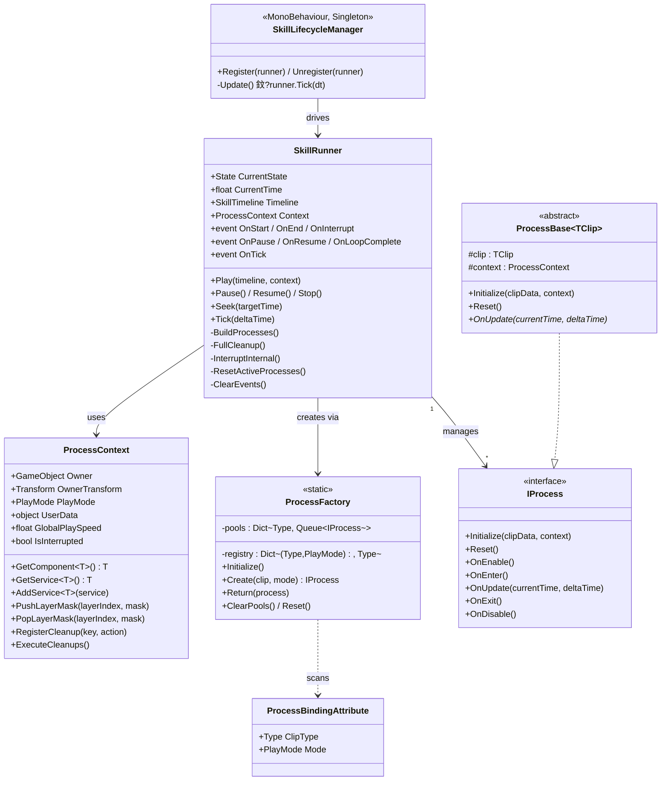
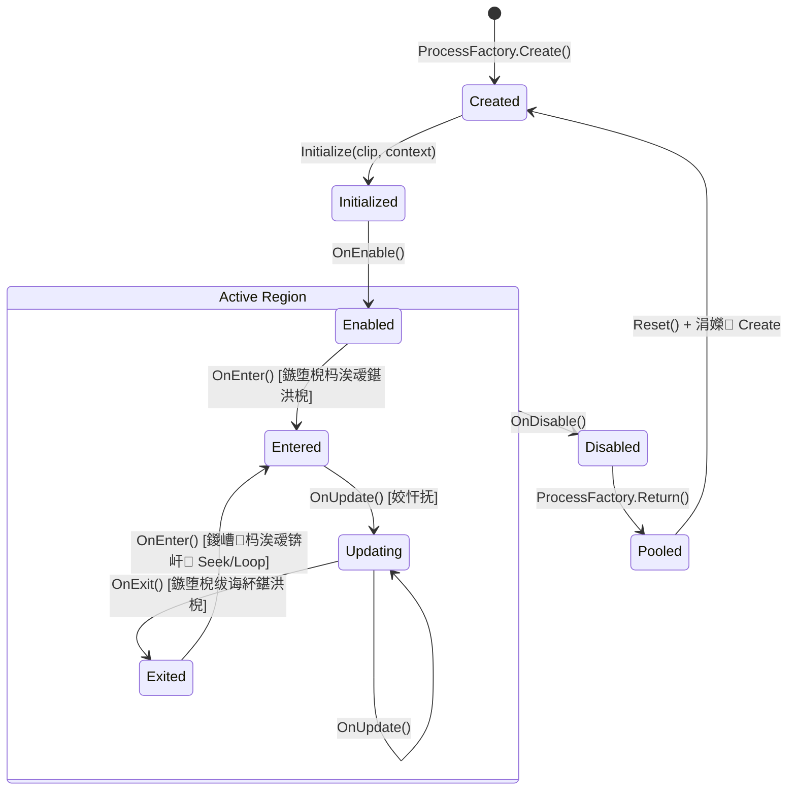
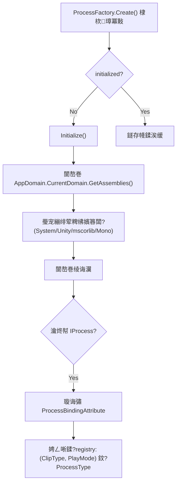
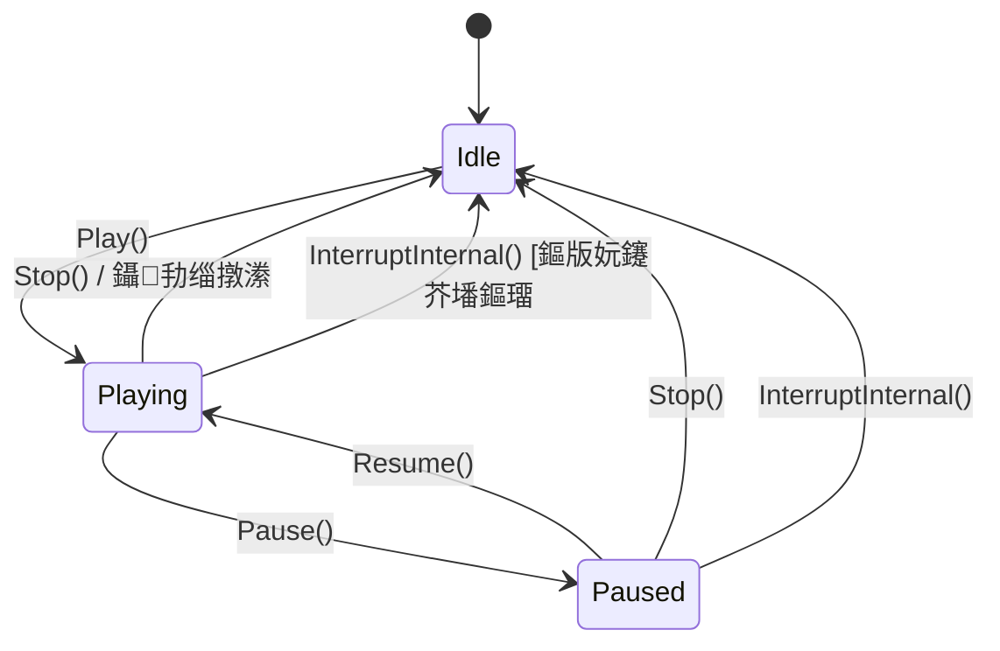
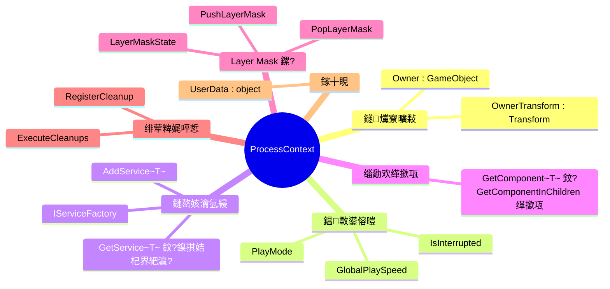
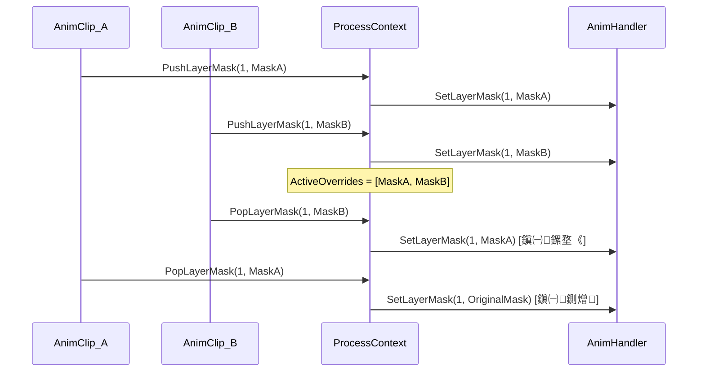
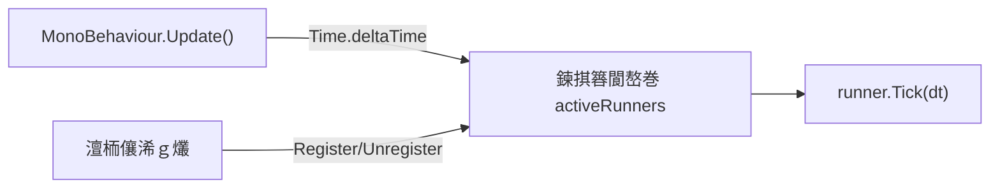
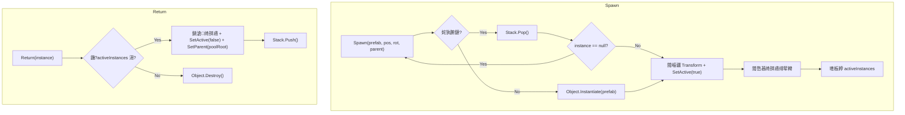
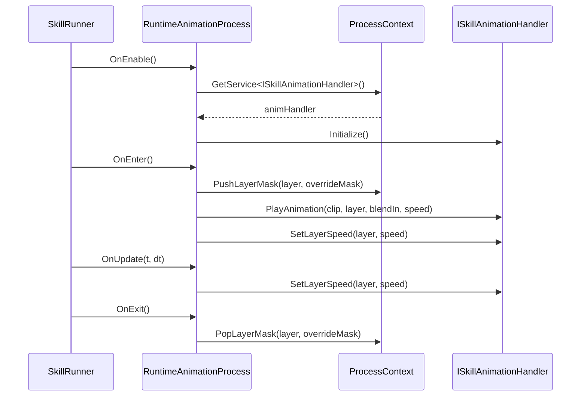
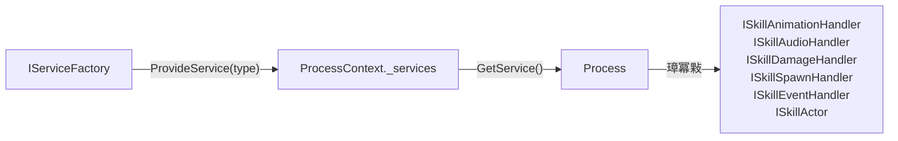

# SkillEditor 杩愯鏃?Logic 灞傚垎鏋愭姤鍛?

> **鍒嗘瀽鑼冨洿**: `Runtime/Playback/` 鍏ㄩ儴瀛愮洰褰曪紙Core銆両nterfaces銆丩ifecycle銆丳rocesses锛夊強 `Runtime/Sample/`
> **鍒嗘瀽鏃ユ湡**: 2026-02-22
> **鍒嗘瀽缁村害**: 杩愯鏃?脳 Logic

---

## 1. 鎾斁绯荤粺鏁翠綋鏋舵瀯



---

## 2. IProcess 鐢熷懡鍛ㄦ湡鎺ュ彛

**鏂囦欢**: [IProcess.cs](file:///D:/Unity/Server_Game/Assets/ATEditor/Runtime/Playback/Core/IProcess.cs)

### 2.1 浜旈樁娈电敓鍛藉懆鏈?



| 闃舵 | 鏂规硶 | 璋冪敤鏃舵満 | 鍏稿瀷鐢ㄩ€?|
|:-----|:-----|:---------|:---------|
| 鍒濆鍖?| `Initialize` | `BuildProcesses` 鏃?| 娉ㄥ叆 clip 鏁版嵁鍜?context |
| 鍚敤 | `OnEnable` | `Play()` 鍚庣珛鍗?| 缂撳瓨缁勪欢寮曠敤銆佹敞鍐岀郴缁熸竻鐞?|
| 杩涘叆 | `OnEnter` | 鏃堕棿鎸囬拡杩涘叆鐗囨鍖洪棿 | 寮€濮嬫挱鏀惧姩鐢?闊抽銆佸疄渚嬪寲鐗规晥 |
| 鏇存柊 | `OnUpdate` | 姣忓抚锛堝湪鍖洪棿鍐咃級 | 鍚屾閫熷害銆佹娴嬩激瀹?|
| 閫€鍑?| `OnExit` | 鏃堕棿鎸囬拡绂诲紑鐗囨鍖洪棿 | 鍥炴敹瀹炰緥銆侀噸缃复鏃剁姸鎬?|
| 绂佺敤 | `OnDisable` | `Stop()`/鎵撴柇鏃?| 閲婃斁杩涚▼绾ц祫婧?|
| 閲嶇疆 | `Reset` | 瀵硅薄姹犲鐢ㄥ墠 | 娓呯┖鎵€鏈夊瓧娈靛埌榛樿鍊?|

### 2.2 璁捐璇勪环

- 鉁?**绮掑害鍚堢悊**: Enter/Update/Exit 瑕嗙洊浜嗙墖娈垫寔缁椂闂村唴鐨勫畬鏁寸敓鍛藉懆鏈燂紱Enable/Disable 瑕嗙洊浜嗘暣涓挱鏀句細璇?
- 鉁?**瀵硅薄姹犲弸濂?*: `Reset()` 鏂规硶纭繚瀹炰緥鍙畨鍏ㄥ鐢?
- 鈿狅笍 **OnEnable 涓?OnEnter 鑱岃矗杈圭晫**: 閮ㄥ垎 Process锛堝 RuntimeAnimationProcess锛夊湪 `OnEnable` 涓皟鐢?`animHandler.Initialize()`锛屽鏋滃涓姩鐢?Clip 鍏变韩鍚屼竴 AnimationHandler锛屽彲鑳藉娆″垵濮嬪寲

---

## 3. ProcessBase 娉涘瀷鍩虹被

**鏂囦欢**: [ProcessBase.cs](file:///D:/Unity/Server_Game/Assets/ATEditor/Runtime/Playback/Core/ProcessBase.cs)

```csharp
public abstract class ProcessBase<TClip> : IProcess where TClip : ClipBase
{
    protected TClip clip;
    protected ProcessContext context;

    public void Initialize(ClipBase clipData, ProcessContext context)
    {
        this.clip = (TClip)clipData;  // 寮哄埗杞崲锛岀敱 ProcessBinding 淇濊瘉绫诲瀷瀹夊叏
        this.context = context;
    }

    public virtual void Reset()
    {
        clip = default;
        context = null;
    }

    // 榛樿绌哄疄鐜帮紝瀛愮被鎸夐渶瑕嗗啓
    public virtual void OnEnable() { }
    public virtual void OnEnter() { }
    public abstract void OnUpdate(float currentTime, float deltaTime);
    public virtual void OnExit() { }
    public virtual void OnDisable() { }
}
```

**璁捐瑕佺偣**:

1. **娉涘瀷绾︽潫**: `TClip : ClipBase` 淇濊瘉 `clip` 瀛楁鍏峰寮虹被鍨嬭闂紝閬垮厤棰戠箒杞瀷
2. **Initialize 寮鸿浆**: `(TClip)clipData` 渚濊禆 `ProcessFactory` 鐨勬纭粦瀹氾紝鏃犺繍琛屾椂绫诲瀷妫€鏌?
3. **OnUpdate 鎶借薄**: 鍞竴寮哄埗瀛愮被瀹炵幇鐨勬柟娉曪紝鍏朵綑鍧囦负 `virtual` 绌哄疄鐜?
4. **Reset 鍙鍐?*: 瀛愮被闇€ `override + base.Reset()` 娓呯悊棰濆瀛楁

---

## 4. ProcessBindingAttribute锛堢粦瀹氱壒鎬э級

**鏂囦欢**: [ProcessBindingAttribute.cs](file:///D:/Unity/Server_Game/Assets/ATEditor/Runtime/Playback/Core/ProcessBindingAttribute.cs)

```csharp
[AttributeUsage(AttributeTargets.Class, AllowMultiple = true, Inherited = false)]
public class ProcessBindingAttribute : Attribute
{
    public Type ClipType { get; }
    public PlayMode Mode { get; }
}
```

- **AllowMultiple = true**: 鍚屼竴 Process 绫诲彲缁戝畾澶氱妯″紡锛堝 CameraProcess 鍚屾椂缁戝畾 EditorPreview 鍜?Runtime锛?
- **Inherited = false**: 闃叉瀛愮被缁ф壙鐖剁被鐨勭粦瀹氬叧绯?

### 褰撳墠缁戝畾娉ㄥ唽琛?

| Clip 绫诲瀷 | EditorPreview Process | Runtime Process |
|:----------|:---------------------|:----------------|
| `SkillAnimationClip` | `EditorAnimationProcess` | `RuntimeAnimationProcess` |
| `AudioClip` | `EditorAudioProcess` | `RuntimeAudioProcess` |
| `VFXClip` | `EditorVFXProcess` | `RuntimeVFXProcess` |
| `DamageClip` | `EditorDamageProcess` | `RuntimeDamageProcess` |
| `SpawnClip` | `EditorSpawnProcess` | `RuntimeSpawnProcess` |
| `EventClip` | `EditorEventProcess` | `RuntimeEventProcess` |
| `CameraClip` | `CameraProcess` *(鍏辩敤)* | `CameraProcess` *(鍏辩敤)* |
| `MovementClip` | `MovementProcess` *(鍏辩敤)* | `MovementProcess` *(鍏辩敤)* |

---

## 5. ProcessFactory锛堝伐鍘?+ 瀵硅薄姹狅級

**鏂囦欢**: [ProcessFactory.cs](file:///D:/Unity/Server_Game/Assets/ATEditor/Runtime/Playback/Core/ProcessFactory.cs)

### 5.1 鍒濆鍖栨祦绋?



### 5.2 瀵硅薄姹犳満鍒?

```mermaid
flowchart LR
    subgraph Create
        A[璇锋眰 Create] --> B{姹犱腑鏈?}
        B -->|Yes| C[Dequeue + Reset]
        B -->|No| D[Activator.CreateInstance]
    end

    subgraph Return
        E[褰掕繕 Return] --> F[Enqueue 鍒板搴旂被鍨嬬殑姹燷
    end
```

**鍒嗘瀽瑕佺偣**:

1. **鎯版€у垵濮嬪寲**: 棣栨 `Create` 鏃惰嚜鍔ㄦ壂鎻忥紝鍚庣画涓嶅啀鍙嶅皠
2. **绋嬪簭闆嗚繃婊?*: 璺宠繃 `System`/`Unity`/`mscorlib`/`Mono` 鍓嶇紑鐨勭▼搴忛泦锛岄檷浣庢壂鎻忓紑閿€
3. **瀵硅薄姹犳棤涓婇檺**: 姹犲ぇ灏忎笉鍙楅檺锛屼粎鍦?`ClearPools()` 鏃舵竻绌?

> [!NOTE]
> 瀵硅薄姹犱娇鐢?`Queue<IProcess>` 鑰岄潪 `Stack`锛岃繖鎰忓懗鐫€ FIFO 澶嶇敤椤哄簭銆備竴鑸璞℃睜浣跨敤 `Stack`锛圠IFO锛変互鍒╃敤 CPU 缂撳瓨灞€閮ㄦ€с€傛澶勫樊寮傚奖鍝嶄笉澶э紝鍥犱负 Process 瀵硅薄鏈韩鏄交閲忕骇鐨勩€?

> [!WARNING]
> **ReflectionTypeLoadException 澶勭悊**: `Initialize()` 涓?catch 浜?`ReflectionTypeLoadException` 骞朵娇鐢?`e.Types`锛堝彲鑳藉惈 null锛夛紝鍚庣画閬嶅巻涓凡鏈?`type == null` 妫€鏌ワ紝璁捐瀹屽杽銆備絾濡傛灉鏌愪簺 Process 绫诲瀷浣嶄簬鏈杩囨护鐨勭▼搴忛泦涓笖鍔犺浇澶辫触锛屽彲鑳介渶瑕佹洿璇︾粏鐨勬棩蹇楄褰曘€?

---

## 6. SkillRunner锛堟牳蹇冩挱鏀惧櫒锛?

**鏂囦欢**: [SkillRunner.cs](file:///D:/Unity/Server_Game/Assets/ATEditor/Runtime/Playback/Core/SkillRunner.cs)

### 6.1 鐘舵€佹満



### 6.2 鏍稿績鏂规硶鍒嗘瀽

#### Play(timeline, context)

```
1. 濡傛灉褰撳墠闈?Idle 鈫?InterruptInternal() 鍏堟墦鏂?
2. 璁剧疆 Timeline銆丆ontext銆侀噸缃椂闂?
3. BuildProcesses() 鈫?涓烘瘡涓惎鐢ㄧ殑 Clip 鍒涘缓 Process
4. 鎵€鏈?Process.OnEnable()
5. 瑙﹀彂 OnStart 浜嬩欢
```

**BuildProcesses 璇︾粏娴佺▼** (L298-323):
- 閬嶅巻 `Timeline.AllTracks`锛堣烦杩?`!isEnabled` 鐨?Track锛?
- 閬嶅巻姣忎釜 Track 鐨?`clips`锛堣烦杩?`!isEnabled` 鐨?Clip锛?
- 閫氳繃 `ProcessFactory.Create(clip, playMode)` 鑾峰彇 Process
- 璋冪敤 `process.Initialize(clip, context)`
- 灏佽涓?`ProcessInstance` 缁撴瀯浣撳瓨鍏ュ垪琛?

#### Tick(deltaTime)

```
1. 闈?Playing 鐘舵€佺洿鎺ヨ繑鍥?
2. CurrentTime += deltaTime 脳 GlobalPlaySpeed
3. 鍖洪棿鎵弿锛氶亶鍘嗘墍鏈?ProcessInstance
   - shouldBeActive = currentTime 鈭?[clip.startTime, clip.EndTime)
   - 杩涘叆鍖洪棿锛歄nEnter() + isActive=true
   - 鍖洪棿鍐咃細OnUpdate(currentTime, deltaTime)
   - 绂诲紑鍖洪棿锛歄nExit() + isActive=false
4. 瑙﹀彂 OnTick 浜嬩欢
5. 鎾斁缁撴潫妫€娴嬶細
   - 寰幆 鈫?ResetActiveProcesses() + CurrentTime=0
   - 闈炲惊鐜?鈫?FullCleanup() + 鍥炲埌 Idle
```

> [!IMPORTANT]
> **鍖洪棿鍒ゅ畾浣跨敤宸﹂棴鍙冲紑 `[startTime, EndTime)`**: `shouldBeActive = currentTime >= startTime && currentTime < EndTime`銆傝繖鎰忓懗鐫€ `EndTime` 閭ｄ竴甯т笉浼氭墽琛?`OnUpdate`锛岃€屾槸瑙﹀彂 `OnExit`銆?

#### Seek(targetTime)

```
1. 閬嶅巻鎵€鏈?ProcessInstance
   - 璁＄畻 willBeActive = targetTime 鈭?[startTime, EndTime)
   - 褰撳墠娲昏穬浣嗗嵆灏嗕笉娲昏穬 鈫?OnExit()
   - 褰撳墠涓嶆椿璺冧絾鍗冲皢娲昏穬 鈫?OnEnter()
2. 璁剧疆 CurrentTime = targetTime
3. 瀵规墍鏈夋椿璺?Process 璋冪敤 OnUpdate(currentTime, deltaTime=0)
```

- **deltaTime=0**: 琛ㄧず闈欐€侀噰鏍凤紝Process 鍙嵁姝ゅ尯鍒?Seek 鍜屾甯告挱鏀?
- **鐢ㄩ€?*: 缂栬緫鍣ㄦ椂闂磋酱鎷栨嫿瀹氫綅

#### FullCleanup()锛堜笁灞傛竻鐞嗭級

```mermaid
flowchart TD
    A["绾у埆 1: 瀹炰緥绾ф竻鐞?] --> B["閬嶅巻娲昏穬 Process 鈫?OnExit()"]
    B --> C["绾у埆 2: 杩涚▼绾ф竻鐞?] --> D["閬嶅巻鎵€鏈?Process 鈫?OnDisable()"]
    D --> E["褰掕繕瀵硅薄姹?] --> F["ProcessFactory.Return(process)"]
    F --> G["娓呯┖ processes 鍒楄〃"]
    G --> H["绾у埆 3: 绯荤粺绾ф竻鐞?] --> I["context.ExecuteCleanups()"]
```

**璁捐浜偣**:

- **涓夊眰鍒嗙骇**: 瀹炰緥绾э紙OnExit锛夆啋 杩涚▼绾э紙OnDisable锛夆啋 绯荤粺绾э紙Context Cleanups锛?
- **瀵硅薄姹犲綊杩?*: 鍦?OnDisable 涔嬪悗銆佺郴缁熸竻鐞嗕箣鍓嶅綊杩橈紝纭繚 Process 涓嶅啀鎸佹湁璧勬簮
- **Context.ExecuteCleanups**: 鍘婚噸瀛楀吀锛堝悓 key 浠呬竴涓洖璋冿級锛岄伩鍏嶉噸澶嶆竻鐞?

### 6.3 浜嬩欢绯荤粺

| 浜嬩欢 | 瑙﹀彂鏃舵満 | 鍏稿瀷鐢ㄩ€?|
|:-----|:---------|:---------|
| `OnStart` | `Play()` 瀹屾垚鍚?| 閫氱煡 UI/鐘舵€佹満 |
| `OnEnd` | 鑷劧缁撴潫鎴?`Stop()` | 鍥炴敹鎶€鑳藉璞?|
| `OnInterrupt` | 琚柊鎶€鑳芥墦鏂?| 鏃ф妧鑳芥竻鐞嗛€昏緫 |
| `OnPause` / `OnResume` | 鏆傚仠/鎭㈠ | UI 鏆傚仠鍥炬爣 |
| `OnLoopComplete` | 寰幆鎾斁涓€杞畬鎴?| 璁℃暟/鏉′欢鍒ゆ柇 |
| `OnTick` | 姣忓抚 | 杩涘害鏉℃洿鏂?|

> [!WARNING]
> **ClearEvents 璁捐**: `Stop()` 鍜?`InterruptInternal()` 鍚庢竻闄ゆ墍鏈変簨浠惰闃咃紙`OnStart = null` 绛夛級銆傝繖鎰忓懗鐫€姣忔 `Play()` 閮介渶瑕侀噸鏂拌闃呬簨浠躲€傚鏋滃閮ㄤ唬鐮佸湪 `OnEnd` 鍥炶皟涓紩鐢ㄤ簡 SkillRunner 骞舵湡鏈涘鐢ㄤ簨浠惰闃咃紝浼氶亣鍒伴棶棰樸€?

### 6.4 ProcessInstance 缁撴瀯浣?

```csharp
public struct ProcessInstance
{
    public IProcess process;
    public ClipBase clip;
    public bool isActive;
}
```

- 浣跨敤 `struct` 閬垮厤鍫嗗垎閰嶏紝浣嗗瓨鍏?`List<ProcessInstance>` 鏃堕渶娉ㄦ剰鍊肩被鍨嬭涔?
- Tick 寰幆涓€氳繃 `processes[i] = inst` 鍥炲啓淇敼鍚庣殑 `isActive`

---

## 7. ProcessContext锛堟挱鏀句笂涓嬫枃锛?

**鏂囦欢**: [ProcessContext.cs](file:///D:/Unity/Server_Game/Assets/ATEditor/Runtime/Playback/Core/ProcessContext.cs)

### 7.1 鏍稿績鑱岃矗



### 7.2 鏈嶅姟瀹氫綅鍣ㄦā寮?

```csharp
public T GetService<T>() where T : class
{
    // 1. 缂撳瓨鍛戒腑
    if (_services.TryGetValue(type, out var service)) return service as T;
    // 2. 宸ュ巶鎳掑姞杞?
    if (_serviceFactory != null)
    {
        var newService = _serviceFactory.ProvideService(type);
        if (newService != null && newService is T typedService)
        {
            AddService<T>(typedService);
            return typedService;
        }
    }
    return null;
}
```

**娴佺▼**: Dictionary 缂撳瓨 鈫?IServiceFactory 鎳掑姞杞?鈫?缂撳瓨缁撴灉

- 鉁?**鎯版€цВ鏋?*: 鎸夐渶鑾峰彇鏈嶅姟锛屾湭浣跨敤鐨勬帴鍙ｄ笉浼氬疄渚嬪寲
- 鉁?**缂撳瓨鍘婚噸**: 棣栨鑾峰彇鍚庡瓨鍏ュ瓧鍏革紝鍚庣画鐩存帴鍛戒腑
- 鈿狅笍 **寮辩被鍨嬪瓧鍏?*: `Dictionary<Type, object>` 浣跨敤瑁呯锛屼絾鏈嶅姟鏁伴噺灏戯紝褰卞搷鍙拷鐣?

### 7.3 LayerMask 鏍堢鐞?

**涓撻棬澶勭悊鍔ㄧ敾閬僵锛圓vatarMask锛夌殑宓屽瑕嗙洊闂**锛?



- 浣跨敤 `List<AvatarMask>` 浣滀负鏍堬紙鏈€鍚庝竴涓厓绱犱负鏍堥《锛?
- 鏀寔涓棿閫€鍑猴紙`Remove` 鑰岄潪 `RemoveAt(Count-1)`锛?
- 鏍堢┖鏃舵仮澶嶅師濮?Mask 骞舵竻鐞?State

### 7.4 绯荤粺绾ф竻鐞嗘敞鍐?

```csharp
public void RegisterCleanup(string key, Action cleanup)
{
    _cleanupActions[key] = cleanup; // 鍚?key 瑕嗙洊
}
```

- **鍚?key 鍘婚噸**: 澶氫釜鍔ㄧ敾 Process 娉ㄥ唽 `"AnimComponent"` 娓呯悊鍥炶皟锛屽彧淇濈暀鏈€鍚庝竴涓?
- **鎵ц鏃舵満**: `SkillRunner.FullCleanup()` 鈫?`context.ExecuteCleanups()`

---

## 8. SkillLifecycleManager锛堢敓鍛藉懆鏈熺鐞嗗櫒锛?

**鏂囦欢**: [SkillLifecycleManager.cs](file:///D:/Unity/Server_Game/Assets/ATEditor/Runtime/Playback/Lifecycle/SkillLifecycleManager.cs)



**璁捐鍒嗘瀽**:

| 鐗规€?| 鍒嗘瀽 |
|:-----|:-----|
| 鎳掑垵濮嬪寲鍗曚緥 | `DontDestroyOnLoad`锛岄娆¤闂?`Instance` 鏃跺垱寤?|
| 鍊掑簭閬嶅巻 | 鍏佽 Runner 鍦?Tick 涓嚜琛屾敞閿€锛岄伩鍏嶅垪琛ㄤ慨鏀瑰紓甯?|
| 浠呴┍鍔?Tick | 涓嶈礋璐?Runner 鐨勫垱寤?閿€姣侊紝鑱岃矗娓呮櫚 |
| 甯у悓姝ュ吋瀹?| 娉ㄩ噴璇存槑甯у悓姝ユā寮忎笅涓嶄娇鐢ㄦ绠＄悊鍣紝鐢卞閮ㄦ鏋剁洿鎺ヨ皟鐢?`Runner.Tick()` |

> [!TIP]
> 褰撳墠浣跨敤 `List.Contains()` 鍋氶噸澶嶆鏌ワ紙O(n)锛夛紝濡傛灉鍚屾椂娲昏穬鐨?Runner 鏁伴噺杈冨锛屽彲鑰冭檻鏀圭敤 `HashSet` 杈呭姪鍘婚噸銆?

---

## 9. VFXPoolManager锛圴FX 瀵硅薄姹狅級

**鏂囦欢**: [VFXPoolManager.cs](file:///D:/Unity/Server_Game/Assets/ATEditor/Runtime/Playback/VFXPoolManager.cs)

### 9.1 鏋舵瀯



### 9.2 璁捐鍒嗘瀽

| 鐗规€?| 璇勪环 |
|:-----|:-----|
| 闈欐€佺被 | 鉁?鍏ㄥ眬鍗曚竴姹狅紝閬垮厤閲嶅瀹炰緥鍖?|
| Stack 瀛樺偍 | 鉁?LIFO 澶嶇敤锛岀紦瀛樺弸濂?|
| `DontDestroyOnLoad` 鏍硅妭鐐?| 鉁?璺ㄥ満鏅寔涔?|
| 绮掑瓙绯荤粺閲嶅惎 | 鉁?`Clear + Play` 纭繚澶嶇敤鏃剁姸鎬佸共鍑€ |
| null 妫€娴?+ 閫掑綊 | 鈿狅笍 琚攢姣佺殑瀵硅薄閫掑綊閲嶈瘯锛屾瀬绔儏鍐靛彲鑳?StackOverflow |
| 鏃犳睜瀹归噺涓婇檺 | 鈿狅笍 涓嶄富鍔ㄩ攢姣侀棽缃璞★紝鍐呭瓨鎸佺画澧為暱 |
| 鏃犻鐑帴鍙?| 馃煛 缂哄皯 `Prewarm(prefab, count)` |

---

## 10. 杩愯鏃?Process 瀹炵幇璇﹁В

### 10.1 RuntimeAnimationProcess

**鏂囦欢**: [RuntimeAnimationProcess.cs](file:///D:/Unity/Server_Game/Assets/ATEditor/Runtime/Playback/Processes/RuntimeAnimationProcess.cs) (61琛?



- 閫氳繃 `ISkillAnimationHandler` 鎺ュ彛椹卞姩锛屽畬鍏ㄨВ鑰?
- 閫熷害 = `clip.playbackSpeed 脳 context.GlobalPlaySpeed`
- 鏀寔 AvatarMask 鍔ㄦ€佽鐩栵紙Push/Pop 妯″紡锛?

### 10.2 RuntimeAudioProcess

**鏂囦欢**: [RuntimeAudioProcess.cs](file:///D:/Unity/Server_Game/Assets/ATEditor/Runtime/Playback/Processes/RuntimeAudioProcess.cs) (65琛?

- 浣跨敤 `AudioArgs` 鍊肩被鍨嬪皝瑁呮挱鏀惧弬鏁帮紙volume/pitch/loop/spatialBlend/startTime/position锛?
- `playingSoundId` 杩借釜褰撳墠鎾斁瀹炰緥锛岀敤浜?Stop 鍜?UpdateSound
- `OnUpdate` 鎸佺画鍚屾 pitch锛堝洜 GlobalPlaySpeed 鍙兘鍔ㄦ€佸彉鍖栵級

### 10.3 RuntimeVFXProcess

**鏂囦欢**: [RuntimeVFXProcess.cs](file:///D:/Unity/Server_Game/Assets/ATEditor/Runtime/Playback/Processes/RuntimeVFXProcess.cs) (182琛?

**瀹屾暣鐨?VFX 鐢熷懡鍛ㄦ湡绠＄悊**锛?

1. **OnEnter**: 鑾峰彇鎸傜偣 鈫?VFXPoolManager.Spawn 鈫?搴旂敤鍋忕Щ/缂╂斁 鈫?缂撳瓨绮掑瓙淇℃伅 鈫?鍚屾閫熷害
2. **OnUpdate**: 鎸佺画鍚屾绮掑瓙妯℃嫙閫熷害
3. **OnExit**: 鍖哄垎纭粨鏉燂紙鐩存帴 Return锛夊拰杞粨鏉燂紙StopEmitting + 寤惰繜 Return锛?

**杞粨鏉熸満鍒?*:
```csharp
// 鍋滄鍙戝皠浣嗕繚鐣欏凡鏈夌矑瀛?
ps.Stop(true, ParticleSystemStopBehavior.StopEmitting);
// 璁＄畻鏈€闀跨矑瀛愬鍛?
float maxLifetime = ps.main.startLifetime.constantMax;
// 寤惰繜鍥炴敹
runner.StartCoroutine(DelayReturn(instance, maxLifetime));
```

> [!WARNING]
> **鍗忕▼渚濊禆**: 杞粨鏉熶緷璧?`context.GetService<MonoBehaviour>()` 鑾峰彇鍗忕▼ Runner銆傚鏋滄湇鍔′笉鍙敤锛岄€€鍖栦负纭粨鏉熴€傝繖鏄竴涓殣寮忎緷璧栥€?

### 10.4 RuntimeDamageProcess

**鏂囦欢**: [RuntimeDamageProcess.cs](file:///D:/Unity/Server_Game/Assets/ATEditor/Runtime/Playback/Processes/RuntimeDamageProcess.cs) (215琛?

**鏈€澶嶆潅鐨?Process**锛屽畬鏁村疄鐜颁簡 5 绉嶇鎾炰綋鐨勪激瀹虫娴嬶細

```mermaid
flowchart TD
    A["DoDamageCheck()"] --> B["GetMatrix() 鈫?璁＄畻涓栫晫鍧愭爣"]
    B --> C{"shape.shapeType?"}
    C -->|Sphere| D["Physics.OverlapSphere"]
    C -->|Box| E["Physics.OverlapBox"]
    C -->|Capsule| F["Physics.OverlapCapsule"]
    C -->|Sector/Ring| G["Physics.OverlapBox (broad-phase)"]
    D & E & F & G --> H["杩囨护"]
    H --> I["鑷韩鎺掗櫎"]
    I --> J["鍐峰嵈杩囨护 (hitRecords)"]
    J --> K{"Sector/Ring?"}
    K -->|Yes| L["浜屾绮剧‘杩囨护\n楂樺害/鍗婂緞/瑙掑害/鍐呭崐寰?]
    K -->|No| M
    L --> M["鏈夋晥鐩爣鍒楄〃"]
    M --> N{"maxHitTargets > 0?"}
    N -->|Yes| O["鎺掑簭 (Closest/Random) + 鎴柇"]
    N -->|No| P
    O --> P["鏋勫缓 DamageData"]
    P --> Q["damageHandler.OnDamageDetect(data)"]
```

**妫€娴嬮鐜囩瓥鐣?*:

| HitFrequency | 琛屼负 |
|:-------------|:-----|
| `Once` | 浠呭湪 `OnEnter` 鏃舵娴嬩竴娆?|
| `Always` | 姣忓抚 `OnUpdate` 閮芥娴?|
| `Interval` | 鎸?`checkInterval` 闂撮殧妫€娴?|

**楂樼骇纰版挒浣撳鐞?*:

- **Sector锛堟墖褰級**: 鍏堢敤 Box 鍋?broad-phase锛屽啀鍦ㄥ眬閮ㄥ潗鏍囩郴涓仛瑙掑害杩囨护
- **Ring锛堢幆褰級**: 鍏堢敤 Box 鍋?broad-phase锛屽啀杩囨护鍐呭崐寰?
- 涓よ€呴兘鍋氶珮搴﹀墧闄わ紙灞€閮?Y 杞达級

**DamageData 鍊肩被鍨?*:
```csharp
DamageData damageData = new DamageData()
{
    deployer = context.Owner,
    targets = validHits.ToArray(),
    eventTag = clip.eventTag,
    actionTags = clip.targetTags
};
```

### 10.5 RuntimeSpawnProcess

**鏂囦欢**: [RuntimeSpawnProcess.cs](file:///D:/Unity/Server_Game/Assets/ATEditor/Runtime/Playback/Processes/RuntimeSpawnProcess.cs) (86琛?

- 浣跨敤 `SpawnData` 鍊肩被鍨嬪皝瑁呯敓鎴愬弬鏁?
- `OnEnter` 鏃堕€氳繃 `ISkillSpawnHandler.Spawn()` 鐢熸垚瀹炰綋
- 鐢熸垚鍚庤皟鐢?`ISkillProjectile.Initialize()` 涓嬪彂涓婁笅鏂?
- `OnUpdate` **涓嶄粙鍏?*鎶曞皠鐗╄繍鍔紙鐢辨姇灏勭墿鑷韩绠＄悊锛?
- `OnExit` 鏃惰嫢琚墦鏂?(`context.IsInterrupted`) 涓?`destroyOnInterrupt`锛岃皟鐢?`Recycle()`

### 10.6 RuntimeEventProcess

**鏂囦欢**: [RuntimeEventProcess.cs](file:///D:/Unity/Server_Game/Assets/ATEditor/Runtime/Playback/Processes/RuntimeEventProcess.cs) (33琛?

- 鏈€绠€鍗曠殑 Process锛歚OnEnter` 鏃惰Е鍙?`ISkillEventHandler.OnSkillEvent(eventName, parameters)`
- `OnUpdate` 绌哄疄鐜帮紙浜嬩欢鏄灛鏃剁殑锛?

### 10.7 CameraProcess / MovementProcess锛堥鏋讹級

**鏂囦欢**: [CameraProcess.cs](file:///D:/Unity/Server_Game/Assets/ATEditor/Runtime/Playback/Processes/CameraProcess.cs) / [MovementProcess.cs](file:///D:/Unity/Server_Game/Assets/ATEditor/Runtime/Playback/Processes/MovementProcess.cs) (鍚?6琛?

- **缂栬緫鍣?杩愯鏃跺叡鐢?* (`[ProcessBinding]` 鏍囨敞浜嗕袱绉?PlayMode)
- 鍏ㄩ儴鏂规硶涓?`TODO` 绌哄疄鐜?

---

## 11. CharSkillActor锛堢ず渚嬪疄鐜帮級

**鏂囦欢**: [CharSkillActor.cs](file:///D:/Unity/Server_Game/Assets/ATEditor/Runtime/Sample/CharSkillActor.cs)

- 瀹炵幇 `ISkillActor.GetBone(BindPoint, customName)` 鎺ュ彛
- 浣跨敤 `Animator.GetBoneTransform(HumanBodyBones.XX)` 鑾峰彇浜哄舰楠ㄩ
- 姝﹀櫒鎸傜偣閫氳繃 `Transform.Find("WeaponLeftHolder")` 鏌ユ壘
- 鑷畾涔夐楠奸€氳繃 `Transform.Find(customName)` 鏌ユ壘
- 鎵€鏈夋壘涓嶅埌鐨勬儏鍐甸兘闄嶇骇杩斿洖 `owner.transform`

---

## 12. 鏁版嵁娴佹€荤粨

### 12.1 瀹屾暣鎾斁鏁版嵁娴?

```mermaid
flowchart TD
    subgraph 鍒濆鍖栭樁娈?
        A["澶栭儴浠ｇ爜"] -->|"new SkillRunner(PlayMode.Runtime)"| B["SkillRunner"]
        A -->|"new ProcessContext(owner, mode, factory)"| C["ProcessContext"]
        A -->|"runner.Play(timeline, context)"| D["Play()"]
        D --> E["BuildProcesses()"]
        E --> F["ProcessFactory.Create(clip, mode)"]
        F -->|鍙嶅皠鏌ユ壘| G["(ClipType, PlayMode) 鈫?ProcessType"]
        G -->|瀵硅薄姹犳垨 new| H["IProcess 瀹炰緥"]
        H -->|"Initialize(clip, context)"| I["Process 灏辩华"]
        I --> J["OnEnable()"]
        J -->|"GetService<IHandler>()"| K["鏈嶅姟鎳掑姞杞?]
    end

    subgraph 鎾斁寰幆
        L["SkillLifecycleManager.Update()"] -->|deltaTime| M["runner.Tick(dt)"]
        M --> N["鍖洪棿鎵弿"]
        N -->|杩涘叆| O["OnEnter()"]
        N -->|鍖洪棿鍐厊 P["OnUpdate(t, dt)"]
        N -->|绂诲紑| Q["OnExit()"]
        O & P & Q -->|閫氳繃鎺ュ彛| R["Handler 鎵ц鍏蜂綋閫昏緫"]
    end

    subgraph 娓呯悊闃舵
        S["Stop() / Interrupt"] --> T["FullCleanup()"]
        T --> U["L1: OnExit() 娲昏穬 Process"]
        U --> V["L2: OnDisable() 鎵€鏈?Process"]
        V --> W["褰掕繕瀵硅薄姹?]
        W --> X["L3: Context.ExecuteCleanups()"]
    end
```

### 12.2 渚濊禆娉ㄥ叆鏁版嵁娴?



---

## 13. 璁捐璇勪及

### 13.1 浼樺娍

| 鏂归潰 | 璇勪环 |
|:-----|:-----|
| Process 鐢熷懡鍛ㄦ湡 | 鉁?浜旈樁娈佃璁¤鐩栧畬鏁达紝鑱岃矗娓呮櫚 |
| ProcessBinding 澹版槑寮?| 鉁?鏂板 Process 鏃犻渶淇敼宸ュ巶浠ｇ爜锛圤CP锛?|
| 瀵硅薄姹犲鐢?| 鉁?ProcessFactory 鍜?VFXPoolManager 鍙屽眰姹犲寲 |
| 渚濊禆鍊掔疆 | 鉁?鎵€鏈?Process 閫氳繃鎺ュ彛璁块棶澶栭儴鏈嶅姟锛圖IP锛?|
| 鎵撴柇瀹夊叏 | 鉁?涓夊眰娓呯悊 + IsInterrupted 鏍囪 |
| 甯у悓姝ュ弸濂?| 鉁?SkillRunner 涓虹函 C# 绫伙紝涓嶄緷璧?MonoBehaviour |
| LayerMask 鏍?| 鉁?鏀寔鍔ㄧ敾閬僵宓屽瑕嗙洊锛屾纭仮澶?|

### 13.2 闇€瑕佸叧娉ㄧ殑闂

| 鏄惁瑙ｅ喅 | 闂 | 涓ラ噸绋嬪害 | 璇存槑 |
|:----:|:--------:|:-----|:----:|
| 鉂?| ClearEvents 娓呴櫎璁㈤槄 | 馃煛 涓?| Stop/Interrupt 鍚庢墍鏈変簨浠惰闃呰娓呯┖锛屽閮ㄩ渶姣忔閲嶆柊璁㈤槄 |
| 鉂?| VFX 杞粨鏉熷崗绋嬩緷璧?| 馃煛 涓?| 渚濊禆 `GetService<MonoBehaviour>()` 鑾峰彇鍗忕▼ Runner |
| 鉂?| VFXPoolManager 鏃犲閲忎笂闄?| 馃煛 涓?| 涓嶄富鍔ㄥ洖鏀堕棽缃璞★紝鍙兘鍐呭瓨鎸佺画澧為暱 |
| 鉂?| Debug.Log 娈嬬暀 | 馃煝 浣?| RuntimeAnimationProcess/RuntimeVFXProcess 涓畫鐣欒皟璇曟棩蹇?|
| 鉂?| CameraProcess/MovementProcess 绌哄疄鐜?| 馃煝 浣?| 楠ㄦ灦浠ｇ爜锛屽姛鑳藉緟瀹炵幇 |
| 鉂?| ProcessFactory 鎯版€у垵濮嬪寲绾跨▼瀹夊叏 | 馃煝 浣?| 闈炵嚎绋嬪畨鍏紝浣?Unity 涓荤嚎绋嬪崟绾跨▼妯″瀷涓嬫棤闂 |

---

## 闄勫綍锛氭枃浠舵竻鍗?

| 鏂囦欢璺緞 | 琛屾暟 | 澶у皬 | 瑙掕壊 |
|:---------|:----:|:----:|:-----|
| `Runtime/Playback/Core/SkillRunner.cs` | 391 | 11.6KB | 鏍稿績鎾斁鐘舵€佹満 |
| `Runtime/Playback/Core/ProcessContext.cs` | 205 | 7.4KB | 渚濊禆娉ㄥ叆涓婁笅鏂?|
| `Runtime/Playback/Core/ProcessFactory.cs` | 129 | 4.2KB | 鍙嶅皠宸ュ巶+瀵硅薄姹?|
| `Runtime/Playback/Core/ProcessBase.cs` | 49 | 1.4KB | 娉涘瀷 Process 鍩虹被 |
| `Runtime/Playback/Core/IProcess.cs` | 48 | 1.5KB | 鐢熷懡鍛ㄦ湡鎺ュ彛 |
| `Runtime/Playback/Core/ProcessBindingAttribute.cs` | 38 | 1.3KB | 缁戝畾鐗规€?|
| `Runtime/Playback/Lifecycle/SkillLifecycleManager.cs` | 79 | 2.2KB | Mono 鍗曚緥椹卞姩鍣?|
| `Runtime/Playback/VFXPoolManager.cs` | 119 | 3.9KB | VFX 瀵硅薄姹?|
| `Runtime/Playback/Processes/RuntimeAnimationProcess.cs` | 61 | 2.3KB | 鍔ㄧ敾澶勭悊鍣?|
| `Runtime/Playback/Processes/RuntimeAudioProcess.cs` | 65 | 2.3KB | 闊抽澶勭悊鍣?|
| `Runtime/Playback/Processes/RuntimeVFXProcess.cs` | 182 | 6.5KB | VFX 澶勭悊鍣?|
| `Runtime/Playback/Processes/RuntimeDamageProcess.cs` | 215 | 8.2KB | 浼ゅ澶勭悊鍣?|
| `Runtime/Playback/Processes/RuntimeSpawnProcess.cs` | 86 | 3.0KB | 鐢熸垚澶勭悊鍣?|
| `Runtime/Playback/Processes/RuntimeEventProcess.cs` | 33 | 848B | 浜嬩欢澶勭悊鍣?|
| `Runtime/Playback/Processes/CameraProcess.cs` | 26 | 700B | 鐩告満澶勭悊鍣紙楠ㄦ灦锛?|
| `Runtime/Playback/Processes/MovementProcess.cs` | 26 | 690B | 绉诲姩澶勭悊鍣紙楠ㄦ灦锛?|
| `Runtime/Sample/CharSkillActor.cs` | 41 | 1.7KB | 绀轰緥 Actor |
