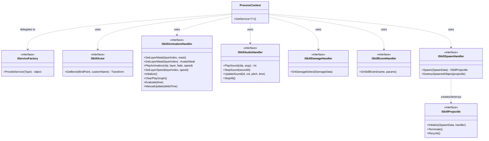
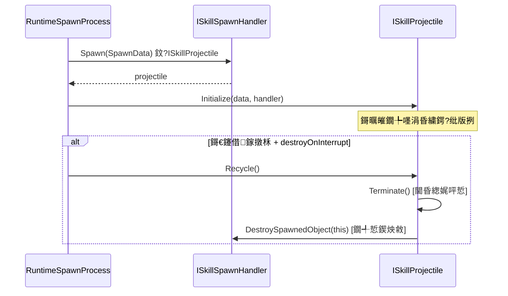
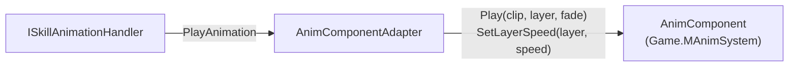
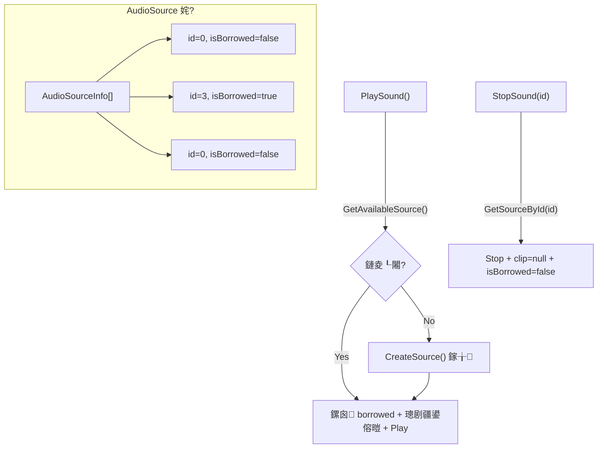
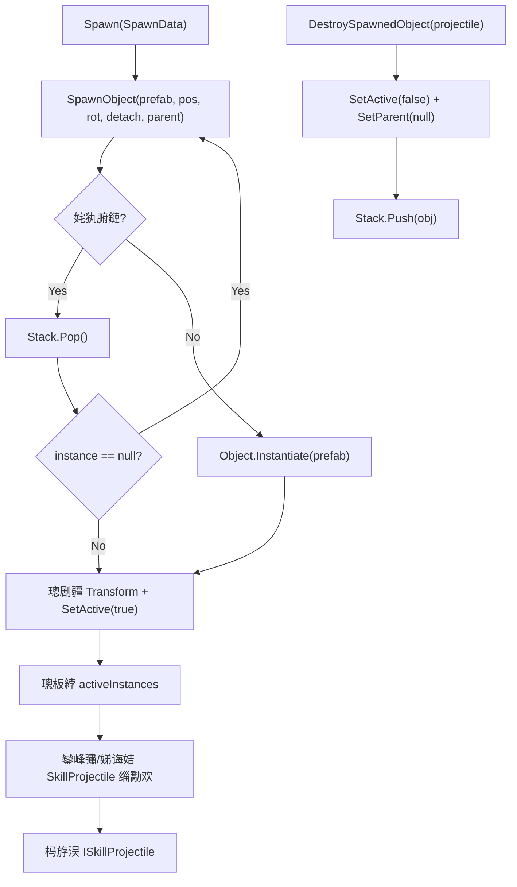
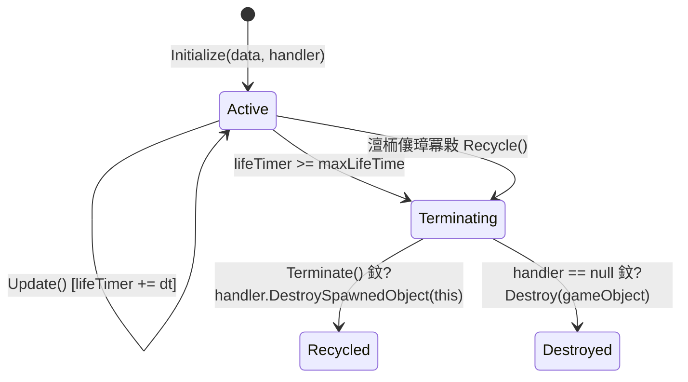
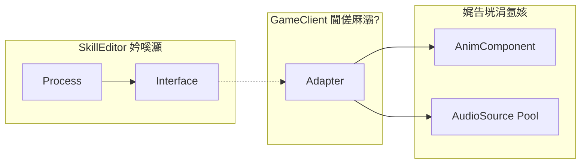

# SkillEditor 杩愯鏃舵帴鍙ｄ笌閫傞厤鍣ㄥ垎鏋愭姤鍛?

> **鍒嗘瀽鑼冨洿**: `Runtime/Playback/Interfaces/`锛?涓帴鍙?+ 3涓€肩被鍨嬪弬鏁板寘锛夊強 `GameClient/Adapters/`锛?涓€傞厤鍣ㄥ疄鐜帮級
> **鍒嗘瀽鏃ユ湡**: 2026-02-22
> **鍒嗘瀽缁村害**: 杩愯鏃?脳 鎺ュ彛灞?

---

## 1. 鎺ュ彛灞傛暣浣撴灦鏋?



### 鎺ュ彛鍒嗙被

| 绫诲埆 | 鎺ュ彛 | 娑堣垂鑰?(Process) |
|:-----|:-----|:-----------------|
| 鍩虹璁炬柦 | `IServiceFactory` | `ProcessContext` |
| 瑙掕壊鏌ヨ | `ISkillActor` | VFX / Damage / Spawn Process |
| 鍔ㄧ敾鎺у埗 | `ISkillAnimationHandler` | `RuntimeAnimationProcess` |
| 闊抽鎺у埗 | `ISkillAudioHandler` | `RuntimeAudioProcess` |
| 浼ゅ鍥炶皟 | `ISkillDamageHandler` | `RuntimeDamageProcess` |
| 浜嬩欢鍥炶皟 | `ISkillEventHandler` | `RuntimeEventProcess` |
| 鐢熸垚绠＄悊 | `ISkillSpawnHandler` + `ISkillProjectile` | `RuntimeSpawnProcess` |

---

## 2. 鍚勬帴鍙ｈ缁嗗垎鏋?

### 2.1 IServiceFactory锛堟湇鍔″伐鍘傦級

**鏂囦欢**: [IServiceFactory.cs](file:///D:/Unity/Server_Game/Assets/ATEditor/Runtime/Playback/Interfaces/IServiceFactory.cs)

```csharp
public interface IServiceFactory
{
    object ProvideService(Type serviceType);
}
```

- **鑱岃矗**: 鏍规嵁 `Type` 鍒涘缓/鎻愪緵瀵瑰簲鐨勬湇鍔″疄渚?
- **娑堣垂鏂?*: `ProcessContext.GetService<T>()` 鍦ㄧ紦瀛樻湭鍛戒腑鏃惰皟鐢?
- **杩斿洖鍊?*: `object`锛堝急绫诲瀷锛夛紝鐢辫皟鐢ㄦ柟寮鸿浆

> [!NOTE]
> 浣跨敤 `Type` 鍙傛暟鑰岄潪娉涘瀷鏂规硶 `T ProvideService<T>()`锛岃繖浣垮緱瀹炵幇鏂瑰彲浠ョ敤 `if-else` 閾捐矾鐢变笉鍚岀被鍨嬶紝浣嗘瘡涓垎鏀渶瑕佹墜鍔ㄧ被鍨嬪尮閰嶃€傛硾鍨嬫帴鍙ｉ渶瑕佹洿澶嶆潅鐨勫疄鐜颁絾鏇寸被鍨嬪畨鍏ㄣ€傚綋鍓嶇殑 `object` 杩斿洖鍊艰璁℃槸绠€鍗曞疄鐢ㄧ殑閫夋嫨銆?

---

### 2.2 ISkillActor锛堟妧鑳借鑹诧級

**鏂囦欢**: [ISkillActor.cs](file:///D:/Unity/Server_Game/Assets/ATEditor/Runtime/Playback/Interfaces/ISkillActor.cs)

```csharp
public interface ISkillActor
{
    Transform GetBone(BindPoint point, string customName = "");
}
```

- **鑱岃矗**: 瑙ｆ瀽 `BindPoint` 鏋氫妇鍒板疄闄呯殑 `Transform` 寮曠敤
- **娑堣垂鏂?*: RuntimeVFXProcess銆丷untimeDamageProcess銆丷untimeSpawnProcess 鈥?3 涓?Process 閮介渶瑕佽幏鍙栨寕鐐逛綅缃?
- **璁捐璇勪环**: 鉁?鏋佺畝鍗曚竴鎺ュ彛锛圛SP锛夛紝浠呭仛楠ㄩ瑙ｆ瀽锛屼笉娑夊強浠讳綍鐘舵€佷慨鏀?

---

### 2.3 ISkillAnimationHandler锛堝姩鐢诲鐞嗭級

**鏂囦欢**: [ISkillAnimationHandler.cs](file:///D:/Unity/Server_Game/Assets/ATEditor/Runtime/Playback/Interfaces/ISkillAnimationHandler.cs)

```csharp
public interface ISkillAnimationHandler
{
    // 閬僵绠＄悊
    void SetLayerMask(int layerIndex, AvatarMask mask);
    AvatarMask GetLayerMask(int layerIndex);

    // 鎾斁鎺у埗
    void PlayAnimation(AnimationClip clip, int layerIndex, float fadeDuration, float speed);
    void SetLayerSpeed(int layerIndex, float speed);

    // 鍩虹灞炴€?
    void Initialize();
    void ClearPlayGraph();

    // 閲囨牱涓庢墜鍔ㄦ洿鏂帮紙缂栬緫鍣ㄩ瑙堢敤锛?
    void Evaluate(float time);
    void ManualUpdate(float deltaTime);
}
```

| 鏂规硶鍒嗙粍 | 鏂规硶 | 杩愯鏃朵娇鐢?| 缂栬緫鍣ㄤ娇鐢?|
|:---------|:-----|:----------:|:----------:|
| 閬僵绠＄悊 | `SetLayerMask` / `GetLayerMask` | 鉁?| 鉁?|
| 鎾斁鎺у埗 | `PlayAnimation` / `SetLayerSpeed` | 鉁?| 鉂?|
| 鍩虹 | `Initialize` / `ClearPlayGraph` | 鉁?| 鉁?|
| 閲囨牱 | `Evaluate` / `ManualUpdate` | 鉂?| 鉁?|

> [!WARNING]
> **ISP 杩濆弽鍙兘**: `Evaluate` 鍜?`ManualUpdate` 浠呯紪杈戝櫒棰勮浣跨敤锛岃繍琛屾椂瀹炵幇鏂归渶绌哄疄鐜拌繖涓や釜鏂规硶銆傚彲鑰冭檻鎷嗗垎涓?`ISkillAnimationSampler`锛堢紪杈戝櫒涓撶敤锛夊瓙鎺ュ彛銆備絾鑰冭檻鍒版帴鍙ｆ€诲叡鍙湁 8 涓柟娉曪紝鎷嗗垎鏀剁泭鏈夐檺銆?

---

### 2.4 ISkillAudioHandler锛堥煶棰戝鐞嗭級

**鏂囦欢**: [ISkillAudioHandler.cs](file:///D:/Unity/Server_Game/Assets/ATEditor/Runtime/Playback/Interfaces/ISkillAudioHandler.cs)

```csharp
public interface ISkillAudioHandler
{
    int PlaySound(UnityEngine.AudioClip clip, AudioArgs args);
    void StopSound(int soundId);
    void UpdateSound(int soundId, float volume, float pitch, float time);
    void StopAll();
}
```

**閰嶅鍊肩被鍨?*:

```csharp
public struct AudioArgs
{
    public float volume;
    public float pitch;
    public bool loop;
    public float spatialBlend;  // 0=2D, 1=3D
    public float startTime;     // 璧峰鎾斁鏃堕棿
    public Vector3 position;    // 3D闊虫晥浣嶇疆
}
```

- **ID 绠＄悊**: `PlaySound` 杩斿洖 `int` 浣滀负鎾斁瀹炰緥 ID锛屽悗缁搷浣滈€氳繃姝?ID 瀵诲潃
- 鉁?`AudioArgs` 浣跨敤 `struct` 鍊肩被鍨嬶紝閬垮厤鍫嗗垎閰?
- 鉁?`StopAll` 鎻愪緵鎵归噺娓呯悊鑳藉姏

---

### 2.5 ISkillDamageHandler锛堜激瀹冲鐞嗭級

**鏂囦欢**: [ISkillDamageHandler.cs](file:///D:/Unity/Server_Game/Assets/ATEditor/Runtime/Playback/Interfaces/ISkillDamageHandler.cs)

```csharp
public interface ISkillDamageHandler
{
    void OnDamageDetect(DamageData damageData);
}
```

**閰嶅鍊肩被鍨?*:

```csharp
public struct DamageData
{
    public GameObject deployer;     // 閲婃斁鑰?
    public Collider[] targets;      // 鍛戒腑鐩爣
    public string eventTag;         // 浜嬩欢鏍囪瘑
    public string[] actionTags;     // 琛屼负鏍囩
}
```

- **鍗曟柟娉曟帴鍙?*: 鏋佽嚧绠€娲侊紝浠呬紶閫掓娴嬬粨鏋?
- 鉁?`DamageData` 灏佽浜嗘墍鏈変笂涓嬫枃淇℃伅锛屽疄鐜版柟涓嶉渶瑕佸弽鏌?Clip 鏁版嵁
- SkillEditor 璐熻矗绌洪棿妫€娴嬶紝鎴樻枟绯荤粺璐熻矗浼ゅ璁＄畻 鈥?**鑱岃矗娓呮櫚**

> [!NOTE]
> `DamageData` 铏界劧鏄?`struct`锛屼絾鍐呴儴鍖呭惈寮曠敤绫诲瀷锛坄GameObject`銆乣Collider[]`銆乣string[]`锛夛紝瀹為檯涓婂苟涓嶅叿澶囧畬鏁寸殑鍊艰涔夈€備絾浣滀负鍙傛暟鍖呬紶閫掓槸鍚堢悊鐨勩€?

---

### 2.6 ISkillEventHandler锛堜簨浠跺鐞嗭級

**鏂囦欢**: [ISkillEventHandler.cs](file:///D:/Unity/Server_Game/Assets/ATEditor/Runtime/Playback/Interfaces/ISkillEventHandler.cs)

```csharp
public interface ISkillEventHandler
{
    void OnSkillEvent(string eventName, List<SkillEventParam> parameters);
}
```

- **閫氱敤浜嬩欢鏈哄埗**: 閫氳繃 `eventName` + `List<SkillEventParam>` 瀹炵幇杩愯鏃舵棤闄愭墿灞?
- 鎴樻枟绯荤粺鍙牴鎹?`eventName` 鍒嗗彂鍒颁笉鍚屽鐞嗛€昏緫锛堝 "AddBuff"銆?SetCamera"銆?PlayVO" 绛夛級
- 鈿狅笍 `List<SkillEventParam>` 鏄紩鐢ㄧ被鍨嬶紝瀹炵幇鏂归渶娉ㄦ剰涓嶈淇敼鍘熷鏁版嵁

---

### 2.7 ISkillSpawnHandler + ISkillProjectile锛堢敓鎴愮郴缁燂級

**鏂囦欢**: [ISkillSpawnHandler.cs](file:///D:/Unity/Server_Game/Assets/ATEditor/Runtime/Playback/Interfaces/ISkillSpawnHandler.cs) / [ISkillProjectile.cs](file:///D:/Unity/Server_Game/Assets/ATEditor/Runtime/Playback/Interfaces/ISkillProjectile.cs)



**ISkillSpawnHandler**:

```csharp
public interface ISkillSpawnHandler
{
    ISkillProjectile Spawn(SpawnData data);
    void DestroySpawnedObject(ISkillProjectile projectile);
}
```

**SpawnData**:

```csharp
public struct SpawnData
{
    public GameObject configPrefab;  // 棰勫埗浣?
    public Vector3 position;         // 涓栫晫鍧愭爣
    public Quaternion rotation;      // 涓栫晫鏃嬭浆
    public bool detach;              // 鑴辩鐖惰妭鐐?
    public Transform parent;         // 鐖惰妭鐐?
    public string eventTag;          // 浜嬩欢鏍囪瘑
    public string[] targetTags;      // 鐩爣鏍囩
    public GameObject deployer;      // 閲婃斁鑰?
}
```

**ISkillProjectile**:

```csharp
public interface ISkillProjectile
{
    void Initialize(SpawnData data, ISkillSpawnHandler handler);
    void Terminate();   // 閫昏緫娓呯悊锛堝仠姝㈢矑瀛?闊虫晥绛夛級
    void Recycle();     // 鐪熷疄鍥炴敹锛堝叆姹?閿€姣侊紝鍏堣皟 Terminate锛?
}
```

**璁捐浜偣**:

1. **鍙屾帴鍙ｅ崗浣?*: Handler 璐熻矗鐢熸垚/閿€姣侊紝Projectile 璐熻矗鑷韩鐢熷懡鍛ㄦ湡
2. **SpawnData 鍊肩被鍨?*: 瀹屾暣鐨勫弬鏁板寘锛屼竴娆℃€т紶閫?
3. **Terminate/Recycle 鍒嗙**: 閫昏緫娓呯悊鍜岀墿鐞嗗洖鏀惰В鑰︼紝鏀寔娓愰殣鏁堟灉
4. **鍙嶅悜寮曠敤**: Projectile 鎸佹湁 Handler 寮曠敤锛屽彲涓诲姩瑙﹀彂鍥炴敹

---

## 3. 閫傞厤鍣ㄥ疄鐜板垎鏋?

### 3.1 閫傞厤鍣ㄦ€昏

```mermaid
classDiagram
    direction TB

    IServiceFactory <|.. SkillServiceFactory
    ISkillAnimationHandler <|.. AnimComponentAdapter
    ISkillAudioHandler <|.. GameSkillAudioHandler
    ISkillDamageHandler <|.. DamageHandler
    ISkillSpawnHandler <|.. SkillSpawnHandler
    ISkillProjectile <|.. SkillProjectile
    ISkillActor <|.. CharSkillActor

    class SkillServiceFactory {
        -_owner : GameObject
        +ProvideService(Type) object
    }

    class AnimComponentAdapter {
        -_target : AnimComponent
        浠ｇ悊鎵€鏈夋柟娉曞埌 AnimComponent
    }

    class GameSkillAudioHandler {
        <<MonoBehaviour>>
        -_pool : List~AudioSourceInfo~
        瀵硅薄姹犵鐞?AudioSource
    }

    class DamageHandler {
        浠呮棩蹇楄緭鍑?鍗犱綅)
    }

    class SkillSpawnHandler {
        -_pool : Dict~int,Stack~GameObject~~
        瀵硅薄姹犵鐞?Prefab 瀹炰緥
    }

    class SkillProjectile {
        <<MonoBehaviour>>
        +maxLifeTime : float
        鑷姩瓒呮椂鍥炴敹
    }

    class CharSkillActor {
        Animator 楠ㄩ瑙ｆ瀽
    }
```

---

### 3.2 SkillServiceFactory锛堟湇鍔″伐鍘傞€傞厤鍣級

**鏂囦欢**: [SkillServiceFactory.cs](file:///D:/Unity/Server_Game/Assets/GameClient/Adapters/SkillServiceFactory.cs)

**鏈嶅姟璺敱琛?*:

| 璇锋眰绫诲瀷 | 鎻愪緵鐨勫疄鐜?| 鍒涘缓鏂瑰紡 |
|:---------|:----------|:---------|
| `ISkillAnimationHandler` | `AnimComponentAdapter` | `new`锛堝寘瑁?AnimComponent锛?|
| `MonoBehaviour` | 浠绘剰 MonoBehaviour | `GetComponent<MonoBehaviour>()` |
| `ISkillActor` | `CharSkillActor` | `new`锛堜紶鍏?owner锛?|
| `ISkillAudioHandler` | `GameSkillAudioHandler` | `AddComponent<>()`锛堝姩鎬佹寕杞斤級 |
| `ISkillDamageHandler` | `DamageHandler` | `new`锛堝崰浣嶅疄鐜帮級 |

**鍒嗘瀽瑕佺偣**:

1. **if-else 閾捐矾鐢?*: 绠€鍗曠洿鎺ヤ絾杩濆弽 OCP锛屾瘡鏂板鏈嶅姟闇€淇敼姝ょ被
2. **鍒涘缓鏂瑰紡涓嶄竴鑷?*: 
   - `AnimComponentAdapter` 鍜?`CharSkillActor` 鐢?`new` 鍒涘缓绾?C# 瀵硅薄
   - `GameSkillAudioHandler` 鐢?`AddComponent` 鍔ㄦ€佹寕杞?MonoBehaviour

> [!WARNING]
> **AddComponent 姣忔璋冪敤**: `ISkillAudioHandler` 閫氳繃 `AddComponent<GameSkillAudioHandler>()` 鍒涘缓锛屽鏋?`GetService` 琚娆¤皟鐢紙铏界劧鏈夌紦瀛橈級锛岄娆¤皟鐢ㄤ細鍦?GameObject 涓婂姩鎬佹坊鍔犵粍浠躲€備笖 `ProcessContext` 鐨勭紦瀛樺湪 `Clear()` 鍚庡け鏁堬紝涓嬫闇€瑕佹椂浼氬啀娆?`AddComponent`锛岄€犳垚缁勪欢鍫嗙Н銆?

3. **缂哄皯鍑犱釜鏈嶅姟**: `ISkillSpawnHandler` 鍜?`ISkillEventHandler` 鏈湪宸ュ巶涓敞鍐岋紝鍙兘杩樻湭鎺ュ叆銆?

---

### 3.3 AnimComponentAdapter锛堝姩鐢婚€傞厤鍣級

**鏂囦欢**: [AnimComponentAdapter.cs](file:///D:/Unity/Server_Game/Assets/GameClient/Adapters/AnimComponentAdapter.cs)

- **閫傞厤鍣ㄦā寮?*鐨勬暀绉戜功瀹炵幇锛氬皢 `AnimComponent`锛堟父鎴忎笓鏈夊姩鐢荤粍浠讹級鍖呰涓?`ISkillAnimationHandler`
- 姣忎釜鏂规硶鐩存帴浠ｇ悊鍒?`_target`锛屼娇鐢?`?.` 绌哄畨鍏ㄨ皟鐢?
- `PlayAnimation` 灏?SkillEditor 鐨勫弬鏁版槧灏勫埌 AnimComponent 鐨?`Play(clip, layer, fade)` + `SetLayerSpeed(layer, speed)`



---

### 3.4 GameSkillAudioHandler锛堥煶棰戦€傞厤鍣級

**鏂囦欢**: [GameSkillAudioHandler.cs](file:///D:/Unity/Server_Game/Assets/GameClient/Adapters/GameSkillAudioHandler.cs)

**鏍稿績璁捐**: MonoBehaviour + AudioSource 瀵硅薄姹?



| 鐗规€?| 鍒嗘瀽 |
|:-----|:-----|
| 棰勫垱寤烘睜 | 鉁?`Awake` 鏃跺垱寤?`poolSize`(10) 涓?AudioSource |
| 鑷姩鎵╁ | 鉁?姹犳弧鏃?`CreateSource()` 杩藉姞鏂扮殑 |
| ID 杩借釜 | 鉁?閫掑 `_nextId` 淇濊瘉鍞竴鎬?|
| UpdateSound | 鉁?鏀寔鍔ㄦ€佷慨鏀?volume/pitch锛屼笖 time 鍚屾鏈?0.1s 闃堝€间繚鎶?|
| 绾挎€ф煡鎵?| 鈿狅笍 `GetSourceById` 鍜?`GetAvailableSource` 鍧囦负 O(n) 绾挎€ф壂鎻?|
| 鏃犵缉瀹?| 鈿狅笍 鍒涘缓鐨?AudioSource 涓嶄細閿€姣侊紝浠呭洖鏀跺埌姹?|

---

### 3.5 SkillSpawnHandler锛堢敓鎴愰€傞厤鍣級

**鏂囦欢**: [SkillSpawnHandler.cs](file:///D:/Unity/Server_Game/Assets/GameClient/Adapters/SkillSpawnHandler.cs)

**瀵硅薄姹犲寲鐨?Prefab 瀹炰緥绠＄悊**:



**璁捐鍒嗘瀽**:

1. 鉁?**姹犲寲妯″紡**: 涓?`VFXPoolManager` 鐩镐技鐨?`Dictionary<int, Stack<GameObject>>` 缁撴瀯
2. 鉁?**GetComponent/AddComponent**: 鑷姩鑾峰彇鎴栨坊鍔?`SkillProjectile` 缁勪欢
3. 鈿狅笍 **閫掑綊绌烘娴?*: 涓?VFXPoolManager 鐩稿悓鐨?null 閫掑綊閲嶈瘯闂
4. 鈿狅笍 **鏈疄鐜?InitializePool**: 鏂规硶浣撲负绌猴紝涓嶆敮鎸侀鐑?

---

### 3.6 SkillProjectile锛堟姇灏勭墿閫傞厤鍣級

**鏂囦欢**: [SkillProjectile.cs](file:///D:/Unity/Server_Game/Assets/GameClient/Adapters/SkillProjectile.cs)



| 鐗规€?| 鍒嗘瀽 |
|:-----|:-----|
| `maxLifeTime` | 鉁?Inspector 鍙厤缃殑鑷姩瓒呮椂鍥炴敹 |
| `virtual` 鏂规硶 | 鉁?`Initialize` / `Update` / `Terminate` 鍧?`virtual`锛屾敮鎸佸瓙绫绘墿灞?|
| `Recycle()` 娴佺▼ | 鉁?鍏?`Terminate()` 閫昏緫娓呯悊锛屽啀閫氳繃 Handler 鐗╃悊鍥炴敹 |
| 闄嶇骇閿€姣?| 鉁?Handler 涓?null 鏃剁洿鎺?`Destroy`锛岄伩鍏嶅唴瀛樻硠婕?|
| `Terminate` 绌哄疄鐜?| 馃煛 鍩虹被 `Terminate()` 涓虹┖锛岄渶瀛愮被瑕嗗啓瀹為檯閫昏緫 |

---

### 3.7 DamageHandler锛堜激瀹冲崰浣嶉€傞厤鍣級

**鏂囦欢**: [DamageHandler.cs](file:///D:/Unity/Server_Game/Assets/GameClient/Adapters/DamageHandler.cs)

```csharp
public class DamageHandler : ISkillDamageHandler
{
    public void OnDamageDetect(DamageData damageData)
    {
        foreach (var c in damageData.targets)
        {
            Debug.Log($"{c.gameObject.name}:Damage Triggered!");
        }
    }
}
```

- **绾崰浣嶅疄鐜?*: 浠呰緭鍑烘棩蹇楋紝涓嶅仛瀹為檯浼ゅ璁＄畻
- 寰呮帴鍏ョ湡瀹炴垬鏂楃郴缁熷悗鏇挎崲

---

## 4. 鎺ュ彛闂翠緷璧栧叧绯?

```mermaid
flowchart TD
    SF["IServiceFactory"] -->|鎻愪緵| All["鎵€鏈夋帴鍙ｅ疄渚?]

    subgraph 鐙珛鎺ュ彛
        IA["ISkillActor"]
        IAn["ISkillAnimationHandler"]
        IAu["ISkillAudioHandler"]
        ID["ISkillDamageHandler"]
        IE["ISkillEventHandler"]
    end

    subgraph 鍗忎綔鎺ュ彛
        ISH["ISkillSpawnHandler"]
        ISP["ISkillProjectile"]
        ISH -->|"Spawn() 鈫?杩斿洖"| ISP
        ISP -->|"Recycle() 鈫?璋冪敤"| ISH
    end

    PC["ProcessContext"] -->|"GetService<T>()"| SF
    PC -->|"PushLayerMask/PopLayerMask"| IAn
```

**鍏抽敭瑙傚療**:
- 澶ч儴鍒嗘帴鍙ｆ槸 **鐙珛鐨?*锛屽郊姝ゆ棤渚濊禆
- 鍞竴鐨?**鍗忎綔瀵?* 鏄?`ISkillSpawnHandler` 鈫?`ISkillProjectile`锛堝弻鍚戝紩鐢級
- `ProcessContext` 鏄墍鏈夋帴鍙ｇ殑 **鑱氬悎鐐?*锛屼絾鎺ュ彛涔嬮棿涓嶇煡閬撳郊姝ょ殑瀛樺湪

---

## 5. 鍊肩被鍨嬪弬鏁板寘璁捐

### 5.1 鍙傛暟鍖呭姣?

| 鍙傛暟鍖?| 绫诲瀷 | 瀛楁鏁?| 娑堣垂鏂?|
|:-------|:-----|:------:|:-------|
| `AudioArgs` | `struct` | 6 | `ISkillAudioHandler.PlaySound` |
| `DamageData` | `struct` | 4 | `ISkillDamageHandler.OnDamageDetect` |
| `SpawnData` | `struct` | 7 | `ISkillSpawnHandler.Spawn` / `ISkillProjectile.Initialize` |

### 5.2 璁捐璇勪环

| 鏂归潰 | 璇勪环 |
|:-----|:-----|
| 浣跨敤 struct | 鉁?閬垮厤鍫嗗垎閰嶏紝浼犲弬鏃跺鍒跺€?|
| 鍙傛暟鑱氬悎 | 鉁?閬垮厤鏂规硶绛惧悕杩囬暱锛堟浛浠ｅ鍙傛暟鏂规硶锛?|
| 鏁版嵁瀹夊叏 | 鈿狅笍 鍖呭惈寮曠敤绫诲瀷瀛楁锛圙ameObject銆丆ollider[]锛夛紝淇敼寮曠敤鎸囧悜鐨勫璞′粛浼氬奖鍝嶅師濮嬫暟鎹?|
| 鍙墿灞曟€?| 鉁?鏂板瀛楁鍙渶淇敼 struct锛屼笉褰卞搷鎺ュ彛绛惧悕 |

---

## 6. 璁捐鍘熷垯閬靛畧璇勪及

### 6.1 SOLID 鍒嗘瀽

| 鍘熷垯 | 璇勪环 | 璇存槑 |
|:-----|:----:|:-----|
| **SRP** | 鉁?| 姣忎釜鎺ュ彛鑱岃矗鍗曚竴锛欰ctor 鍋氶楠兼煡璇€丏amageHandler 鍋氫激瀹冲洖璋冦€丄udioHandler 鍋氶煶棰戠鐞?|
| **OCP** | 鉁?鈿狅笍 | 鎺ュ彛灞傚畬缇庨伒瀹?OCP锛堟柊澧炲疄鐜颁笉淇敼鎺ュ彛锛夛紱浣?`SkillServiceFactory` 鐨?if-else 閾捐繚鍙?OCP |
| **LSP** | 鉁?| 鎵€鏈夐€傞厤鍣ㄥ彲鏇挎崲鎺ュ彛浣跨敤鏂逛笉鐭ラ亾鍏蜂綋瀹炵幇 |
| **ISP** | 鉁?鈿狅笍 | 澶ч儴鍒嗘帴鍙ｇ簿绠€锛沗ISkillAnimationHandler` 鍖呭惈缂栬緫鍣ㄤ笓鐢ㄦ柟娉曪紝杞诲井杩濆弽 |
| **DIP** | 鉁?| Process 灞傚畬鍏ㄤ緷璧栨娊璞℃帴鍙ｏ紝涓嶄緷璧?GameClient 鍏蜂綋绫?|

### 6.2 閫傞厤鍣ㄦā寮忚瘎浠?



- **杈圭晫娓呮櫚**: SkillEditor 妗嗘灦涓嶇煡閬?GameClient 鐨勫瓨鍦紙鍗曞悜渚濊禆锛?
- **鏇挎崲鎴愭湰浣?*: 鏇存崲娓告垙寮曟搸/闊抽绯荤粺鍙渶閲嶅啓閫傞厤鍣紝涓嶄慨鏀?SkillEditor
- **绋嬪簭闆嗛殧绂?*: 鎺ュ彛鍦?`ATEditor.Runtime`锛岄€傞厤鍣ㄥ湪 `GameClient`

---

## 7. 璁捐璇勪及

### 7.1 浼樺娍

| 鏂归潰 | 璇勪环 |
|:-----|:-----|
| DIP 璐交褰诲簳 | 鉁?鎵€鏈?Process 鈫?Interface 鈫?Adapter 鈫?鍏蜂綋瀹炵幇 |
| 鍊肩被鍨嬪弬鏁板寘 | 鉁?AudioArgs/DamageData/SpawnData 鎻愬崌鏁版嵁瀹夊叏鎬у拰浼犲弬娓呮櫚搴?|
| 鍙屾帴鍙ｇ敓鎴愮郴缁?| 鉁?SpawnHandler/Projectile 鍒嗙鐢熸垚鍜岀敓鍛藉懆鏈熺鐞?|
| 閫傞厤鍣ㄦ睜鍖?| 鉁?AudioHandler 鍜?SpawnHandler 閮藉疄鐜颁簡瀵硅薄姹?|
| 鎺ュ彛鏋佺畝 | 鉁?澶ч儴鍒嗘帴鍙ｄ粎 1-4 涓柟娉?|

### 7.2 闇€瑕佸叧娉ㄧ殑闂

| 鏄惁瑙ｅ喅 | 闂 | 涓ラ噸绋嬪害 | 璇存槑 |
|:----:|:--------:|:-----|:----:|
| 鉂?| SkillServiceFactory if-else 閾?| 馃煛 涓?| 杩濆弽 OCP锛屾柊澧炴湇鍔￠渶淇敼宸ュ巶锛涘彲鑰冭檻瀛楀吀娉ㄥ唽鎴栨硾鍨嬫柟娉?|
| 鉂?| AudioHandler AddComponent | 馃煛 涓?| 姣忔棣栨鑾峰彇鏈嶅姟鏃跺姩鎬佹寕杞?MonoBehaviour锛屽彲鑳介噸澶嶆寕杞?|
| 鉂?| ISkillAnimationHandler 缂栬緫鍣ㄦ柟娉?| 馃煝 浣?| `Evaluate`/`ManualUpdate` 浠呯紪杈戝櫒浣跨敤锛岃繍琛屾椂绌哄疄鐜?|
| 鉂?| DamageHandler 鍗犱綅瀹炵幇 | 馃煝 浣?| 浠呮棩蹇楄緭鍑猴紝闇€鎺ュ叆鐪熷疄鎴樻枟绯荤粺 |
| 鉂?| 缂哄皯 SpawnHandler/EventHandler 娉ㄥ唽 | 馃煛 涓?| SkillServiceFactory 鏈敞鍐岃繖涓や釜鏈嶅姟 |
| 鉂?| SpawnHandler.InitializePool 鏈疄鐜?| 馃煝 浣?| 棰勭儹鏂规硶浣撲负绌?|

---

## 闄勫綍锛氭枃浠舵竻鍗?

| 鏂囦欢璺緞 | 琛屾暟 | 澶у皬 | 瑙掕壊 |
|:---------|:----:|:----:|:-----|
| `Runtime/Playback/Interfaces/IServiceFactory.cs` | 18 | 489B | 鏈嶅姟宸ュ巶鎺ュ彛 |
| `Runtime/Playback/Interfaces/ISkillActor.cs` | 20 | 612B | 瑙掕壊鏌ヨ鎺ュ彛 |
| `Runtime/Playback/Interfaces/ISkillAnimationHandler.cs` | 28 | 813B | 鍔ㄧ敾澶勭悊鎺ュ彛 |
| `Runtime/Playback/Interfaces/ISkillAudioHandler.cs` | 48 | 1.4KB | 闊抽澶勭悊鎺ュ彛+AudioArgs |
| `Runtime/Playback/Interfaces/ISkillDamageHandler.cs` | 28 | 971B | 浼ゅ鍥炶皟鎺ュ彛+DamageData |
| `Runtime/Playback/Interfaces/ISkillEventHandler.cs` | 19 | 646B | 浜嬩欢鍥炶皟鎺ュ彛 |
| `Runtime/Playback/Interfaces/ISkillSpawnHandler.cs` | 40 | 1.5KB | 鐢熸垚绠＄悊鎺ュ彛+SpawnData |
| `Runtime/Playback/Interfaces/ISkillProjectile.cs` | 32 | 1.2KB | 鎶曞皠鐗╂帴鍙?|
| `GameClient/Adapters/SkillServiceFactory.cs` | 61 | 2.0KB | 鏈嶅姟宸ュ巶瀹炵幇 |
| `GameClient/Adapters/AnimComponentAdapter.cs` | 63 | 1.6KB | 鍔ㄧ敾閫傞厤鍣?|
| `GameClient/Adapters/GameSkillAudioHandler.cs` | 150 | 4.3KB | 闊抽閫傞厤鍣?|
| `GameClient/Adapters/DamageHandler.cs` | 17 | 380B | 浼ゅ鍗犱綅閫傞厤鍣?|
| `GameClient/Adapters/SkillSpawnHandler.cs` | 85 | 2.7KB | 鐢熸垚閫傞厤鍣?|
| `GameClient/Adapters/SkillProjectile.cs` | 54 | 1.2KB | 鎶曞皠鐗╅€傞厤鍣?|
| `Runtime/Sample/CharSkillActor.cs` | 41 | 1.7KB | 绀轰緥瑙掕壊閫傞厤鍣?|
