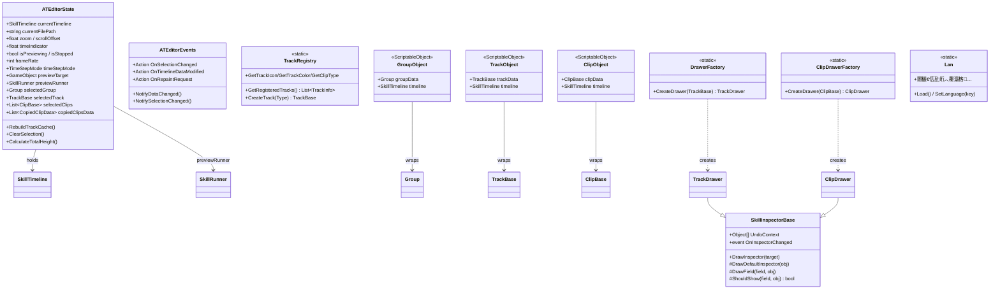
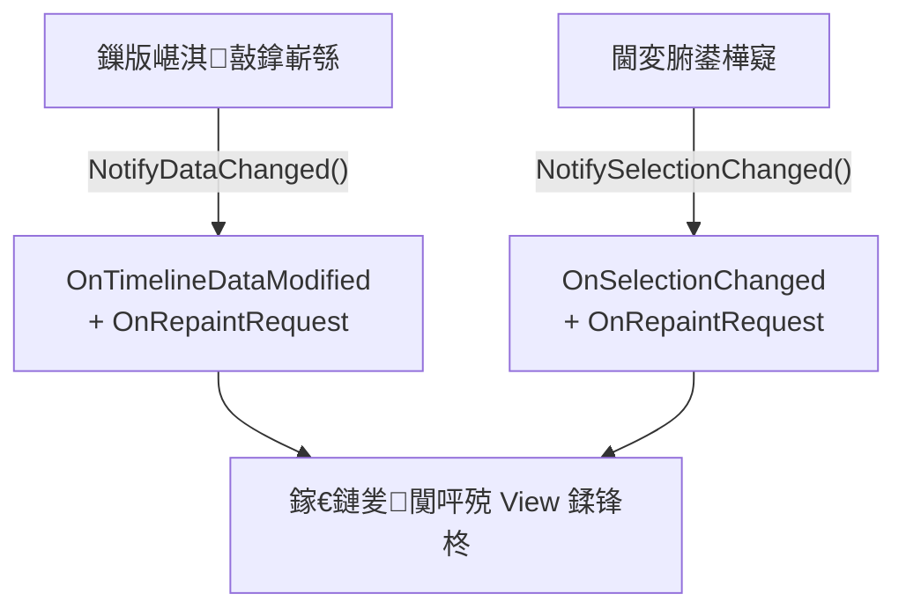
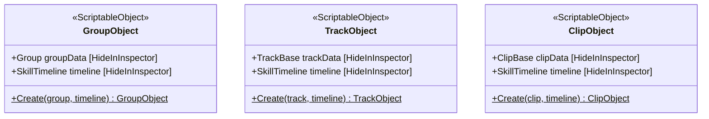
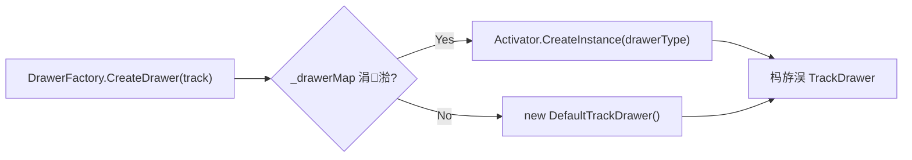

# SkillEditor 缂栬緫鍣?Data 灞傚垎鏋愭姤鍛?

> **鍒嗘瀽鑼冨洿**: `Editor/Core/`銆乣Editor/Enums/`銆乣Editor/Language/`銆乣Editor/Drawers/Base/`銆乣Editor/TrackObjectWrapper.cs`
> **鍒嗘瀽鏃ユ湡**: 2026-02-22
> **鍒嗘瀽缁村害**: 缂栬緫鍣?脳 Data

---

## 1. 缂栬緫鍣ㄦ暟鎹眰鏋舵瀯



---

## 2. ATEditorState锛堝叏灞€ UI 鐘舵€侊級

**鏂囦欢**: [ATEditorState.cs](file:///D:/Unity/Server_Game/Assets/ATEditor/Editor/Core/ATEditorState.cs) (246琛?

### 2.1 鑱岃矗鍒嗗尯

| 鍒嗗尯 | 瀛楁/灞炴€?| 鎸佷箙鍖栨柟寮?|
|:-----|:---------|:-----------|
| **鏍稿績鏁版嵁寮曠敤** | `currentTimeline`銆乣currentFilePath` | 鏃狅紙浼氳瘽鍐咃級 |
| **瑙嗗彛鐘舵€?* | `zoom`銆乣scrollOffset`銆乣verticalScrollOffset`銆乣timeIndicator` | 鏃狅紙浼氳瘽鍐咃級 |
| **鏃堕棿鎸囩ず鍣?* | `isPreviewing`銆乣isStopped`銆乣ShouldShowIndicator` | 鏃狅紙浼氳瘽鍐咃級 |
| **閫変腑椤?* | `selectedGroup`銆乣selectedTrack`銆乣selectedClips`銆乣isTimelineSelected` | 鏃狅紙浼氳瘽鍐咃級 |
| **澶嶅埗绮樿创** | `copiedClipsData`銆乣copiedTrack`銆乣copiedGroup`銆乣pasteTargetTrack/Time` | 鏃狅紙浼氳瘽鍐咃級 |
| **棰勮** | `previewTarget`銆乣previewRunner`銆乣PreviewContext` | 鏃狅紙浼氳瘽鍐咃級 |
| **璁剧疆锛堟寔涔呭寲锛?* | `previewSpeedMultiplier`銆乣snapEnabled`銆乣frameRate`銆乣timeStepMode`銆乣Language`銆乣DefaultPreviewCharacterPath` | EditorPrefs |

### 2.2 杞ㄩ亾缂撳瓨绯荤粺

```csharp
private Dictionary<string, TrackBase> trackCache;

public void RebuildTrackCache()     // 鍏ㄩ噺閲嶅缓
public void AddTrackToCache(track)  // 澧為噺娣诲姞
public void RemoveTrackFromCache(id)// 澧為噺绉婚櫎
public TrackBase GetTrackById(id)   // O(1) 鏌ユ壘
```

- 鉁?**鍏ㄩ噺+澧為噺鍙屾ā寮?*: 鏀寔鍒濆鍖栧叏閲忔壂鎻忓拰杩愯鏃舵寜闇€鏇存柊
- 鉁?**O(1) 鏌ユ壘**: Dictionary 閫氳繃 trackId 蹇€熺储寮?

### 2.3 閫変腑鐘舵€佺鐞?

```mermaid
flowchart LR
    subgraph 澶氶€夋ā寮?
        A["selectedClips: List<ClipBase>"]
        B["SelectedClip: 鏈€鍚庝竴涓?]
    end

    subgraph 鍗曢€変簰鏂?
        C["selectedGroup"]
        D["selectedTrack"]
        E["isTimelineSelected"]
    end

    F["ClearSelection()"] --> C & D & A & E
```

- 鏀寔 **澶?Clip 閫変腑**锛坄List<ClipBase>`锛?
- Group / Track / Timeline 閫変腑鏄?**浜掓枼鐨?*
- `SelectedClip` 灞炴€у彇鍒楄〃鏈€鍚庝竴椤癸紙鏈€杩戦€変腑鐨勶級

### 2.4 澶嶅埗绮樿创绯荤粺

```csharp
public struct CopiedClipData
{
    public ClipBase clip;
    public string sourceTrackId;
    public int sourceTrackIndex;  // 缁存寔鐩稿杞ㄩ亾灞傜骇
}

public List<CopiedClipData> copiedClipsData;
```

- 鏀寔 **澶?Clip 澶嶅埗**锛屼繚鐣欐簮杞ㄩ亾 ID 鍜岀储寮曚俊鎭?
- 鍚屾椂缁存姢浜嗘棫鐗堝崟椤?`copiedClip` 灞炴€х殑鍏煎鎬?
- 鏀寔鍒嗙粍澶嶅埗锛歚copiedGroup` + `copiedTracksForGroup`

### 2.5 鏃堕棿姝ラ暱涓庡抚鎺у埗

| 灞炴€?| 璇存槑 |
|:-----|:-----|
| `timeStepMode` | `Variable`锛堝姩鎬佺綉鏍硷級/ `Fixed`锛堝浐瀹氬抚鐜囷級 |
| `frameRate` | 閫昏緫甯х巼锛堥粯璁?0锛?|
| `useFrameSnap` | `Fixed` 妯″紡涓嬭嚜鍔ㄥ惎鐢?|
| `SnapInterval` | `Fixed` 妯″紡 = `1/frameRate`锛宍Variable` 妯″紡 = `-1`锛堝姩鎬侊級 |

> [!NOTE]
> 璁剧疆閫氳繃 `EditorPrefs` 鎸佷箙鍖栵紝璺ㄧ紪杈戝櫒浼氳瘽淇濈暀鐢ㄦ埛鍋忓ソ銆侹ey 浣跨敤 `SkillEditor_` 鍓嶇紑閬垮厤鍐茬獊銆?

---

## 3. ATEditorEvents锛堜簨浠舵€荤嚎锛?

**鏂囦欢**: [ATEditorEvents.cs](file:///D:/Unity/Server_Game/Assets/ATEditor/Editor/Core/ATEditorEvents.cs) (42琛?



| 浜嬩欢 | 瑙﹀彂鏃舵満 | 璁㈤槄鑰?|
|:-----|:---------|:-------|
| `OnSelectionChanged` | 閫変腑 Group/Track/Clip 鍙樺寲 | Inspector銆佸睘鎬ч潰鏉?|
| `OnTimelineDataModified` | 澧炲垹 Track/Clip/Group | 鎵€鏈?View |
| `OnRepaintRequest` | 涓婅堪涓よ€?+ 鐩存帴璇锋眰 | EditorWindow.Repaint |

- 鉁?**閫氱煡鍚堝苟**: `NotifyDataChanged` 鍚屾椂瑙﹀彂鏁版嵁淇敼鍜岄噸缁?
- 馃煛 **绠€鍗?Action 濮旀墭**: 鏃犱簨浠跺弬鏁帮紙鏃犳硶鐭ラ亾鍏蜂綋淇敼浜嗕粈涔堬級锛屾墍鏈夎闃呰€呭仛鍏ㄩ噺鍒锋柊

---

## 4. TrackRegistry锛堣建閬撴敞鍐岃〃锛?

**鏂囦欢**: [TrackRegistry.cs](file:///D:/Unity/Server_Game/Assets/ATEditor/Editor/Core/TrackRegistry.cs) (162琛?

### 4.1 鍒濆鍖栨祦绋?

```mermaid
flowchart TD
    A["GetRegisteredTracks() 棣栨璋冪敤"] --> B["Initialize()"]
    B --> C["閬嶅巻鎵€鏈夌▼搴忛泦"]
    C --> D["璺宠繃 System/Unity/mscorlib/Mono"]
    D --> E["鎵惧埌 TrackBase 闈炴娊璞″瓙绫?]
    E --> F["璇诲彇 TrackDefinitionAttribute"]
    F --> G["瀛樺叆 registeredTracks"]
    G --> H["鎸?Order 鎺掑簭"]
```

### 4.2 鏌ヨ API

| 鏂规硶 | 杈撳叆 | 杈撳嚭 |
|:-----|:-----|:-----|
| `GetRegisteredTracks()` | - | 鍏ㄩ儴 TrackInfo 鍒楄〃 |
| `CreateTrack(Type)` | Track Type | TrackBase 瀹炰緥 |
| `GetTrackIcon(typeName)` | Track 绫诲瀷鍚?| Icon 瀛楃涓?|
| `GetTrackColor(typeName)` | Track 绫诲瀷鍚?| Color |
| `GetClipType(trackType)` | Track Type | Clip Type |
| `GetTrackTypeByClipType(clipType)` | Clip Type | Track 绫诲瀷鍚?|

- 鉁?**涓?ProcessFactory 妯″紡涓€鑷?*: 鍙嶅皠鎵弿 + 鎯版€у垵濮嬪寲 + 绋嬪簭闆嗚繃婊?
- 鉁?**TrackType 鈫?ClipType 鍙屽悜鏌ヨ**: 鏀寔浠?Track 鏌?Clip 绫诲瀷锛屼篃鏀寔鍙嶅悜鏌ユ壘
- 鈿狅笍 **绾挎€ф煡鎵?*: `GetTrackIcon`/`GetTrackColor`/`GetClipType` 閮芥槸 O(n) 閬嶅巻銆俆rack 绫诲瀷鏁伴噺灏戯紙8绉嶏級锛屽奖鍝嶅彲蹇界暐

---

## 5. TrackObjectWrapper锛圫O 灏佽灞傦級

**鏂囦欢**: [TrackObjectWrapper.cs](file:///D:/Unity/Server_Game/Assets/ATEditor/Editor/TrackObjectWrapper.cs) (219琛?

### 5.1 涓夊眰 ScriptableObject 灏佽



**璁捐鐩殑**: Unity Inspector 鍙兘鏄剧ず `UnityEngine.Object` 鐨?`CustomEditor`銆傝繍琛屾椂鏁版嵁锛圙roup/TrackBase/ClipBase锛変笉鏄?SO锛屽洜姝ら渶瑕?Wrapper 灏嗗叾鍖呰涓轰复鏃?SO锛坄HideFlags.DontSave`锛夛紝鍐嶉€氳繃 `[CustomEditor]` 鎺ョ Inspector 缁樺埗銆?

### 5.2 涓変釜 CustomEditor

| Editor | Target | Drawer 绯荤粺 | Fallback |
|:-------|:-------|:-----------|:---------|
| `GroupObjectEditor` | `GroupObject` | 鐩存帴 EditorGUILayout | - |
| `TrackObjectEditor` | `TrackObject` | `DrawerFactory.CreateDrawer(track)` | 鏂囨湰妗?trackName |
| `ClipObjectEditor` | `ClipObject` | `ClipDrawerFactory.CreateDrawer(clip)` | 鏂囨湰妗?clip 鍩烘湰瀛楁 |

**閫氱敤娴佺▼**:

```
1. EditorGUI.BeginChangeCheck()
2. 鑾峰彇 Drawer锛堟垨 Fallback锛?
3. 璁剧疆 UndoContext = [wrapperSO, timeline]
4. 娉ㄥ唽 OnInspectorChanged 鈫?SceneView.RepaintAll()
5. 璋冪敤 drawer.DrawInspector(data)
6. EditorGUI.EndChangeCheck() 鈫?SetDirty + RefreshWindows
```

> [!TIP]
> `TrackObjectUtility.RefreshWindows()` 閫氳繃 `Resources.FindObjectsOfTypeAll<ATEditorWindow>()` 鏌ユ壘鎵€鏈夋墦寮€鐨勭紪杈戝櫒绐楀彛骞跺埛鏂帮紝鏀寔澶氱獥鍙ｅ悓姝ャ€?

---

## 6. Drawer 绯荤粺锛堝弽灏勫紡 Inspector锛?

### 6.1 SkillInspectorBase锛堟牳蹇?Inspector 寮曟搸锛?

**鏂囦欢**: [SkillInspectorBase.cs](file:///D:/Unity/Server_Game/Assets/ATEditor/Editor/Drawers/Base/SkillInspectorBase.cs) (326琛?

**閫氳繃鍙嶅皠鑷姩缁樺埗浠绘剰瀵硅薄鐨勬墍鏈?public 瀛楁**銆?

```mermaid
flowchart TD
    A["DrawInspector(target)"] --> B["DrawDefaultInspector(obj)"]
    B --> C["鏋勫缓缁ф壙閾?Stack (Base鈫扗erived)"]
    C --> D["閬嶅巻姣忓眰鐨?DeclaredOnly 瀛楁"]
    D --> E{ShouldShow?}
    E -->|No| D
    E -->|Yes| F["DrawField(field, obj)"]
    F --> G{"瀛楁绫诲瀷?"}
    G -->|int| H["IntField"]
    G -->|float| I["FloatField / Slider"]
    G -->|bool| J["Toggle"]
    G -->|string| K["TextField"]
    G -->|Vector2/3| L["VectorField"]
    G -->|Color| M["ColorField"]
    G -->|AnimationCurve| N["CurveField"]
    G -->|UnityEngine.Object| O["ObjectField"]
    G -->|Enum| P["EnumPopup"]
    G -->|LayerMask| Q["MaskField"]
    G -->|HitBoxShape| R["宓屽褰㈢姸缂栬緫鍣?]
    G -->|List~SkillEventParam~| S["鍙傛暟鍒楄〃缂栬緫鍣?]
    G -->|string[]| T["鏍囩涓嬫媺缂栬緫鍣?]
    G -->|IList| U["鏈疄鐜版彁绀?]
    G -->|鍏朵粬| V["涓嶆敮鎸佹彁绀?]
```

### 6.2 鏀寔鐨勫瓧娈电被鍨?

| 绫诲瀷 | 鎺т欢 | 鐗规畩澶勭悊 |
|:-----|:-----|:---------|
| `int` | IntField | - |
| `float` | FloatField | startTime/duration 闄愰潪璐燂紱blendIn/Out 鐢?Slider |
| `bool` | Toggle | - |
| `string` | TextField | - |
| `Vector2` | Vector2Field | - |
| `Vector3` | Vector3Field | - |
| `Color` | ColorField | - |
| `AnimationCurve` | CurveField | - |
| `UnityEngine.Object` | ObjectField | allowSceneObjects=false |
| `Enum` | EnumPopup | - |
| `LayerMask` | MaskField | 浣跨敤 InternalEditorUtility 杞崲 |
| `HitBoxShape` | 宓屽缂栬緫 | 鎸?shapeType 鏉′欢鏄剧ず鍙傛暟 |
| `List<SkillEventParam>` | 鍙鍒犲垪琛?| key/string/float/int 瀛楁 |
| `string[]` | 鏍囩涓嬫媺 | 鑷姩璇诲彇 SkillTagConfig 璧勪骇 |

### 6.3 瀛楁鏄剧ず瑙勫垯锛圫houldShow锛?

```csharp
// 1. [HideInInspector] 鈫?闅愯棌
// 2. blendIn/blendOut 鈫?浠?SupportsBlending 鐨?Clip 鏄剧ず
// 3. customBoneName 鈫?浠?bindPoint == CustomBone 鏃舵樉绀?
```

### 6.4 Undo 鏀寔

```csharp
if (EditorGUI.EndChangeCheck())
{
    Undo.RecordObjects(UndoContext, "Inspector Change: " + name);
    field.SetValue(obj, newValue);
    OnInspectorChanged?.Invoke();
}
```

- 鍦ㄥ€煎彉鍖栨椂璁板綍 Undo锛坄UndoContext` 閫氬父鍖呭惈 SO Wrapper + Timeline锛?
- 鍊奸€氳繃鍙嶅皠 `SetValue` 鍐欏洖瀵硅薄

### 6.5 璁捐璇勪环

| 鏂归潰 | 璇勪环 |
|:-----|:-----|
| 鑷姩鍖栫▼搴?| 鉁?鏂板瀛楁鏃犻渶缂栧啓 Inspector 浠ｇ爜 |
| 鐗规畩绫诲瀷澶勭悊 | 鉁?HitBoxShape/SkillEventParam/string[] 閮芥湁涓撻棬閫昏緫 |
| SkillTagConfig 闆嗘垚 | 鉁?鑷姩鎼滅储閰嶇疆璧勪骇锛屾彁渚涗笅鎷夐€夋嫨 |
| 纭紪鐮佹潯浠?| 鈿狅笍 `ShouldShow` 涓‖缂栫爜浜?blendDuration/customBoneName 鐨勬樉绀洪€昏緫 |
| 鎬ц兘 | 鈿狅笍 姣忔缁樺埗閮藉弽灏勮幏鍙栧瓧娈碉紙鍙紦瀛?FieldInfo[]锛?|

---

## 7. DrawerFactory / ClipDrawerFactory锛圖rawer 宸ュ巶锛?

### 7.1 DrawerFactory锛圱rack Drawer锛?

**鏂囦欢**: [TrackDrawer.cs](file:///D:/Unity/Server_Game/Assets/ATEditor/Editor/Drawers/Base/TrackDrawer.cs) (67琛?



- 閫氳繃 `[CustomDrawer(typeof(XXTrack))]` 娉ㄨВ鍏宠仈
- 鍙嶅皠鎵弿 `TrackDrawer` 瀛愮被 + 瀵瑰簲鐗规€?
- 鏈敞鍐岀殑绫诲瀷浣跨敤 `DefaultTrackDrawer`锛堣皟鐢ㄥ熀绫诲弽灏勭粯鍒讹級

### 7.2 ClipDrawerFactory锛圕lip Drawer锛?

**鏂囦欢**: [ClipDrawer.cs](file:///D:/Unity/Server_Game/Assets/ATEditor/Editor/Drawers/Base/ClipDrawer.cs) (71琛?

- 缁撴瀯涓?DrawerFactory **瀹屽叏瀵圭О**
- `ClipDrawer` 棰濆鎻愪緵 `DrawSceneGUI(clip, state)` 铏氭柟娉曪紝渚涘瓙绫诲湪 Scene 绐楀彛缁樺埗 Gizmos

### 7.3 CustomDrawerAttribute

**鏂囦欢**: [CustomDrawerAttribute.cs](file:///D:/Unity/Server_Game/Assets/ATEditor/Editor/Drawers/CustomDrawerAttribute.cs) (16琛?

```csharp
[AttributeUsage(AttributeTargets.Class, Inherited = false, AllowMultiple = false)]
public class CustomDrawerAttribute : Attribute
{
    public Type TargetType { get; }
}
```

- `AllowMultiple = false`: 姣忎釜 Drawer 绫诲彧鑳界粦瀹氫竴涓暟鎹被鍨?
- `Inherited = false`: 闃叉瀛愮被缁ф壙

---

## 8. 澶氳瑷€绯荤粺锛圠an锛?

### 8.1 鏋舵瀯

**鏂囦欢**: [Lan.cs](file:///D:/Unity/Server_Game/Assets/ATEditor/Editor/Language/Lan.cs) (123琛? / [ILanguages.cs](file:///D:/Unity/Server_Game/Assets/ATEditor/Editor/Language/ILanguages.cs) (13琛?

```mermaid
flowchart TD
    A["Lan.Load()"] --> B["鍙嶅皠鎵弿 ILanguages 瀹炵幇"]
    B --> C["鐢?NameAttribute 鑾峰彇璇█鍚?]
    C --> D["瀛樺叆 AllLanguages Dict"]
    D --> E["鍔犺浇 EditorPrefs 淇濆瓨鐨勮瑷€"]
    E --> F["RefreshLanguage()"]
    F --> G["鍙嶅皠璇诲彇璇█绫荤殑 static 瀛楁"]
    G --> H["鍐欏叆 Lan 绫荤殑鍚屽悕 static 瀛楁"]
```

**鎵╁睍鏂规硶**: 瀹炵幇 `ILanguages` 鎺ュ彛 + 娣诲姞 `[Name("璇█鍚?)]` 鐗规€?+ 瀹氫箟鍚屽悕闈欐€佸瓧娈?

### 8.2 璁捐璇勪环

| 鏂归潰 | 璇勪环 |
|:-----|:-----|
| 鎵╁睍鎬?| 鉁?鏂板璇█鍙渶娣诲姞瀹炵幇绫伙紙OCP锛?|
| 鍙嶅皠鏄犲皠 | 鉁?瀛楁鍚嶅尮閰嶏紝鏃犻渶鎵嬪姩娉ㄥ唽 |
| 鎸佷箙鍖?| 鉁?璇█閫夋嫨閫氳繃 EditorPrefs 淇濆瓨 |
| 闄嶇骇澶勭悊 | 鉁?鎵句笉鍒颁繚瀛樼殑璇█鏃跺洖閫€鍒伴粯璁?|
| 绫诲瀷瀹夊叏 | 鈿狅笍 瀛楁鍚嶅繀椤诲畬鍏ㄤ竴鑷达紝涓嶅尮閰嶆椂闈欓粯璺宠繃 |

---

## 9. 缂栬緫鍣ㄦ灇涓?

**鏂囦欢**: [EditorEnums.cs](file:///D:/Unity/Server_Game/Assets/ATEditor/Editor/Enums/EditorEnums.cs) (36琛?

| 鏋氫妇 | 鍊?| 鐢ㄩ€?|
|:-----|:---|:-----|
| `TrackListDragType` | None, Track, Group | 杞ㄩ亾鍒楄〃鎷栨嫿绫诲瀷璇嗗埆 |
| `ClipDragMode` | None, MoveClip, ResizeLeft, ResizeRight, CrossTrackDrag, BlendIn, BlendOut | 鏃堕棿杞?Clip 浜や簰妯″紡 |
| `TimeStepMode` | Variable(0), Fixed(1) | 鏃堕棿姝ラ暱绛栫暐 |

---

## 10. 鏁版嵁娴佹€荤粨

### 10.1 缂栬緫鍣ㄦ暟鎹祦

```mermaid
flowchart TD
    subgraph 杩愯鏃舵暟鎹?
        RT["SkillTimeline\n鈫?Group 鈫?Track 鈫?Clip"]
    end

    subgraph 缂栬緫鍣ㄦ暟鎹眰
        STATE["ATEditorState\n(鍏ㄥ眬鐘舵€?"]
        EVENTS["ATEditorEvents\n(浜嬩欢鎬荤嚎)"]
        REG["TrackRegistry\n(娉ㄥ唽琛?"]
        WRAP["SO Wrappers\n(GroupObject/TrackObject/ClipObject)"]
        DRAWER["Drawer 绯荤粺\n(SkillInspectorBase)"]
        LAN["Lan (澶氳瑷€)"]
    end

    subgraph 缂栬緫鍣ㄨ鍥?
        INSP["Unity Inspector"]
        VIEW["Timeline / TrackList / Toolbar"]
    end

    RT --> STATE
    STATE -->|閫変腑浜嬩欢| EVENTS
    EVENTS -->|閲嶇粯| VIEW
    STATE -->|閫変腑鏁版嵁| WRAP
    WRAP --> INSP
    INSP --> DRAWER
    DRAWER -->|鍙嶅皠缁樺埗| RT
    REG -->|鎻愪緵杞ㄩ亾鍏冩暟鎹畖 VIEW
    LAN -->|UI 鏂囨湰| VIEW
```

### 10.2 Inspector 娓叉煋閾?

```mermaid
flowchart LR
    A["鐢ㄦ埛閫変腑 Clip"] --> B["鍒涘缓 ClipObject (SO Wrapper)"]
    B --> C["Unity 璋冪敤 ClipObjectEditor.OnInspectorGUI"]
    C --> D["ClipDrawerFactory.CreateDrawer(clip)"]
    D --> E{鏈夎嚜瀹氫箟 Drawer?}
    E -->|Yes| F["CustomClipDrawer.DrawInspector"]
    E -->|No| G["DefaultClipDrawer 鈫?SkillInspectorBase"]
    F & G --> H["鍙嶅皠閬嶅巻瀛楁 鈫?EditorGUILayout 鎺т欢"]
    H -->|鍊煎彉鍖東 I["Undo.Record + field.SetValue"]
    I --> J["SetDirty + RefreshWindows"]
```

---

## 11. 璁捐璇勪及

### 11.1 浼樺娍

| 鏂归潰 | 璇勪环 |
|:-----|:-----|
| 鍙嶅皠寮?Inspector | 鉁?鏂板瀛楁鑷姩鍑虹幇鍦ㄩ潰鏉夸腑锛岄浂 Inspector 浠ｇ爜 |
| SO Wrapper 妯″紡 | 鉁?灏嗛潪 SO 鏁版嵁鏃犵紳鎺ュ叆 Unity Inspector |
| Drawer 宸ュ巶 | 鉁?澹版槑寮忔敞鍐岋紙OCP锛夛紝鏀寔鑷畾涔夊拰榛樿 Fallback |
| TrackRegistry | 鉁?涓?ProcessFactory 妯″紡涓€鑷达紝鍙嶅皠鍙戠幇鏃犻渶鎵嬪姩娉ㄥ唽 |
| EventBus | 鉁?瑙ｈ€?View 涓?State 鐨勫彉鏇撮€氱煡 |
| 澶氳瑷€绯荤粺 | 鉁?鍙嶅皠鏄犲皠瀹炵幇 OCP 鎵╁睍 |
| EditorPrefs 鎸佷箙鍖?| 鉁?鐢ㄦ埛璁剧疆璺ㄤ細璇濅繚鐣?|

### 11.2 闇€瑕佸叧娉ㄧ殑闂

| 鏄惁瑙ｅ喅 | 闂 | 涓ラ噸绋嬪害 | 璇存槑 |
|:----:|:--------:|:-----|:----:|
| 鉂?| SkillInspectorBase 纭紪鐮侀€昏緫 | 馃煛 涓?| `ShouldShow` 涓‖缂栫爜浜?blendDuration/customBoneName锛屾柊澧炵被浼奸€昏緫闇€淇敼鍩虹被 |
| 鉂?| 鍙嶅皠鎬ц兘 | 馃煝 浣?| 姣忔缁樺埗鍙嶅皠鑾峰彇 FieldInfo[]锛屽彲鑰冭檻缂撳瓨 |
| 鉂?| EventBus 鏃犵粏绮掑害鍙傛暟 | 馃煛 涓?| 浜嬩欢浠?`Action`锛堟棤鍙傦級锛岃闃呰€呮棤娉曞尯鍒嗗叿浣撲慨鏀瑰唴瀹?|
| 鉂?| DrawerFactory 姣忔 new | 馃煝 浣?| `CreateDrawer` 姣忔鍒涘缓鏂板疄渚嬭€岄潪澶嶇敤锛孖nspector 姣忓抚璋冪敤 |
| 鉂?| Lan 瀛楁鍚嶉潤榛樺尮閰?| 馃煝 浣?| 鎷煎啓閿欒涓嶄細鎶ラ敊锛岄渶缁存姢鏃舵敞鎰忎竴鑷存€?|
| 鉂?| SO Wrapper 鍐呭瓨 | 馃煝 浣?| `HideFlags.DontSave` 鐨?SO 涓嶄細鎸佷箙鍖栦絾鍗犵敤缂栬緫鍣ㄥ唴瀛?|

---

## 闄勫綍锛氭枃浠舵竻鍗?

| 鏂囦欢璺緞 | 琛屾暟 | 澶у皬 | 瑙掕壊 |
|:---------|:----:|:----:|:-----|
| `Editor/Core/ATEditorState.cs` | 246 | 8.9KB | 鍏ㄥ眬 UI 鐘舵€?|
| `Editor/Core/ATEditorEvents.cs` | 42 | 1.1KB | 浜嬩欢鎬荤嚎 |
| `Editor/Core/TrackRegistry.cs` | 162 | 5.0KB | 杞ㄩ亾娉ㄥ唽琛?|
| `Editor/TrackObjectWrapper.cs` | 219 | 7.6KB | SO 灏佽 + CustomEditor |
| `Editor/Enums/EditorEnums.cs` | 36 | 743B | 缂栬緫鍣ㄦ灇涓?|
| `Editor/Drawers/CustomDrawerAttribute.cs` | 16 | 378B | Drawer 缁戝畾鐗规€?|
| `Editor/Drawers/Base/SkillInspectorBase.cs` | 326 | 13.7KB | 鍙嶅皠 Inspector 寮曟搸 |
| `Editor/Drawers/Base/TrackDrawer.cs` | 67 | 2.3KB | Track Drawer 鍩虹被+宸ュ巶 |
| `Editor/Drawers/Base/ClipDrawer.cs` | 71 | 2.4KB | Clip Drawer 鍩虹被+宸ュ巶 |
| `Editor/Language/ILanguages.cs` | 13 | 283B | 璇█鎺ュ彛+NameAttribute |
| `Editor/Language/Lan.cs` | 123 | 5.1KB | 澶氳瑷€绠＄悊鍣?|
