# SkillEditor 缂栬緫鍣?View 灞傚垎鏋愭姤鍛?

> **鍒嗘瀽鑼冨洿**: `Editor/ATEditorWindow.cs` + `Editor/Views/` 鍏ㄩ儴6涓枃浠?
> **鍒嗘瀽鏃ユ湡**: 2026-02-22
> **鍒嗘瀽缁村害**: 缂栬緫鍣?脳 View

---

## 1. 瑙嗗浘灞傛暣浣撴灦鏋?

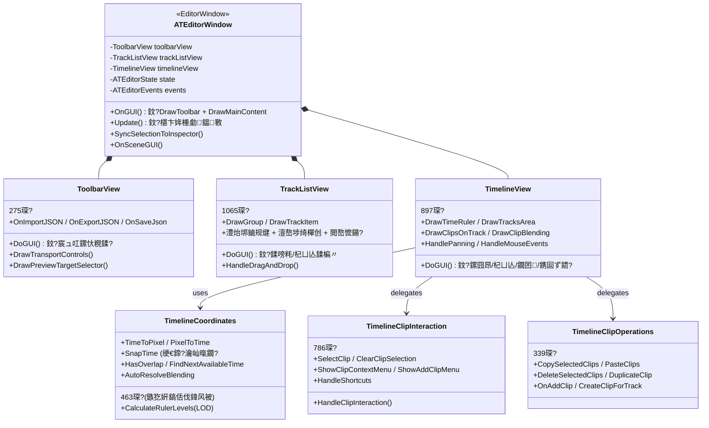

---

## 2. 绐楀彛甯冨眬

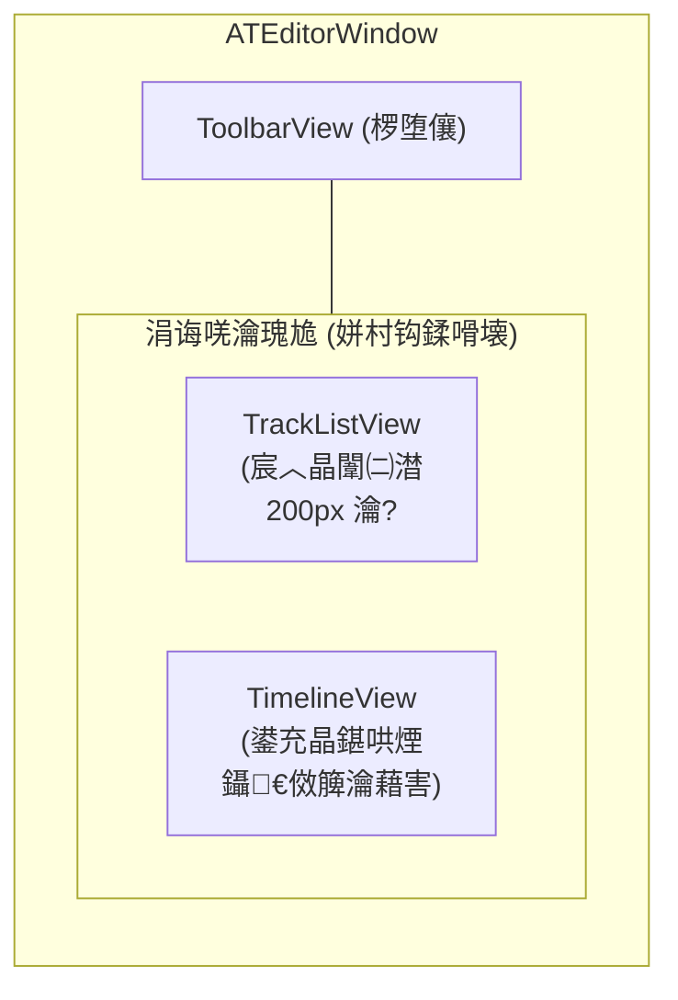

| 鍖哄煙 | 鏂囦欢 | 琛屾暟 | 鑱岃矗 |
|:-----|:-----|:----:|:-----|
| **宸ュ叿鏍?* | `ToolbarView.cs` | 275 | 鎾斁鎺у埗銆佸鍏?瀵煎嚭/淇濆瓨銆佽缃€侀瑙堣鑹?|
| **杞ㄩ亾鍒楄〃** | `TrackListView.cs` | 1065 | 鍒嗙粍/杞ㄩ亾鐨勬爲褰㈠垪琛ㄣ€佹嫋鎷芥帓搴忋€佸彸閿彍鍗曘€侀噸鍛藉悕 |
| **鏃堕棿杞?* | `TimelineView.cs` | 897 | 鏍囧昂銆佽建閬撳尯鍩熴€佺墖娈电粯鍒躲€佹椂闂存寚绀哄櫒 |
| **浜や簰** | `TimelineClipInteraction.cs` | 786 | 鐗囨閫夋嫨銆佹嫋鎷斤紙绉诲姩/缂╂斁/璺ㄨ建閬?铻嶅悎鎵嬫焺锛?|
| **鎿嶄綔** | `TimelineClipOperations.cs` | 339 | 澶嶅埗/绮樿创/鍒犻櫎/鍏嬮殕/娣诲姞 |
| **鍧愭爣** | `TimelineCoordinates.cs` | 463 | 鏃堕棿鈫斿儚绱犺浆鎹€佸惛闄勩€佹爣灏?LOD銆侀噸鍙犳娴?|
| **涓荤獥鍙?* | `ATEditorWindow.cs` | 542 | 缁勮瑙嗗浘銆乁pdate 椹卞姩銆乁ndo銆両nspector 鍚屾 |

---

## 3. ATEditorWindow锛堜富绐楀彛锛?

**鏂囦欢**: [ATEditorWindow.cs](file:///D:/Unity/Server_Game/Assets/ATEditor/Editor/ATEditorWindow.cs) (542琛?

### 3.1 鐢熷懡鍛ㄦ湡

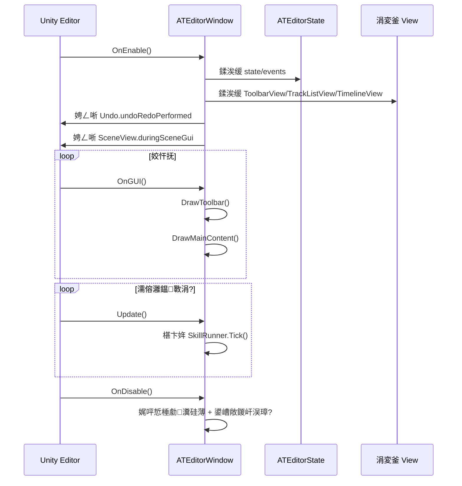

### 3.2 鏍稿績鏂规硶

| 鏂规硶 | 琛岃寖鍥?| 鑱岃矗 |
|:-----|:------:|:-----|
| `OnEnable` | 51-92 | 鍒濆鍖?State/Events/Views锛屽姞杞借瑷€锛屾敞鍐屽洖璋?|
| `OnDisable` | 94-121 | 娓呯悊棰勮 Runner锛屽弽娉ㄥ唽 Undo/SceneView 鍥炶皟 |
| `OnUndoRedo` | 123-186 | Undo 鍚庨噸寤?trackCache + 鍚屾 Inspector |
| `OnGUI` | 201-214 | 甯冨眬璋冪敤 DrawToolbar + DrawMainContent |
| `Update` | 218-258 | 椹卞姩 SkillRunner.Tick + 鍚屾 timeIndicator |
| `DrawMainContent` | 311-358 | 姘村钩鍒嗗壊杞ㄩ亾鍒楄〃鍜屾椂闂磋酱锛屽鐞嗙劍鐐逛簰鏂?|
| `SyncSelectionToInspector` | 453-522 | 灏嗛€変腑鐘舵€佸悓姝ヤ负 SO Wrapper 骞惰涓?Inspector target |
| `OnSceneGUI` | 524-537 | 閬嶅巻閫変腑 Clip 鐨?Drawer 璋冪敤 DrawSceneGUI |

### 3.3 鐒︾偣绠＄悊

```csharp
// DrawMainContent 涓?
if (trackListRect.Contains(e.mousePosition) && e.type == EventType.MouseDown)
{
    timelineView.OnLostFocus();  // 娓呴櫎 Clip 閫変腑
}
if (timelineRect.Contains(e.mousePosition) && e.type == EventType.MouseDown)
{
    trackListView.OnLostFocus(); // 娓呴櫎 Track 閫変腑 + 閫€鍑洪噸鍛藉悕
}
```

- 宸﹀彸闈㈡澘鐐瑰嚮浜掓枼锛氱偣鍑昏建閬撳垪琛ㄦ椂娓呴櫎鏃堕棿杞撮€変腑锛屽弽涔嬩害鐒?

---

## 4. ToolbarView锛堝伐鍏锋爮锛?

**鏂囦欢**: [ToolbarView.cs](file:///D:/Unity/Server_Game/Assets/ATEditor/Editor/Views/ToolbarView.cs) (275琛?

### 4.1 甯冨眬缁撴瀯

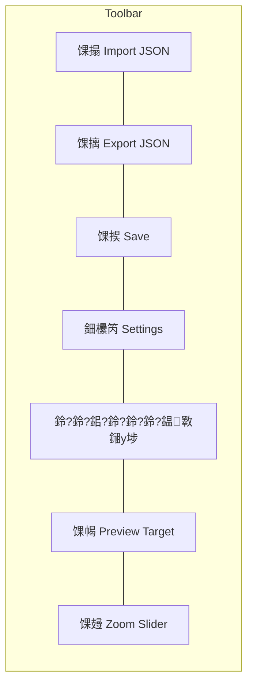

### 4.2 鎾斁鎺у埗

| 鎸夐挳 | 鏂规硶 | 琛屼负 |
|:-----|:-----|:-----|
| 鈴?Jump to Start | `OnJumpToStart` | `timeIndicator = 0` |
| 鈴?Prev Frame | `OnPrevFrame` | `timeIndicator -= 1/frameRate` |
| 鈻?鈴?Play/Pause | `OnTogglePlay` | 濮旀墭缁?Window 澶勭悊鎾斁鐘舵€?|
| 鈴?Next Frame | `OnNextFrame` | `timeIndicator += 1/frameRate` |
| 鈴?Jump to End | `OnJumpToEnd` | `timeIndicator = timeline.duration` |
| 鈴?Stop | `OnStop` | 濮旀墭缁?Window 鍋滄 + 閲嶇疆 |

### 4.3 JSON 鎿嶄綔

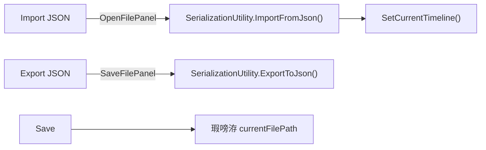

---

## 5. TrackListView锛堣建閬撳垪琛級

**鏂囦欢**: [TrackListView.cs](file:///D:/Unity/Server_Game/Assets/ATEditor/Editor/Views/TrackListView.cs) (1065琛?

### 5.1 鏍稿績娓叉煋

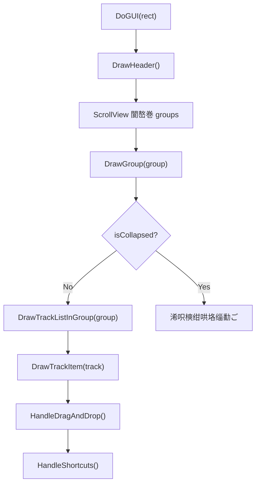

### 5.2 鍔熻兘鍒嗗尯

| 鍔熻兘 | 鏂规硶 | 琛岃寖鍥?|
|:-----|:-----|:------:|
| **缁樺埗** | `DrawHeader`/`DrawGroup`/`DrawTrackItem` | 160-358 |
| **澧炲垹** | `CreateNewGroup`/`OnAddTrackToGroup`/`DeleteTrack`/`DeleteGroup` | 362-557 |
| **鎷栨嫿鎺掑簭** | `HandleDragAndDrop`/`UpdateDropTarget`/`ExecuteDrop` | 569-728 |
| **澶嶅埗绮樿创** | `CopyTrack`/`PasteTrack`/`CopyGroup`/`PasteGroup` | 798-881 |
| **閫変腑** | `SelectTrack`/`SelectGroup`/`ClearTrackSelection` | 901-945 |
| **鍏嬮殕** | `DuplicateGroup`/`DuplicateTrack` | 981-1049 |
| **鍙抽敭鑿滃崟** | `ShowGroupContextMenu`/`ShowTrackContextMenu`/`ShowGlobalContextMenu` | 378-794 |
| **閲嶅懡鍚?* | `OnLostFocus`/`EndRenaming` | 41-85 |

### 5.3 鎷栨嫿鎺掑簭

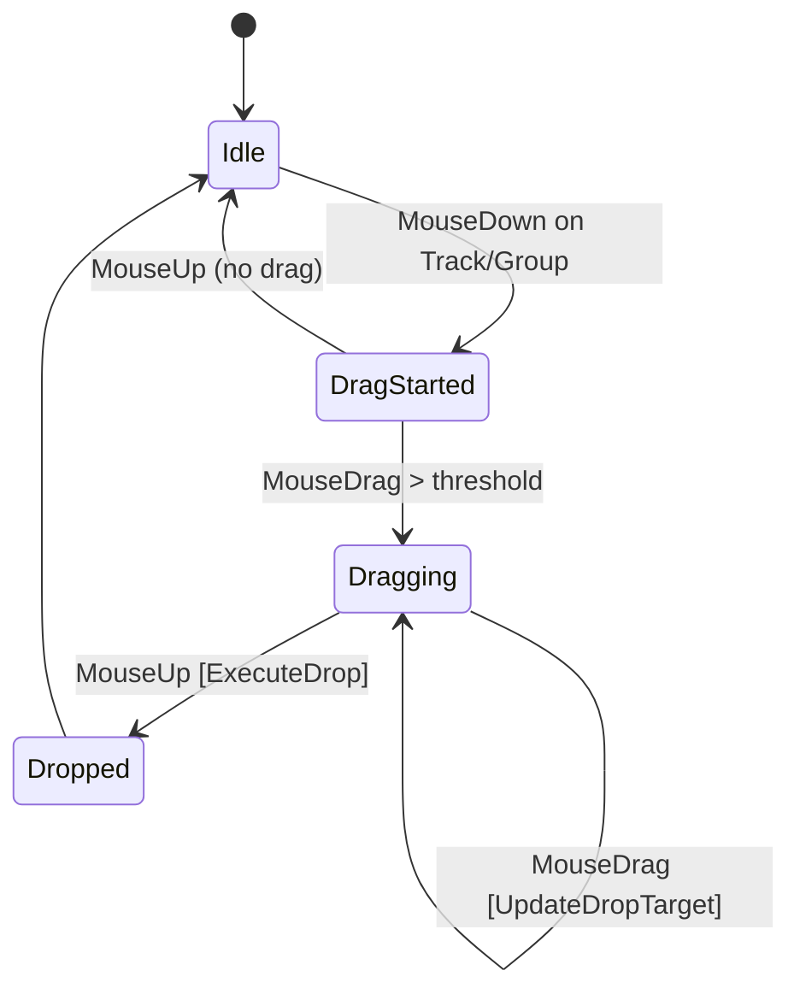

- 鏀寔 **Track 璺?Group 鎷栨斁** 鍜?**Group 閲嶆帓搴?*
- `UpdateDropTarget()` 瀹炴椂璁＄畻鎷栨斁浣嶇疆
- `ExecuteDrop()` 鎵ц瀹為檯鐨勫垪琛ㄩ噸缁?

---

## 6. TimelineView锛堟椂闂磋酱瑙嗗浘锛?

**鏂囦欢**: [TimelineView.cs](file:///D:/Unity/Server_Game/Assets/ATEditor/Editor/Views/TimelineView.cs) (897琛?

### 6.1 娓叉煋娴佺▼

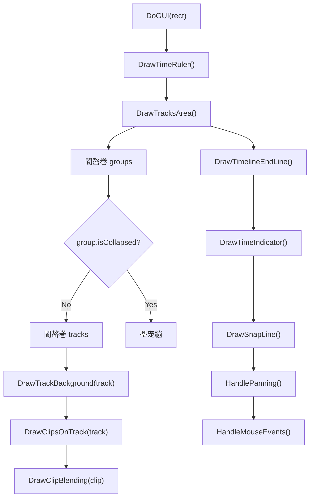

### 6.2 娓叉煋鏂规硶鍒嗘瀽

| 鏂规硶 | 琛岃寖鍥?| 鑱岃矗 |
|:-----|:------:|:-----|
| `DrawTimeRuler` | 102-165 | 鏍囧昂鍒诲害锛堜娇鐢?LOD 鍒嗙骇锛? 鏃堕棿鏂囨湰 |
| `DrawTracksArea` | 167-250 | 閬嶅巻 Group/Track锛岃绠?Y 鍋忕Щ锛岀粯鍒惰建閬撹 |
| `DrawTrackBackground` | 268-288 | 浜ゆ浛鑳屾櫙鑹?+ 閫変腑楂樹寒 |
| `DrawClipsOnTrack` | 290-372 | 涓烘瘡涓?Clip 璁＄畻鐭╁舰 鈫?缁樺埗濉厖/杈规/鍚嶇О/鏃堕棿鏍囩 |
| `DrawClipBlending` | 374-430 | 缁樺埗 BlendIn/BlendOut 涓夎褰㈠尯鍩?|
| `DrawTimeIndicator` | 450-464 | 绾㈣壊绔栫嚎 + 鏃堕棿鏂囨湰 |
| `DrawSnapLine` | 432-448 | 鍚搁檮鏃舵樉绀虹殑缁胯壊杈呭姪绾?|
| `DrawTimelineEndLine` | 252-266 | 鐧借壊绔栫嚎鏍囪 Timeline 鏈 |

### 6.3 浜嬩欢澶勭悊

```mermaid
flowchart TD
    A["HandleMouseEvents()"] --> B{event.type?}
    B -->|ScrollWheel| C["缂╂斁鎿嶄綔"]
    B -->|MouseDown| D{Shift+宸﹂敭?}
    D -->|Yes| E["鏃堕棿绾挎嫋鎷介瑙?]
    D -->|No| F["濮旀墭 ClipInteraction"]
    B -->|MouseDrag| G["ClipInteraction.HandleClipInteraction"]
    B -->|MouseUp| H["缁撴潫鎷栨嫿"]
    B -->|ContextClick| I["ProcessContextClick 鈫?鍙抽敭鑿滃崟"]
    B -->|KeyDown| J["ClipInteraction.HandleShortcuts"]
```

- **Shift+宸﹂敭**: 鏃堕棿鎸囬拡鎷栨嫿瀹氫綅
- **婊氳疆**: 浠ラ紶鏍囦綅缃负閿氱偣鐨勭缉鏀撅紙淇濇寔榧犳爣涓嬬殑鏃堕棿鐐逛笉鍔級
- **榧犳爣浜嬩欢**: 濮旀墭缁?`TimelineClipInteraction` 澶勭悊

---

## 7. TimelineCoordinates锛堝潗鏍囧伐鍏凤級

**鏂囦欢**: [TimelineCoordinates.cs](file:///D:/Unity/Server_Game/Assets/ATEditor/Editor/Views/TimelineCoordinates.cs) (463琛?

### 7.1 鍧愭爣杞崲

```
鏃堕棿 (绉? 鈫愨啋 閫昏緫鍍忕礌 鈫愨啋 鐗╃悊鍍忕礌

TimeToPixel(time) = time 脳 zoom
PixelToTime(pixel) = pixel / zoom
TimeToPhysX(time) = time 脳 zoom - scrollOffset + startMargin
PhysXToTime(physX) = (physX + scrollOffset - startMargin) / zoom
```

### 7.2 鍚搁檮绯荤粺

**涓ょ増 SnapTime**:

| 鐗堟湰 | 鐢ㄩ€?| 鐗规€?|
|:-----|:-----|:-----|
| 绠€鍖栫増 | 閫氱敤鍚搁檮 | 浠呰繑鍥炲惛闄勫悗鏃堕棿鍊?|
| 瀹屾暣鐗?| 鎷栨嫿瀹炴椂 | 杩斿洖 `(snappedTime, isSnapped, minPixelDist)`锛屾敮鎸佹帓闄ゅ綋鍓嶆嫋鎷界殑 Clip |

**鍚搁檮浼樺厛绾?*: 鐗囨杈圭紭 > 甯х綉鏍?> 鏍囧昂鍒诲害

### 7.3 鏍囧昂 LOD锛圠evel of Detail锛?

```mermaid
flowchart LR
    A["CalculateRulerLevels(zoom)"] --> B["璁＄畻姣忕骇鍒诲害闂撮殧"]
    B --> C["30甯у埢搴?] --> D["娆″埢搴?] --> E["涓诲埢搴?] --> F["鏁板瓧鏍囩"]
    style C fill:#555
    style D fill:#888
    style E fill:#aaa
    style F fill:#ddd
```

- 鏍规嵁 `zoom` 鍔ㄦ€佽皟鏁村埢搴﹀瘑搴?
- 鏀寔鍥哄畾甯х巼锛團ixed 妯″紡锛夊拰鍔ㄦ€佸埢搴︼紙Variable 妯″紡锛?

### 7.4 閲嶅彔涓庤瀺鍚?

| 鏂规硶 | 鑱岃矗 |
|:-----|:-----|
| `HasOverlap` | 妫€娴?Clip 鍦ㄧ粰瀹氫綅缃槸鍚︿笌鍚岃建閬撳叾浠?Clip 閲嶅彔 |
| `FindNextAvailableTime` | 鏌ユ壘涓嬩竴涓笉閲嶅彔鐨勬椂闂翠綅缃?|
| `AllowsOverlap` | 鏌ヨ杞ㄩ亾绫诲瀷鏄惁鍏佽閲嶅彔锛坄track.CanOverlap`锛?|
| `AutoResolveBlending` | 鑷姩璁＄畻閲嶅彔閮ㄥ垎鐨?BlendIn/BlendOut 鏃堕暱 |

---

## 8. TimelineClipInteraction锛堢墖娈典氦浜掞級

**鏂囦欢**: [TimelineClipInteraction.cs](file:///D:/Unity/Server_Game/Assets/ATEditor/Editor/Views/TimelineClipInteraction.cs) (786琛?

### 8.1 浜や簰妯″紡

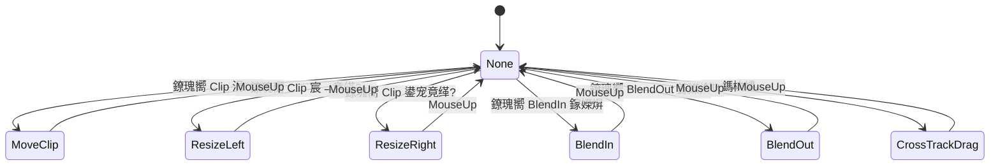

### 8.2 HandleClipInteraction 璇﹁В

**鏍稿績鏂规硶** (L188-592)锛屾渶澶х殑鏂规硶涔嬩竴锛?

```
1. MouseDown:
   - 妫€娴嬬偣鍑讳綅缃?鈫?纭畾 ClipDragMode
   - 璁板綍鍒濆鐘舵€?(SelectedClipInitialState)
   - 璋冪敤 SelectClip() 澶勭悊 Ctrl 澶氶€?

2. MouseDrag:
   - MoveClip: 璁＄畻鏂?startTime + 鍚搁檮 + 鑼冨洿闄愬埗
   - ResizeLeft/Right: 淇敼 startTime/duration + 鏈€灏忓搴︿繚鎶?
   - CrossTrackDrag: 璺ㄨ建閬撶Щ鍔紙鏀瑰彉 Clip 鎵€灞?Track锛?
   - BlendIn/Out: 璋冩暣 blendInDuration/blendOutDuration
   - 澶氶€夋嫋鎷斤細缁存寔鐩稿浣嶇疆鍏崇郴

3. MouseUp:
   - 鎻愪氦淇敼锛圲ndo.Record锛?
   - 閲嶅彔妫€娴?鈫?AutoResolveBlending
   - ResetDragState()
```

### 8.3 閫変腑鏈哄埗

```csharp
// Ctrl 澶氶€?
if (ctrlPressed)
{
    if (state.selectedClips.Contains(clip))
        state.selectedClips.Remove(clip);  // 鍙栨秷閫変腑
    else
        state.selectedClips.Add(clip);     // 杩藉姞閫変腑
}
else
{
    state.selectedClips.Clear();
    state.selectedClips.Add(clip);         // 鍗曢€?
}
```

### 8.4 蹇嵎閿?

| 蹇嵎閿?| 琛屼负 |
|:-------|:-----|
| `Delete` | 鍒犻櫎閫変腑 Clip |
| `Ctrl+C` | 澶嶅埗閫変腑 Clip |
| `Ctrl+V` | 绮樿创 Clip |
| `Ctrl+D` | 鍏嬮殕閫変腑 Clip |
| `Ctrl+A` | 鍏ㄩ€夊綋鍓嶈建閬?|

---

## 9. TimelineClipOperations锛堢墖娈垫搷浣滐級

**鏂囦欢**: [TimelineClipOperations.cs](file:///D:/Unity/Server_Game/Assets/ATEditor/Editor/Views/TimelineClipOperations.cs) (339琛?

### 9.1 鎿嶄綔娴佺▼

```mermaid
flowchart TD
    subgraph 澶嶅埗
        A["CopySelectedClips()"] --> B["閬嶅巻 selectedClips"]
        B --> C["clip.Clone() + 璁板綍 sourceTrackId"]
        C --> D["瀛樺叆 copiedClipsData"]
    end

    subgraph 绮樿创
        E["PasteClips()"] --> F["閬嶅巻 copiedClipsData"]
        F --> G{鍚岃建閬撳彲鐢?}
        G -->|Yes| H["绮樿创鍒板師杞ㄩ亾"]
        G -->|No| I["绮樿创鍒板綋鍓嶉€変腑杞ㄩ亾"]
        H & I --> J["鍐嶆 Clone + 鍋忕Щ鏃堕棿"]
        J --> K["閲嶅彔妫€娴?+ AutoResolve"]
    end

    subgraph 鍒犻櫎
        L["DeleteSelectedClips()"] --> M["Undo.Record"]
        M --> N["閬嶅巻 tracks 鈫?Remove(clip)"]
        N --> O["娓呴櫎閫変腑"]
    end

    subgraph 鍏嬮殕
        P["DuplicateClip()"] --> Q["clip.Clone()"]
        Q --> R["FindNextAvailableTime()"]
        R --> S["娣诲姞鍒板悓涓€ Track"]
    end
```

### 9.2 绫诲瀷鍏煎鎬?

| 鏂规硶 | 鑱岃矗 |
|:-----|:-----|
| `CreateClipForTrack(trackType)` | 閫氳繃 TrackRegistry 鏌ユ壘鍏宠仈 ClipType锛屽弽灏勫疄渚嬪寲 |
| `GetTrackTypeForClip(clipType)` | 鍙嶅悜鏌ユ壘 Clip 瀵瑰簲鐨?Track 绫诲瀷鍚?|
| `IsClipCompatibleWithTrack(clip, track)` | 妫€鏌?Clip 绫诲瀷鏄惁鍖归厤 Track 绫诲瀷 |

---

## 10. 瑙嗗浘闂撮€氫俊

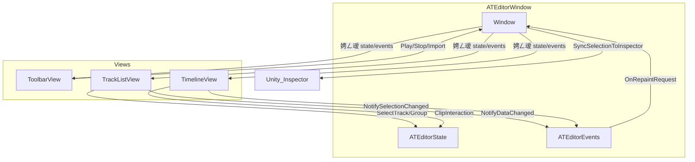

**閫氫俊妯″紡**: 鎵€鏈夎鍥惧叡浜?`state` + `events` 寮曠敤锛岄€氳繃浜嬩欢閫氱煡鍙樻洿

---

## 11. 璁捐璇勪及

### 11.1 浼樺娍

| 鏂归潰 | 璇勪环 |
|:-----|:-----|
| 鑱岃矗鍒嗙 | 鉁?6 涓枃浠跺悇鍙稿叾鑱岋紙娓叉煋/浜や簰/鎿嶄綔/鍧愭爣/宸ュ叿鏍?鍒楄〃锛?|
| 鍧愭爣宸ュ叿鐙珛 | 鉁?`TimelineCoordinates` 鏃犵姸鎬侊紝绾嚱鏁板紡璁捐 |
| 浜や簰涓庢覆鏌撳垎绂?| 鉁?`TimelineView` 鍙粯鍒讹紝浜や簰濮旀墭缁?`ClipInteraction` |
| 鍚搁檮绯荤粺瀹屾暣 | 鉁?鐗囨杈圭紭/甯х綉鏍?鏍囧昂閮芥敮鎸佸惛闄?|
| 澶氶€夋敮鎸?| 鉁?Ctrl 澶氶€?+ 鎵归噺绉诲姩/澶嶅埗/鍒犻櫎 |
| 鎷栨嫿鎺掑簭 | 鉁?Track/Group 閮芥敮鎸佹嫋鎷介噸鎺?|
| Undo 闆嗘垚 | 鉁?鎵€鏈夋暟鎹慨鏀规搷浣滈兘璁板綍 Undo |
| LOD 鏍囧昂 | 鉁?鏍规嵁缂╂斁绾у埆鑷€傚簲鍒诲害瀵嗗害 |

### 11.2 闇€瑕佸叧娉ㄧ殑闂

| 鏄惁瑙ｅ喅 | 闂 | 涓ラ噸绋嬪害 | 璇存槑 |
|:----:|:--------:|:-----|:----:|
| 鉂?| HandleClipInteraction 鏂规硶杩囬暱 | 馃煛 涓?| 404 琛岀殑瓒呭ぇ鏂规硶锛圠188-592锛夛紝鍖呭惈鎵€鏈夋嫋鎷芥ā寮忕殑澶勭悊閫昏緫 |
| 鉂?| HandleMouseEvents 鏂规硶杩囬暱 | 馃煛 涓?| 270 琛岋紙L585-855锛夛紝鍖呭惈婊氳疆/鐐瑰嚮/鎷栨嫿/妗嗛€夌殑鎵€鏈変簨浠?|
| 鉂?| TrackListView 浣撻噺澶?| 馃煛 涓?| 1065 琛屽寘鍚粯鍒?鎿嶄綔+鑿滃崟+鎷栨嫿锛屽彲鑰冭檻杩涗竴姝ユ媶鍒?|
| 鉂?| 纭紪鐮?Magic Numbers | 馃煝 浣?| 濡?`TRACK_HEIGHT=40`, `GROUP_HEIGHT=30` 绛夊垎鏁ｅ湪澶氫釜鏂囦欢涓?|
| 鉂?| OnSceneGUI Drawer 璋冪敤 | 馃煝 浣?| 閬嶅巻鎵€鏈夐€変腑 Clip 璋冪敤 DrawSceneGUI锛屽ぇ閲?Clip 閫変腑鏃跺彲鑳藉奖鍝嶆€ц兘 |

---

## 闄勫綍锛氭枃浠舵竻鍗?

| 鏂囦欢璺緞 | 琛屾暟 | 澶у皬 | 瑙掕壊 |
|:---------|:----:|:----:|:-----|
| `Editor/ATEditorWindow.cs` | 542 | 18.1KB | 涓荤獥鍙?EditorWindow |
| `Editor/Views/ToolbarView.cs` | 275 | 9.5KB | 宸ュ叿鏍忚鍥?|
| `Editor/Views/TrackListView.cs` | 1065 | 40.1KB | 杞ㄩ亾鍒楄〃瑙嗗浘 |
| `Editor/Views/TimelineView.cs` | 897 | 37.7KB | 鏃堕棿杞磋鍥?|
| `Editor/Views/TimelineCoordinates.cs` | 463 | 15.7KB | 鍧愭爣宸ュ叿绫?|
| `Editor/Views/TimelineClipInteraction.cs` | 786 | 31.7KB | 鐗囨浜や簰澶勭悊 |
| `Editor/Views/TimelineClipOperations.cs` | 339 | 11.3KB | 鐗囨鏁版嵁鎿嶄綔 |
| **鍚堣** | **4367** | **164KB** | - |
