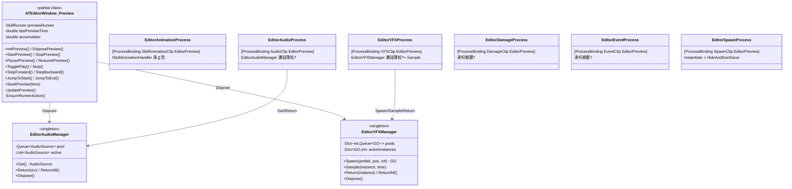
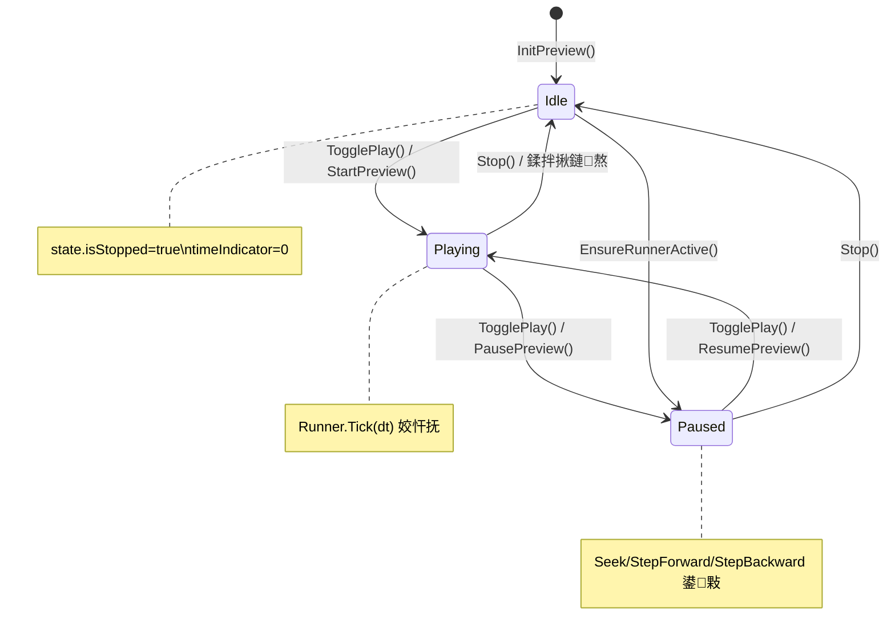
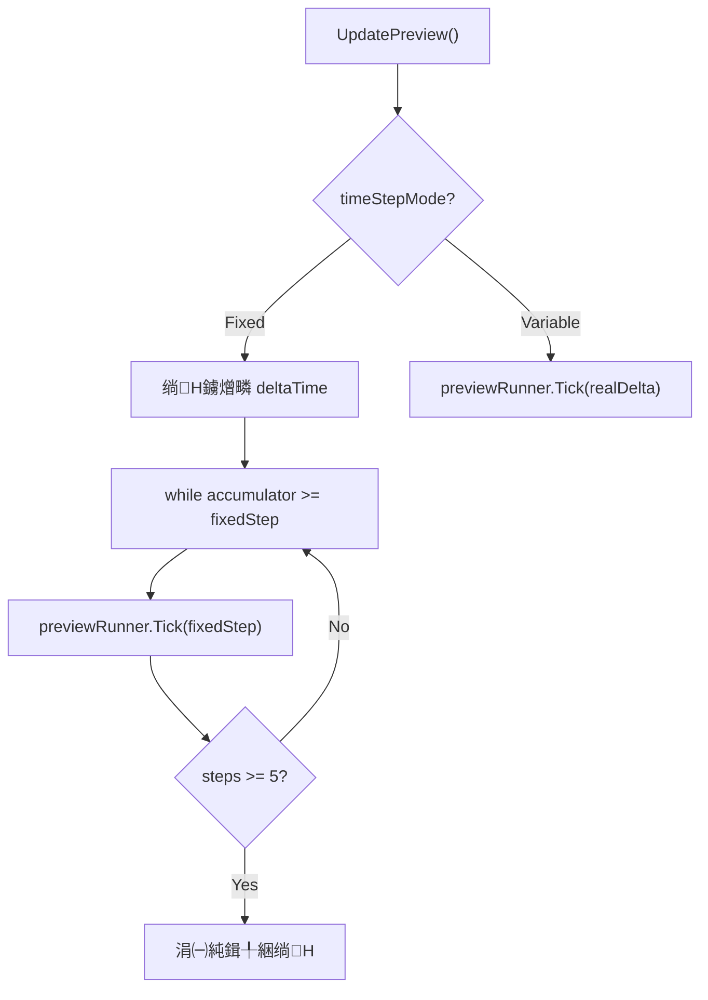
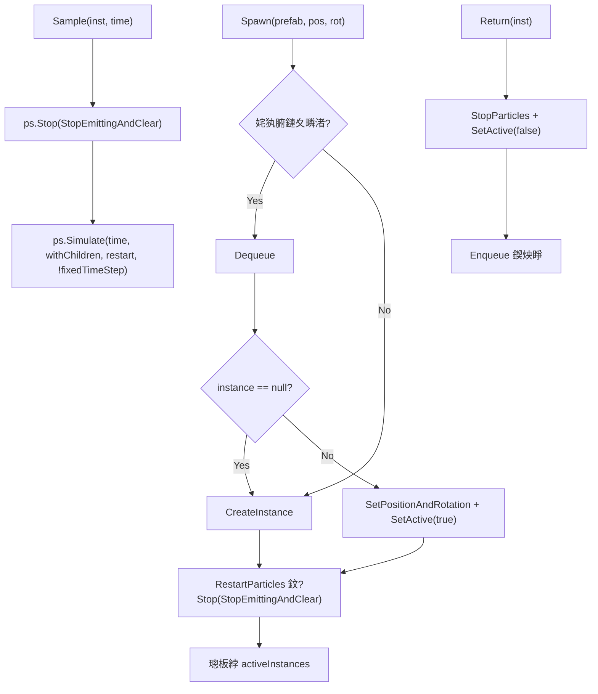
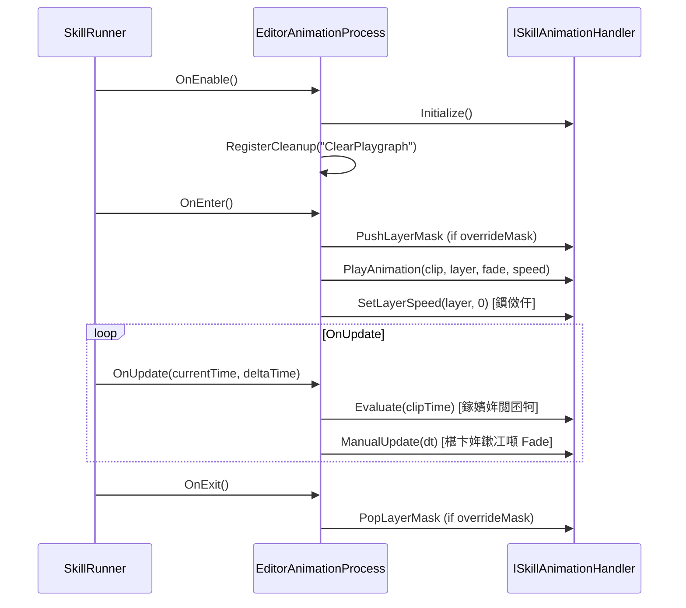
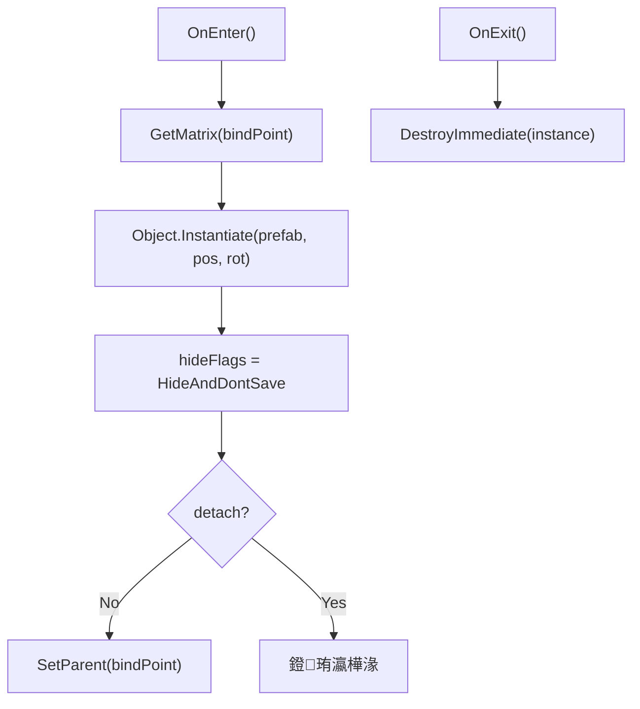
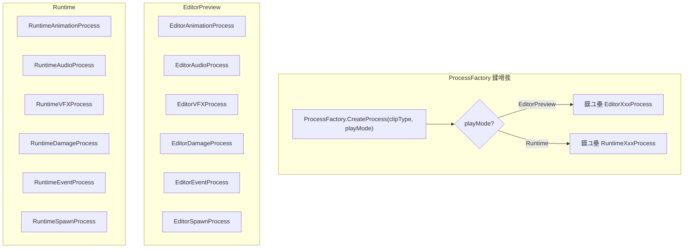

# SkillEditor 缂栬緫鍣?Logic 灞傚垎鏋愭姤鍛?

> **鍒嗘瀽鑼冨洿**: `Editor/Playback/`锛圥review partial + 2涓?Manager + 6涓?Process锛? `Editor/ATEditorSettingsWindow.cs`
> **鍒嗘瀽鏃ユ湡**: 2026-02-22
> **鍒嗘瀽缁村害**: 缂栬緫鍣?脳 Logic

---

## 1. 缂栬緫鍣?Logic 灞傛灦鏋?



---

## 2. 棰勮鎾斁绯荤粺锛圫killEditorWindow.Preview锛?

**鏂囦欢**: [ATEditorWindow.Preview.cs](file:///D:/Unity/Server_Game/Assets/ATEditor/Editor/Playback/ATEditorWindow.Preview.cs) (310琛?

### 2.1 鐘舵€佹満



### 2.2 鏃堕棿姝ラ暱妯″紡



| 妯″紡 | 琛屼负 | 閫傜敤鍦烘櫙 |
|:-----|:-----|:---------|
| **Variable** | 鐩存帴浣跨敤鐪熷疄 deltaTime | 娴佺晠棰勮 |
| **Fixed** | 鎸?`1/frameRate` 鍥哄畾姝ラ暱娑堣€楃疮绉椂闂?| 绮剧‘甯у榻愶紝鏀寔鏈嶅姟鍣ㄥ悓姝ラ獙璇?|

**闃茶拷璧舵満鍒?*: Fixed 妯″紡闄愬埗姣忓抚鏈€澶?5 姝ワ紝瓒呭嚭閮ㄥ垎涓㈠純锛岄槻姝㈠崱椤垮悗鏃犻檺杩借刀銆?

### 2.3 鏍稿績鏂规硶

| 鏂规硶 | 琛屼负 |
|:-----|:-----|
| `InitPreview` | 鍒涘缓 `SkillRunner(EditorPreview)` + `ProcessContext`锛屾敞鍏?`SkillServiceFactory` |
| `StartPreview` | `runner.Play(timeline, context)` |
| `TogglePlay` | 鏅鸿兘鍒囨崲锛欼dle鈫扨lay锛堟湯灏捐嚜鍔ㄥ洖澶达級銆丳laying鈫扨ause銆丳aused鈫扲esume |
| `SeekPreview` | 鏆傚仠鈫抈EnsureRunnerActive`鈫抈runner.Seek(time)` |
| `StepForward/Backward` | 鏆傚仠鈫抈runner.Seek(卤1/frameRate)` |
| `EnsureRunnerActive` | Idle 鏃惰嚜鍔?Start+Pause 浠ュ惎鐢?Process |

### 2.4 棰勮閫熷害

```csharp
accumulator += realDelta * state.previewSpeedMultiplier;
```

- `previewSpeedMultiplier` 褰卞搷绱Н閫熷害锛屽疄鐜板彉閫熼瑙堬紙0.1x ~ 3.0x锛?

---

## 3. EditorAudioManager锛堢紪杈戝櫒闊抽绠＄悊锛?

**鏂囦欢**: [EditorAudioManager.cs](file:///D:/Unity/Server_Game/Assets/ATEditor/Editor/Playback/EditorAudioManager.cs) (120琛?

```mermaid
flowchart LR
    subgraph EditorAudioManager
        A["Queue<AudioSource> pool"]
        B["List<AudioSource> active"]
    end

    C["Get()"] -->|"Dequeue"| A
    A -->|绌簗 D["new GameObject + AddComponent"]
    C -->|"Add"| B

    E["Return(src)"] -->|"Remove"| B
    E -->|"Enqueue"| A
    E -->|"Stop + clip=null + SetActive(false)"| F["閲嶇疆"]
```

| 鐗规€?| 鍒嗘瀽 |
|:-----|:-----|
| 鎯版€у崟渚?| 鉁?`instance ??= new EditorAudioManager()` |
| HideAndDontSave | 鉁?GameObject 闅愯棌涓斾笉淇濆瓨鍒板満鏅?|
| 瀹屾暣閲嶇疆 | 鉁?`ResetSource` 閲嶇疆 volume/pitch/loop/spatialBlend/time |
| `Dispose` | 鉁?ReturnAll + DestroyImmediate(audioRoot) + instance=null |
| 閲嶅妫€鏌?| 鉁?`Return` 妫€鏌?`pool.Contains(src)` 闃叉閲嶅鍏ユ睜 |

---

## 4. EditorVFXManager锛堢紪杈戝櫒 VFX 绠＄悊锛?

**鏂囦欢**: [EditorVFXManager.cs](file:///D:/Unity/Server_Game/Assets/ATEditor/Editor/Playback/EditorVFXManager.cs) (171琛?



### 鍏抽敭鏂规硶锛歋ample

```csharp
public void Sample(GameObject instance, float time)
{
    var particles = instance.GetComponentsInChildren<ParticleSystem>();
    foreach (var ps in particles)
    {
        ps.Stop(true, ParticleSystemStopBehavior.StopEmittingAndClear);
        ps.Simulate(time, true, true, false);
    }
}
```

- **Stop + Simulate 妯″紡**: 姣忔閲囨牱鍏堟竻闄ゆ墍鏈夌矑瀛愶紝鐒跺悗浠庢椂闂?0 妯℃嫙鍒扮洰鏍囨椂闂?
- 鏀寔 Seek/Scrub 鏃剁簿纭瑙堢矑瀛愮姸鎬?
- 鈿狅笍 鏃堕棿瓒婇暱锛宍Simulate` 鎬ц兘寮€閿€瓒婂ぇ锛堢嚎鎬у闀匡級

| 瀵规瘮 | EditorVFXManager | VFXPoolManager (Runtime) |
|:-----|:-----------------|:-------------------------|
| 姹犵粨鏋?| `Dict<int, Queue<GO>>` | `Dict<int, Stack<GO>>` |
| 绮掑瓙鎺у埗 | 鉁?Sample/Simulate | 鉂?鏃犻噰鏍?|
| HideFlags | 鉁?DontSave | 鉂?鏃?|
| 鏆撮湶 API | 鉁?VfxRoot / Sample | 浠?Spawn/Return |

---

## 5. Editor Process 瀹炵幇

### 5.1 杩愯鏃?vs 缂栬緫鍣?Process 瀵规瘮

| Clip 绫诲瀷 | Runtime Process | Editor Process | 鍏抽敭宸紓 |
|:----------|:---------------|:---------------|:---------|
| SkillAnimationClip | `RuntimeAnimationProcess` | `EditorAnimationProcess` | 缂栬緫鍣ㄧ敤 `Evaluate`+`ManualUpdate` 閲囨牱 |
| AudioClip | `RuntimeAudioProcess` | `EditorAudioProcess` | 缂栬緫鍣ㄧ敤 `EditorAudioManager` 姹?|
| VFXClip | `RuntimeVFXProcess` | `EditorVFXProcess` | 缂栬緫鍣ㄧ敤 `EditorVFXManager` + `Sample` |
| DamageClip | `RuntimeDamageProcess` | `EditorDamageProcess` | 缂栬緫鍣ㄤ粎鏃ュ織 |
| EventClip | `RuntimeEventProcess` | `EditorEventProcess` | 缂栬緫鍣ㄤ粎鏃ュ織 |
| SpawnClip | `RuntimeSpawnProcess` | `EditorSpawnProcess` | 缂栬緫鍣ㄧ敤 `Instantiate` + `HideAndDontSave` |

### 5.2 EditorAnimationProcess

**鏂囦欢**: [EditorAnimationProcess.cs](file:///D:/Unity/Server_Game/Assets/ATEditor/Editor/Playback/Processes/EditorAnimationProcess.cs) (65琛?



**鍏抽敭璁捐**: 缂栬緫鍣ㄤ笉渚濊禆 Unity 鑷姩鎾斁鍔ㄧ敾锛岃€屾槸閫氳繃 `Evaluate` 绮剧‘閲囨牱鍒版寚瀹氭椂闂寸偣锛屾敮鎸?Seek/Scrub銆?

### 5.3 EditorAudioProcess

**鏂囦欢**: [EditorAudioProcess.cs](file:///D:/Unity/Server_Game/Assets/ATEditor/Editor/Playback/Processes/EditorAudioProcess.cs) (120琛?

| 鍔熻兘 | 瀹炵幇 |
|:-----|:-----|
| 鑾峰彇 AudioSource | `EditorAudioManager.Instance.Get()` |
| Pitch 鍚屾 | `clip.pitch * context.GlobalPlaySpeed`锛堟敮鎸佸彉閫燂級 |
| 寰幆澶勭悊 | `Mathf.Repeat(clipLocalTime, clipLength)` |
| Scrub 鍚屾 | `audioSource.time` 鍋忓樊 > 0.1s 鏃跺己鍒跺悓姝?|
| 鏆傚仠妫€娴?| `GlobalPlaySpeed == 0` 鈫?`audioSource.Pause()` |
| 褰掕繕 | `OnExit` 鈫?`EditorAudioManager.Instance.Return(src)` |

### 5.4 EditorVFXProcess

**鏂囦欢**: [EditorVFXProcess.cs](file:///D:/Unity/Server_Game/Assets/ATEditor/Editor/Playback/Processes/EditorVFXProcess.cs) (194琛?

鏈€澶嶆潅鐨勭紪杈戝櫒 Process锛岄澶栧姛鑳斤細

| 鍔熻兘 | 璇存槑 |
|:-----|:-----|
| 楠ㄩ瑙ｆ瀽闄嶇骇閾?| `ISkillActor` 鈫?`Animator.GetBoneTransform` 鈫?`OwnerTransform` |
| followTarget | 姣忓抚鏇存柊 Transform |
| Sample 椹卞姩 | `EditorVFXManager.Instance.Sample(inst, clipTime)` |
| GetCurrentRelativeOffset | 浠庝笘鐣屽潗鏍囬€嗗悜璁＄畻 posOffset/rotOffset锛堜緵 Drawer 鍚屾 Handles 淇敼锛?|
| GetHumanBone | 缂栬緫鍣ㄧ嫭鏈夌殑 HumanBodyBones 鏄犲皠 |

### 5.5 EditorDamageProcess & EditorEventProcess

**鏂囦欢**: [EditorDamageProcess.cs](file:///D:/Unity/Server_Game/Assets/ATEditor/Editor/Playback/Processes/EditorDamageProcess.cs) (41琛? / [EditorEventProcess.cs](file:///D:/Unity/Server_Game/Assets/ATEditor/Editor/Playback/Processes/EditorEventProcess.cs) (23琛?

- **涓よ€呴兘鏄棩蹇楀崰浣?*: 缂栬緫鍣ㄧ幆澧冩棤鐪熷疄鎴樻枟瀹炰綋
- DamageProcess 鍖哄垎 `HitFrequency.Once`锛圤nEnter 瑙﹀彂锛夊拰 `Interval`锛堝懆鏈熻Е鍙戯級杈撳嚭鏃ュ織
- EventProcess 浠?`OnEnter` 鎵撳嵃浜嬩欢鍚?

### 5.6 EditorSpawnProcess

**鏂囦欢**: [EditorSpawnProcess.cs](file:///D:/Unity/Server_Game/Assets/ATEditor/Editor/Playback/Processes/EditorSpawnProcess.cs) (104琛?



- 涓庤繍琛屾椂鐨?`ISkillSpawnHandler` 涓嶅悓锛岀紪杈戝櫒鐩存帴 `Instantiate` + `DestroyImmediate`
- `HideAndDontSave` 闃叉璇繚瀛樺埌鍦烘櫙
- 涓嶈蛋瀵硅薄姹狅紙棰勮鍦烘櫙瀹炰緥鏁板皯锛?

---

## 6. ATEditorSettingsWindow锛堣缃獥鍙ｏ級

**鏂囦欢**: [ATEditorSettingsWindow.cs](file:///D:/Unity/Server_Game/Assets/ATEditor/Editor/ATEditorSettingsWindow.cs) (100琛?

### 璁剧疆椤?

| 璁剧疆 | 鎺т欢 | 鎸佷箙鍖?|
|:-----|:-----|:------:|
| **甯х巼** | IntPopup (15/30/60) | EditorPrefs |
| **鏃堕棿姝ラ暱** | EnumPopup (Variable/Fixed) | EditorPrefs |
| **甯у惛闄?* | Toggle (鍙锛岃嚜鍔? | 娲剧敓鍊?|
| **纾佹€у惛闄?* | Toggle | EditorPrefs |
| **棰勮閫熷害** | Slider (0.1-3.0) | EditorPrefs |
| **榛樿棰勮瑙掕壊** | ObjectField (Prefab) | EditorPrefs |
| **璇█** | Popup | EditorPrefs |

---

## 7. 缂栬緫鍣?vs 杩愯鏃?Process 缁戝畾



**`[ProcessBinding]` 鐗规€?*鍐冲畾缁戝畾鍏崇郴锛?
- `[ProcessBinding(typeof(VFXClip), PlayMode.EditorPreview)]` 鈫?EditorVFXProcess
- `[ProcessBinding(typeof(VFXClip), PlayMode.Runtime)]` 鈫?RuntimeVFXProcess

---

## 8. 璁捐璇勪及

### 8.1 浼樺娍

| 鏂归潰 | 璇勪环 |
|:-----|:-----|
| 缂栬緫鍣?杩愯鏃跺畬鍏ㄩ殧绂?| 鉁?閫氳繃 `PlayMode` 鍖哄垎锛屽悓涓€涓?SkillRunner 椹卞姩涓嶅悓 Process |
| 鎵嬪姩閲囨牱 | 鉁?鍔ㄧ敾 Evaluate + 绮掑瓙 Simulate 鏀寔绮剧‘ Seek/Scrub |
| HideAndDontSave | 鉁?棰勮瀵硅薄涓嶆薄鏌撳満鏅?|
| 瀵硅薄姹犵鐞嗗櫒 | 鉁?Audio/VFX 閮芥湁鐙珛鐨勭紪杈戝櫒涓撶敤瀵硅薄姹?|
| Fixed/Variable 鍙屾ā寮?| 鉁?鏀寔绮剧‘甯у榻愬拰娴佺晠棰勮涓ょ闇€姹?|
| 闃茶拷璧舵満鍒?| 鉁?Fixed 妯″紡鏈€澶?5 姝?甯э紝闃叉鍗￠】鍚庨洩宕?|
| 棰勮閫熷害鍊嶇巼 | 鉁?0.1x~3.0x 鍙橀€熼瑙?|

### 8.2 闇€瑕佸叧娉ㄧ殑闂

| 鏄惁瑙ｅ喅 | 闂 | 涓ラ噸绋嬪害 | 璇存槑 |
|:----:|:--------:|:-----|:----:|
| 鉂?| VFX Sample 鎬ц兘 | 馃煛 涓?| `Simulate(time)` 姣忔浠?0 寮€濮嬫ā鎷燂紝鏃堕棿瓒婇暱寮€閿€瓒婂ぇ |
| 鉂?| Debug.Log 娈嬬暀 | 馃煝 浣?| `SeekPreview` 涓湁璋冭瘯鏃ュ織鏈竻鐞?|
| 鉂?| EditorSpawnProcess 鏃犳睜鍖?| 馃煝 浣?| 姣忔 Instantiate/DestroyImmediate锛屾棤瀵硅薄澶嶇敤 |
| 鉂?| GetHumanBone 閲嶅瀹氫箟 | 馃煝 浣?| `EditorVFXProcess` 涓殑楠ㄩ鏄犲皠涓?`CharSkillActor` 閲嶅 |
| 鉂?| 棰勮 Target 鍙樻洿鏈嚜鍔ㄩ噸寤?| 馃煝 浣?| 鍒囨崲棰勮瑙掕壊鍚庨渶鎵嬪姩 InitPreview |

---

## 闄勫綍锛氭枃浠舵竻鍗?

| 鏂囦欢璺緞 | 琛屾暟 | 澶у皬 | 瑙掕壊 |
|:---------|:----:|:----:|:-----|
| `Editor/Playback/ATEditorWindow.Preview.cs` | 310 | 10.8KB | 棰勮鎾斁 partial |
| `Editor/Playback/EditorAudioManager.cs` | 120 | 3.5KB | 缂栬緫鍣ㄩ煶棰戞睜 |
| `Editor/Playback/EditorVFXManager.cs` | 171 | 5.7KB | 缂栬緫鍣?VFX 姹?|
| `Editor/Playback/Processes/EditorAnimationProcess.cs` | 65 | 2.4KB | 鍔ㄧ敾棰勮 Process |
| `Editor/Playback/Processes/EditorAudioProcess.cs` | 120 | 4.8KB | 闊抽棰勮 Process |
| `Editor/Playback/Processes/EditorVFXProcess.cs` | 194 | 7.2KB | VFX 棰勮 Process |
| `Editor/Playback/Processes/EditorDamageProcess.cs` | 41 | 1.6KB | 浼ゅ鏃ュ織 Process |
| `Editor/Playback/Processes/EditorEventProcess.cs` | 23 | 714B | 浜嬩欢鏃ュ織 Process |
| `Editor/Playback/Processes/EditorSpawnProcess.cs` | 104 | 4.3KB | 鐢熸垚棰勮 Process |
| `Editor/ATEditorSettingsWindow.cs` | 100 | 4.1KB | 璁剧疆绐楀彛 |
| **鍚堣** | **1248** | **45KB** | - |
