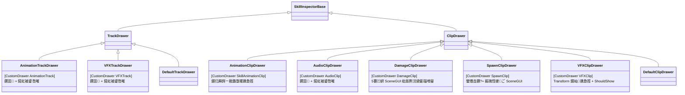
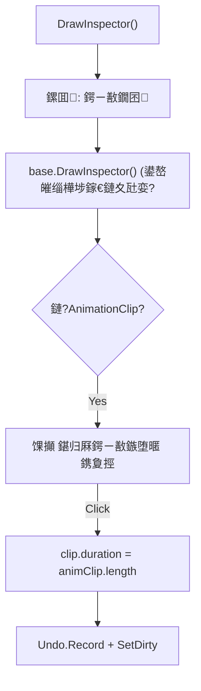

# SkillEditor 鍚勮建閬?鐗囨 Drawer 瀹炵幇鍒嗘瀽鎶ュ憡

> **鍒嗘瀽鑼冨洿**: `Editor/Drawers/Impl/` 鍏ㄩ儴7涓?Drawer 瀹炵幇鏂囦欢
> **鍒嗘瀽鏃ユ湡**: 2026-02-22
> **鍒嗘瀽缁村害**: 缂栬緫鍣?脳 Drawer 鍏蜂綋瀹炵幇

---

## 1. Drawer 娉ㄥ唽鎬昏



### 娉ㄥ唽鏄犲皠琛?

| 鏁版嵁绫诲瀷 | Drawer | 琛屾暟 | Inspector 鎵╁睍 | SceneGUI |
|:---------|:-------|:----:|:--------------:|:--------:|
| `AnimationTrack` | `AnimationTrackDrawer` | 19 | 鏍囬 | 鉂?|
| `VFXTrack` | `VFXTrackDrawer` | 19 | 鏍囬 | 鉂?|
| `SkillAnimationClip` | `AnimationClipDrawer` | 45 | 鉁?鍖归厤鍔ㄧ敾鏃堕暱 | 鉂?|
| `AudioClip` | `AudioClipDrawer` | 24 | 鏍囬 | 鉂?|
| `DamageClip` | `DamageClipDrawer` | 161 | 鍩虹被鍙嶅皠 | 鉁?5绉嶇鎾炰綋 |
| `SpawnClip` | `SpawnClipDrawer` | 90 | 鍩虹被鍙嶅皠 | 鉁?鐢熸垚鐐?绠ご |
| `VFXClip` | `VFXClipDrawer` | 128 | 鉁?Transform 鍚屾 | 鉂?|
| 鍏朵粬 Track | `DefaultTrackDrawer` | - | 鍩虹被鍙嶅皠 | 鉂?|
| 鍏朵粬 Clip | `DefaultClipDrawer` | - | 鍩虹被鍙嶅皠 | 鉂?|

> [!NOTE]
> **鏃犺嚜瀹氫箟 Drawer 鐨勭被鍨?*锛歚DamageTrack`銆乣AudioTrack`銆乣SpawnTrack`銆乣EventTrack`銆乣CameraTrack`銆乣MovementTrack`銆乣EventClip`銆乣CameraClip`銆乣MovementClip` 鈥?杩欎簺绫诲瀷鍏ㄩ儴浣跨敤 `DefaultDrawer` 鐨勫熀绫诲弽灏勭粯鍒躲€?

---

## 2. AnimationClipDrawer

**鏂囦欢**: [AnimationClipDrawer.cs](file:///D:/Unity/Server_Game/Assets/ATEditor/Editor/Drawers/Impl/AnimationClipDrawer.cs) (45琛?

### 鍔熻兘



- **鍖归厤鎸夐挳**: 涓€閿皢 Clip 鐨?`duration` 璁剧疆涓哄疄闄?AnimationClip 鐨勬椂闀?
- 浣跨敤 `d_Refresh` 鍐呯疆鍥炬爣鎻愬崌瑙嗚鏁堟灉

---

## 3. AudioClipDrawer

**鏂囦欢**: [AudioClipDrawer.cs](file:///D:/Unity/Server_Game/Assets/ATEditor/Editor/Drawers/Impl/AudioClipDrawer.cs) (24琛?

- 鏈€绠€鍗曠殑鑷畾涔?Drawer
- 浠呮坊鍔?"闊抽鐗囨璁剧疆" 鏍囬鏍囩
- 鎵€鏈夊瓧娈电敱鍩虹被鍙嶅皠鑷姩缁樺埗

---

## 4. DamageClipDrawer锛堟渶澶嶆潅锛?

**鏂囦欢**: [DamageClipDrawer.cs](file:///D:/Unity/Server_Game/Assets/ATEditor/Editor/Drawers/Impl/DamageClipDrawer.cs) (161琛?

### 4.1 SceneGUI 纰版挒浣撳彲瑙嗗寲

```mermaid
flowchart TD
    A["DrawSceneGUI()"] --> B["鍒ゆ柇 isActive (鏃堕棿鑼冨洿鍐?"]
    B --> C["GetMatrix 鈫?pos + rot"]
    C --> D["Handles.matrix = TRS(pos, rot, 1)"]
    D --> E{shape.shapeType?}
    E -->|Sphere| F["3杞村渾寮?+ 瀹炲績搴曠洏"]
    E -->|Box| G["DrawWireCube"]
    E -->|Capsule| H["涓婁笅鍗婄悆 + 韬共4绾?]
    E -->|Sector| I["鎵囧舰寮?+ 涓婁笅闈?+ 渚ц竟"]
    E -->|Ring| J["鍐呭鍦?+ 8绔栫嚎"]
```

### 4.2 浜旂纰版挒浣撶粯鍒?

| 褰㈢姸 | 娓叉煋鍏冪礌 | 鍙傛暟 |
|:-----|:---------|:-----|
| **Sphere** | 涓夎酱绾挎鍦嗗姬 + 搴曢儴瀹炲績鐩?| `radius` |
| **Box** | 绾挎绔嬫柟浣?| `size (Vector3)` |
| **Capsule** | 涓婁笅鍗婄悆(鍚?涓崐鍦嗗姬) + 涓婁笅姘村钩鍦?+ 4鏍瑰瀭鐩寸嚎 | `radius`, `height` |
| **Sector** | 涓婁笅鎵囧舰寮?+ 渚ц竟绾?+ 鍨傜洿杩炵嚎 + 瀹炲績鎵囬潰 | `radius`, `angle`, `height` |
| **Ring** | 鍐呭涓婁笅鍏?鍦嗗姬 + 8鍨傜洿杈呭姪绾?| `radius`, `innerRadius`, `height` |

### 4.3 棰滆壊缂栫爜

| 鐘舵€?| 绾挎鑹?| 濉厖鑹?|
|:-----|:-------|:-------|
| **婵€娲讳腑**锛堟椂闂磋寖鍥村唴锛?| 馃煝 `(0,1,0,0.8)` | 馃煝 `(0,1,0,0.2)` |
| **闈炴縺娲?* | 鈿?`(0.5,0.5,0.5,0.5)` | 鈿?`(0.5,0.5,0.5,0.1)` |

---

## 5. SpawnClipDrawer

**鏂囦欢**: [SpawnClipDrawer.cs](file:///D:/Unity/Server_Game/Assets/ATEditor/Editor/Drawers/Impl/SpawnClipDrawer.cs) (90琛?

### SceneGUI 鐢熸垚鐐瑰彲瑙嗗寲

```mermaid
flowchart TD
    A["DrawSceneGUI()"] --> B["GetMatrix 鈫?pos + rot"]
    B --> C["馃數 灏忕悆浣?(r=0.2)"]
    C --> D["3杞村崐閫忔槑鍦嗙洏"]
    D --> E["鉃★笍 姝ｅ墠鏂圭澶?(length=1.5)"]
    E --> F["鍗佸瓧鍑嗘槦杈呭姪绾?]
```

| 鍏冪礌 | 棰滆壊 | 璇存槑 |
|:-----|:-----|:-----|
| 椤剁偣鐞?| 馃數 Cyan `(0,1,1,0.8)` | 鐢熸垚鍘熺偣浣嶇疆 |
| 鍦嗙洏 | 鍗婇€忔槑 Cyan | 涓?鍙?鍓嶄笁涓柟鍚?|
| 绠ご | 馃數 Cyan | 1.5 鍗曚綅闀跨殑鏂瑰悜鎸囩ず |
| 鍗佸瓧绾?| 鐧借壊鍗婇€忔槑 | 杈呭姪瀵归綈 |

---

## 6. VFXClipDrawer

**鏂囦欢**: [VFXClipDrawer.cs](file:///D:/Unity/Server_Game/Assets/ATEditor/Editor/Drawers/Impl/VFXClipDrawer.cs) (128琛?

### 6.1 Inspector 鎵╁睍

```mermaid
flowchart TD
    A["DrawInspector()"] --> B["base.DrawInspector() + 妫€娴嬪彉鏇?]
    B --> C{effectPrefab != null?}
    C -->|No| D["缁撴潫"]
    C -->|Yes| E["鏌ユ壘娲昏穬鐨?EditorVFXProcess"]
    E --> F{鎵惧埌娲昏穬瀹炰緥?}
    F -->|Yes| G["GetCurrentRelativeOffset()"]
    G --> H{offset 鏈夊彉鍖?}
    H -->|Yes| I["馃煛 鍚屾鍙樻崲 (鏈夊彉鏇? 鎸夐挳"]
    H -->|No| J["鉁?鍙樻崲宸插悓姝?鎸夐挳"]
    I -->|Click| K["鍥炲啓 posOffset/rotOffset/scale"]
    F -->|No| L["绂佺敤鎸夐挳: 璇峰湪棰勮妯″紡涓嬮€変腑鎾斁浠ュ悓姝?]
```

### 6.2 瀹炴椂 Transform 鍚屾

| 鍔熻兘 | 璇存槑 |
|:-----|:-----|
| **灞炴€у彉鏇存娴?* | `EditorGUI.BeginChangeCheck` 妫€娴嬪弽灏勫瓧娈典慨鏀?|
| **ForceUpdateTransform** | 灞炴€у彉鏇存椂绔嬪嵆鏇存柊 VFX 瀹炰緥浣嶇疆 |
| **閫嗗悜鍋忕Щ璁＄畻** | 浠庝笘鐣屽潗鏍囧弽绠?`posOffset`/`rotOffset`锛堥€氳繃 `InverseTransformPoint`锛?|
| **榛勮壊楂樹寒** | 鏈夊彉鏇存椂鎸夐挳鑳屾櫙鍙橀粍锛岃瑙夋彁绀?|

### 6.3 鑷畾涔?ShouldShow

```csharp
protected override bool ShouldShow(FieldInfo field, object obj)
{
    if (!base.ShouldShow(field, obj)) return false;
    if (field.Name == "customBoneName" && vfx.bindPoint != BindPoint.CustomBone)
        return false;
    return true;
}
```

- 瑕嗗啓鍩虹被鐨?`ShouldShow`锛屽鍔?VFX 涓撳睘鐨勫瓧娈垫樉绀洪€昏緫

---

## 7. Track Drawer 瀹炵幇

### AnimationTrackDrawer / VFXTrackDrawer

**鏂囦欢**: [AnimationTrackDrawer.cs](file:///D:/Unity/Server_Game/Assets/ATEditor/Editor/Drawers/Impl/AnimationTrackDrawer.cs) (19琛? / [VFXTrackDrawer.cs](file:///D:/Unity/Server_Game/Assets/ATEditor/Editor/Drawers/Impl/VFXTrackDrawer.cs) (19琛?

- 涓よ€呯粨鏋勫畬鍏ㄧ浉鍚岋細鏍囬鏍囩 + `base.DrawInspector(track)`
- 鏈坊鍔犺嚜瀹氫箟 Inspector 鎺т欢
- 涓昏鐩殑锛氱‘淇濋€変腑杞ㄩ亾鏃舵樉绀虹被鍨嬬壒瀹氱殑涓枃鏍囬

---

## 8. GetMatrix 妯″紡锛堥€氱敤 Gizmo 瀹氫綅锛?

`DamageClipDrawer` 鍜?`SpawnClipDrawer` 鍏变韩鐩稿悓鐨?`GetMatrix` 閫昏緫妯″紡锛?

```csharp
private void GetMatrix(XxxClip clip, ATEditorState state, out Vector3 pos, out Quaternion rot)
{
    Transform parent = null;
    // 1. 閫氳繃 PreviewContext 鑾峰彇 ISkillActor
    var actor = state.PreviewContext.GetService<ISkillActor>();
    if (actor != null)
        parent = actor.GetBone(clip.bindPoint, clip.customBoneName);

    // 2. 璁＄畻涓栫晫鍧愭爣
    if (parent != null)
    {
        pos = parent.position + parent.rotation * clip.positionOffset;
        rot = parent.rotation * Quaternion.Euler(clip.rotationOffset);
    }
    else  // 闄嶇骇锛氱洿鎺ヤ娇鐢ㄥ亸绉诲€?
    {
        pos = clip.positionOffset;
        rot = Quaternion.Euler(clip.rotationOffset);
    }
}
```

> [!TIP]
> 姝ゆā寮忓湪 `EditorVFXProcess`銆乣EditorSpawnProcess`銆乣DamageClipDrawer`銆乣SpawnClipDrawer` 涓噸澶嶅嚭鐜?娆°€傚彲鑰冭檻鎻愬彇涓哄伐鍏锋柟娉曚互閬靛畧 DRY 鍘熷垯銆?

---

## 9. 璁捐璇勪及

### 9.1 浼樺娍

| 鏂归潰 | 璇勪环 |
|:-----|:-----|
| 澹版槑寮忔敞鍐?| 鉁?`[CustomDrawer]` 鐗规€?+ 鍙嶅皠宸ュ巶锛屾柊澧?Drawer 闆朵慨鏀瑰伐鍘?|
| SceneGUI 鍙鍖?| 鉁?Damage 鍜?Spawn 鎻愪緵鐩磋鐨?Scene 绐楀彛杈呭姪鍥惧舰 |
| VFX Transform 鍚屾 | 鉁?缂栬緫鍣ㄦ嫋鎷?VFX 瀹炰緥鍚庡彲閫嗗悜鍥炲啓鍋忕Щ鍊煎埌鏁版嵁 |
| 娓愯繘寮忚鍐?| 鉁?绠€鍗曠被鍨嬩粎鍔犳爣棰?+ 鍩虹被鍙嶅皠锛屽鏉傜被鍨嬫繁搴﹀畾鍒?|
| 婵€娲荤姸鎬佺潃鑹?| 鉁?Damage Gizmo 鍖哄垎婵€娲?闈炴縺娲荤姸鎬?|

### 9.2 闇€瑕佸叧娉ㄧ殑闂

| 鏄惁瑙ｅ喅 | 闂 | 涓ラ噸绋嬪害 | 璇存槑 |
|:----:|:--------:|:-----|:----:|
| 鉂?| GetMatrix 浠ｇ爜閲嶅 | 馃煛 涓?| 4涓枃浠朵腑閲嶅鐩稿悓鐨勯楠兼煡璇?鍋忕Щ璁＄畻閫昏緫 |
| 鉂?| VFXClipDrawer ShouldShow 閲嶅 | 馃煝 浣?| 涓?`SkillInspectorBase.ShouldShow` 涓殑 blendDuration 閫昏緫閲嶅 |
| 鉂?| 缂哄皯 SceneGUI 鐨勫嚑绉嶇被鍨?| 馃煝 浣?| Camera/Movement Clip 鏈疄鐜?SceneGUI 鍙鍖?|
| 鉂?| Track Drawer 杩囩畝 | 馃煝 浣?| AnimationTrack/VFXTrack 鐨?Drawer 浠呭姞鏍囬锛屾晥鐩婅緝浣?|
| 鉂?| 澶ч噺绫诲瀷鏃犺嚜瀹氫箟 Drawer | 馃煝 浣?| 6绉嶆暟鎹被鍨嬩娇鐢?DefaultDrawer锛屽弽灏勭粯鍒跺凡瓒冲浣嗘墿灞曠┖闂存湁闄?|

---

## 闄勫綍锛氭枃浠舵竻鍗?

| 鏂囦欢璺緞 | 琛屾暟 | 澶у皬 | 瑙掕壊 |
|:---------|:----:|:----:|:-----|
| `Editor/Drawers/Impl/AnimationClipDrawer.cs` | 45 | 1.5KB | 鍔ㄧ敾鐗囨 Drawer |
| `Editor/Drawers/Impl/AnimationTrackDrawer.cs` | 19 | 493B | 鍔ㄧ敾杞ㄩ亾 Drawer |
| `Editor/Drawers/Impl/AudioClipDrawer.cs` | 24 | 709B | 闊抽鐗囨 Drawer |
| `Editor/Drawers/Impl/DamageClipDrawer.cs` | 161 | 8.8KB | 浼ゅ鐗囨 Drawer |
| `Editor/Drawers/Impl/SpawnClipDrawer.cs` | 90 | 3.7KB | 鐢熸垚鐗囨 Drawer |
| `Editor/Drawers/Impl/VFXClipDrawer.cs` | 128 | 5.3KB | 鐗规晥鐗囨 Drawer |
| `Editor/Drawers/Impl/VFXTrackDrawer.cs` | 19 | 473B | 鐗规晥杞ㄩ亾 Drawer |
| **鍚堣** | **486** | **21KB** | - |
