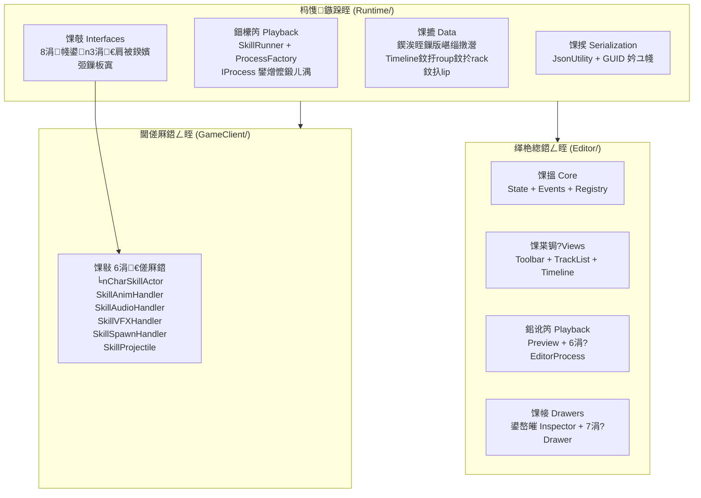
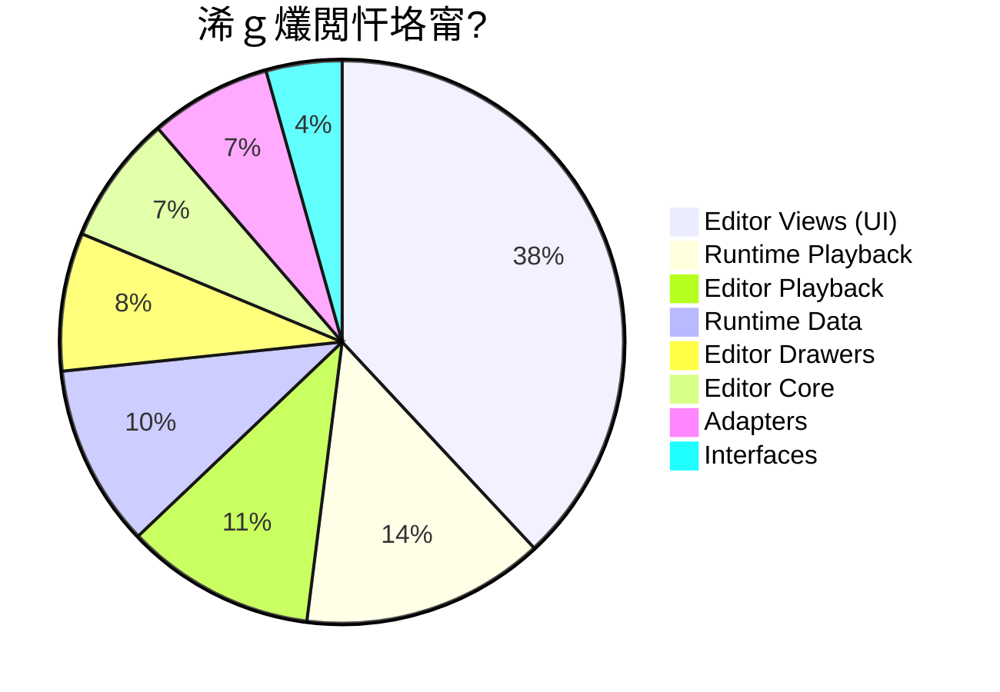
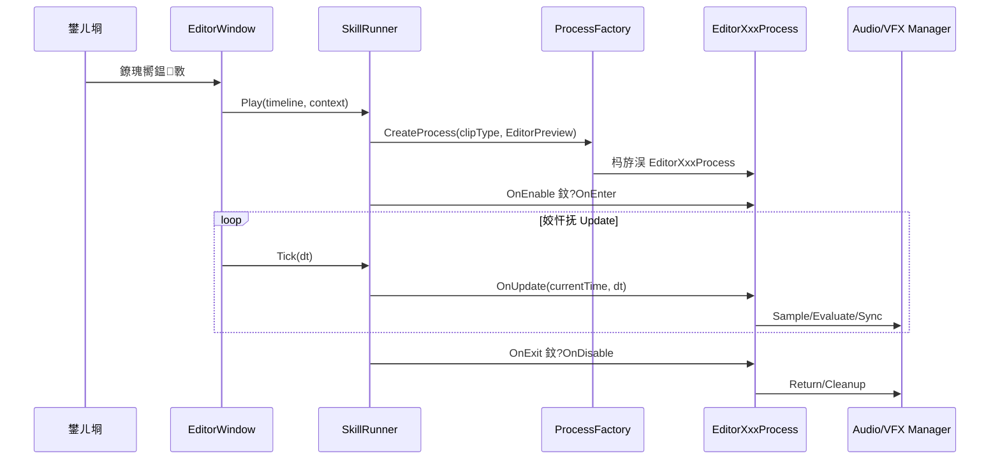
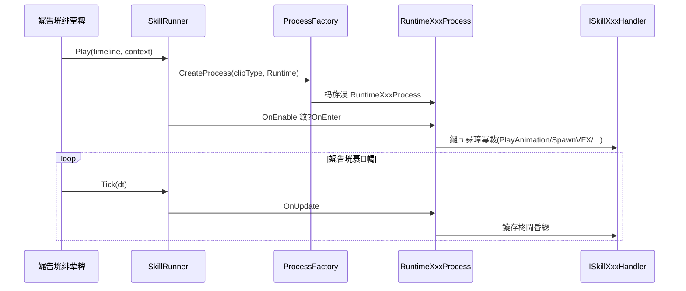
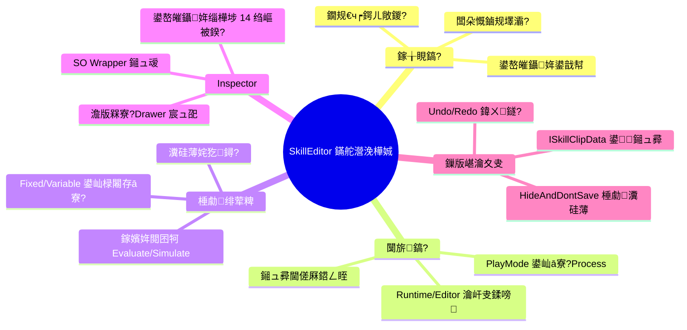

# SkillEditor 鏁翠綋鏋舵瀯涓庢暟鎹祦鍒嗘瀽鎶ュ憡

> **鍒嗘瀽鑼冨洿**: 鍏ㄩ」鐩紙94涓?`.cs` 鏂囦欢锛孯untime + Editor + GameClient 閫傞厤鍣級
> **鍒嗘瀽鏃ユ湡**: 2026-02-22
> **鍒嗘瀽缁村害**: 鏁翠綋鏋舵瀯鎬昏瘎 + 鏁版嵁娴?+ SOLID 璇勪及 + 闂姹囨€?

---

## 1. 椤圭洰鍏ㄦ櫙



---

## 2. 浠ｇ爜閲忕粺璁?

### 2.1 鎸夊眰绾у垎甯?

| 灞傜骇 | 鏂囦欢鏁?| 鏍稿績浠ｇ爜琛屾暟 | 鍗犳瘮 |
|:-----|:------:|:-----------:|:----:|
| Runtime / Data | ~20 | ~1200 | 14% |
| Runtime / Playback | ~8 | ~1600 | 19% |
| Runtime / Interfaces | ~11 | ~500 | 6% |
| Editor / Core (Data) | ~8 | ~850 | 10% |
| Editor / Views | 7 | ~4370 | 52% |
| Editor / Playback (Logic) | 10 | ~1250 | 15% |
| Editor / Drawers | 10 | ~910 | 11% |
| GameClient / Adapters | 6 | ~800 | 10% |
| **鍚堣** | **~94** | **~11500** | 100% |

> [!NOTE]
> Editor Views 鍗犲叏閮ㄤ唬鐮侀噺鐨?**52%**锛屾槸鏈€澶х殑妯″潡銆傚叾涓?`TrackListView.cs`(1065琛? 鍜?`TimelineView.cs`(897琛? 鏄渶澶х殑涓や釜鏂囦欢銆?

### 2.2 鎸夊姛鑳藉垎甯?



---

## 3. 鏁版嵁娴佸叏鏅?

### 3.1 缂栬緫鏃舵暟鎹祦

```mermaid
flowchart TD
    subgraph 鎸佷箙鍖栧眰
        JSON["JSON 鏂囦欢"]
        SO["SkillTimeline\n(ScriptableObject)"]
    end

    subgraph 杩愯鏃舵暟鎹?
        TL["Timeline"]
        GRP["Group"]
        TRK["TrackBase"]
        CLB["ClipBase"]
    end

    subgraph 缂栬緫鍣ㄦ暟鎹?
        STATE["ATEditorState"]
        EVT["ATEditorEvents"]
        REG["TrackRegistry"]
        WRAP["SO Wrappers"]
    end

    subgraph 缂栬緫鍣ㄨ鍥?
        TOOLBAR["ToolbarView"]
        TLIST["TrackListView"]
        TIMELINE["TimelineView"]
        INSP["Unity Inspector"]
    end

    JSON -->|Import| SO
    SO -->|Load| TL --> GRP --> TRK --> CLB
    TL --> STATE
    STATE --> TOOLBAR & TLIST & TIMELINE
    STATE -->|閫変腑| WRAP --> INSP
    INSP -->|鍙嶅皠淇敼| CLB
    CLB -->|NotifyDataChanged| EVT
    EVT -->|OnRepaintRequest| TOOLBAR & TLIST & TIMELINE
    TOOLBAR -->|Export| JSON
```

### 3.2 棰勮鎾斁鏁版嵁娴?



### 3.3 杩愯鏃舵暟鎹祦



---

## 4. 鏍稿績璁捐妯″紡

| 妯″紡 | 搴旂敤浣嶇疆 | 璇存槑 |
|:-----|:---------|:-----|
| **绛栫暐妯″紡** | `IProcess` / `ProcessBase<T>` | 涓嶅悓 Clip 绫诲瀷鐨勫鐞嗛€昏緫鍙浛鎹?|
| **宸ュ巶妯″紡** | `ProcessFactory` / `DrawerFactory` / `ClipDrawerFactory` | 鍙嶅皠鎵弿 + 鎯版€у垵濮嬪寲 |
| **瑙傚療鑰呮ā寮?* | `ATEditorEvents` | EventBus 閫氱煡 View 鍒锋柊 |
| **閫傞厤鍣ㄦā寮?* | `ISkillActor` / 6涓?Handler 鎺ュ彛 | 闅旂杩愯鏃剁紪杈戝櫒宸紓 |
| **妯℃澘鏂规硶** | `ProcessBase.Initialize/Tick` | 瀹氫箟 Process 鐢熷懡鍛ㄦ湡楠ㄦ灦 |
| **瀵硅薄姹?* | `EditorAudioManager` / `EditorVFXManager` / `VFXPoolManager` | 鍑忓皯 GC 鍜屽疄渚嬪寲寮€閿€ |
| **鍗曚緥** | `EditorAudioManager` / `EditorVFXManager` | 缂栬緫鍣ㄥ叏灞€绠＄悊鍣?|
| **鐘舵€佹満** | `SkillRunner.State` | Idle 鈫?Playing 鈬?Paused |
| **Wrapper/Proxy** | `GroupObject` / `TrackObject` / `ClipObject` | 闈?SO 鏁版嵁鎺ュ叆 Inspector |
| **澹版槑寮忔敞鍐?* | `[ProcessBinding]` / `[CustomDrawer]` / `[TrackDefinition]` | 鐗规€ч┍鍔ㄧ殑鑷姩鍙戠幇 |

---

## 5. SOLID 鍘熷垯璇勪及

### 5.1 鍗曚竴鑱岃矗 (SRP) 鈥?猸愨瓙猸愨瓙

| 缁勪欢 | 璇勪环 |
|:-----|:-----|
| Runtime Data | 鉁?姣忎釜 Clip/Track 鐙珛鏂囦欢 |
| Runtime Process | 鉁?姣忎釜 Process 鍙鐞嗕竴绉?Clip |
| Editor Views | 馃煛 `TimelineView`+`ClipInteraction`+`ClipOperations`+`Coordinates` 宸叉媶鍒嗭紝浣嗗崟涓柟娉曚粛鍋忛暱 |
| `TrackListView` | 鈿狅笍 1065琛岋紝娣峰悎缁樺埗+鎿嶄綔+鑿滃崟+鎷栨嫿 |

### 5.2 寮€闂師鍒?(OCP) 鈥?猸愨瓙猸愨瓙猸?

| 鎵╁睍鐐?| 鏂瑰紡 |
|:-------|:-----|
| 鏂板 Track/Clip 绫诲瀷 | 娣诲姞绫?+ `[TrackDefinition]` 鈫?杩愯鏃惰嚜鍔ㄥ彂鐜?|
| 鏂板 Process | 娣诲姞绫?+ `[ProcessBinding]` 鈫?宸ュ巶鑷姩娉ㄥ唽 |
| 鏂板 Drawer | 娣诲姞绫?+ `[CustomDrawer]` 鈫?宸ュ巶鑷姩鍙戠幇 |
| 鏂板璇█ | 瀹炵幇 `ILanguages` + `[Name]` 鈫?鑷姩鍔犺浇 |
| 鏂板閫傞厤鍣?| 瀹炵幇鎺ュ彛 + 娉ㄥ叆 `SkillServiceFactory` |

> **OCP 鏄湰椤圭洰鏈€绐佸嚭鐨勮璁′寒鐐?*锛屽嚑涔庢墍鏈夋墿灞曢兘涓嶉渶瑕佷慨鏀圭幇鏈変唬鐮併€?

### 5.3 閲屾皬鏇挎崲 (LSP) 鈥?猸愨瓙猸愨瓙

- 鉁?`ClipBase`/`TrackBase` 瀛愮被鍧囧彲鏇夸唬鍩虹被浣跨敤
- 鉁?Runtime/Editor Process 閫氳繃 `PlayMode` 鍒囨崲锛屽 `SkillRunner` 閫忔槑

### 5.4 鎺ュ彛闅旂 (ISP) 鈥?猸愨瓙猸愨瓙

- 鉁?8涓帴鍙ｅ悇鍙稿叾鑱岋紙Actor/Animation/Audio/VFX/Damage/Event/Spawn/Projectile锛?
- 鉁?`ISkillClipData` 鎻愪緵鍙鏃堕棿瑙嗗浘

### 5.5 渚濊禆鍊掔疆 (DIP) 鈥?猸愨瓙猸愨瓙

- 鉁?Runtime 渚濊禆鎺ュ彛锛屼笉渚濊禆 GameClient 瀹炵幇
- 鉁?`ProcessContext` 閫氳繃 `GetService<T>` 鎳掑姞杞借幏鍙栨湇鍔?
- 鈿狅笍 `SerializationUtility` 涓?`UnityEditor.AssetDatabase` 鐮村潖浜嗗€掔疆

---

## 6. 闂姹囨€讳笌浼樺厛绾?

### 6.1 鍏抽敭闂

- [ ] | # | 闂 | 鏉ユ簮鎶ュ憡 | 涓ラ噸绋嬪害 | 褰卞搷 |
  |:-:|:-----|:---------|:--------:|:-----|
  | 1 | `SerializationUtility.cs` 鍦?Runtime 涓娇鐢?`UnityEditor.AssetDatabase` | 01 | 馃敶 涓ラ噸 | 杩愯鏃剁紪璇戝け璐?|
  | 2 | `AudioClip.cs` 涓?`UnityEngine.AudioClip` 鍛藉悕鍐茬獊 | 01 | 馃煛 涓?| 闇€瑕佸叏闄愬畾鍚?|


### 6.2 涓瓑闂

- [ ] | # | 闂 | 鏉ユ簮鎶ュ憡 | 璇存槑 |
  |:-:|:-----|:---------|:-----|
  | 3 | `HandleClipInteraction` 404琛岃秴澶ф柟娉?| 05 | 闅句互缁存姢鍜屾祴璇?|
  | 4 | `TrackListView` 1065琛屽崟鏂囦欢 | 05 | 鍙媶鍒嗕负鍒楄〃+鎿嶄綔+鑿滃崟 |
  | 5 | EventBus 鏃犵粏绮掑害鍙傛暟 | 04 | 鎵€鏈夎闃呰€呭叏閲忓埛鏂?|
  | 6 | GetMatrix 浠ｇ爜閲嶅4娆?| 07 | 杩濆弽 DRY |
  | 7 | `SkillInspectorBase.ShouldShow` 纭紪鐮?| 04 | 鏂板绫讳技鏉′欢闇€鏀瑰熀绫?|
  | 8 | `TrackDefinitionAttribute.Order` 鍐茬獊 | 01 | Audio/VFX 鍚屼负 Order 3 |


### 6.3 浣庝紭鍏堢骇闂

- [ ] | # | 闂 | 鏉ユ簮鎶ュ憡 | 璇存槑 |
  |:-:|:-----|:---------|:-----|
  | 9 | VFX `Simulate` 鎬ц兘闅忔椂闂寸嚎鎬у闀?| 06 | 闀挎椂闂寸嚎鐨?Seek 鍙兘鍗￠】 |
  | 10 | `ClipBase` 鍏叡瀛楁鏃犲皝瑁?| 01 | 澶栭儴鍙换鎰忎慨鏀?|
  | 11 | Debug.Log 娈嬬暀 | 06 | SeekPreview 涓湁璋冭瘯鏃ュ織 |
  | 12 | DrawerFactory 姣忔 new | 04 | 鏃犲疄渚嬪鐢?|
  | 13 | CameraClip/MovementClip 楠ㄦ灦瀹炵幇 | 01 | 鏈畬鏁村疄鐜?|
  | 14 | EditorSpawnProcess 鏃犳睜鍖?| 06 | 姣忔 Instantiate/DestroyImmediate |
  | 15 | GetHumanBone 閲嶅瀹氫箟 | 06 | EditorVFXProcess 涓?Adapter 閲嶅 |


---

## 7. 鏋舵瀯浼樺娍鎬荤粨



---

## 8. 鎺ㄨ崘鏀硅繘鏂瑰悜

### 8.1 蹇呴』淇

| 鏄惁瑙ｅ喅 | 鏀硅繘 | 鍏蜂綋鏂规 |
|:----:|:---------|:---------|
| 鉁?| 淇 `SerializationUtility` | 浣跨敤 `#if UNITY_EDITOR` 鍖呰９ `AssetDatabase` 璋冪敤锛屾垨杩佺Щ鍒?Editor 鐩綍 |
| 鉁?| 瑙ｅ喅 `AudioClip` 鍛藉悕鍐茬獊 | 閲嶅懡鍚嶄负 `SkillAudioClip` |

### 8.2 寤鸿浼樺寲

| 鏄惁瑙ｅ喅 | 鏀硅繘 | 鍏蜂綋鏂规 |
|:----:|:---------|:---------|
| 鉂?| 鎻愬彇 GetMatrix 宸ュ叿鏂规硶 | 鍒涘缓 `BindPointUtility.GetWorldTransform(clip, state)` |
| 鉂?| 鎷嗗垎 TrackListView | 鍒嗙涓?`TrackListRenderer` + `TrackListOperations` + `TrackListDragDrop` |
| 鉂?| 鎷嗗垎 HandleClipInteraction | 鎸?`ClipDragMode` 鍒嗘淳鍒扮嫭绔嬬殑 Handler 鏂规硶 |
| 鉂?| 澧炲己 EventBus | 浜嬩欢鎼哄甫鍙樻洿绫诲瀷鍙傛暟 `Action<ChangeType>` |
| 鉂?| ShouldShow 鏀圭敤鐗规€?| 寮曞叆 `[ShowIf("fieldName", value)]` 鏇夸唬纭紪鐮?|
| 鉂?| 缂撳瓨鍙嶅皠 FieldInfo | `SkillInspectorBase` 涓寜绫诲瀷缂撳瓨 `FieldInfo[]` |

---

## 闄勫綍锛氬叏閮ㄥ垎鏋愭姤鍛婄储寮?

| # | 鎶ュ憡 | 鏂囦欢 | 鏍稿績鍐呭 |
|:-:|:-----|:-----|:---------|
| 1 | [杩愯鏃?Data 灞俔(file:///D:/Unity/Server_Game/Assets/ATEditor/docs/01_runtime_data_analysis.md) | `01_runtime_data_analysis.md` | 鍥涘眰鏁版嵁缁撴瀯 + 搴忓垪鍖?+ 灞炴€х郴缁?|
| 2 | [杩愯鏃?Logic 灞俔(file:///D:/Unity/Server_Game/Assets/ATEditor/docs/02_runtime_logic_analysis.md) | `02_runtime_logic_analysis.md` | SkillRunner + ProcessFactory + 8涓?Process |
| 3 | [杩愯鏃舵帴鍙ｄ笌閫傞厤鍣╙(file:///D:/Unity/Server_Game/Assets/ATEditor/docs/03_runtime_interfaces_analysis.md) | `03_runtime_interfaces_analysis.md` | 8鎺ュ彛 + 3鍊肩被鍨嬪寘 + 6閫傞厤鍣?|
| 4 | [缂栬緫鍣?Data 灞俔(file:///D:/Unity/Server_Game/Assets/ATEditor/docs/04_editor_data_analysis.md) | `04_editor_data_analysis.md` | State + Events + Registry + Drawers + Lan |
| 5 | [缂栬緫鍣?View 灞俔(file:///D:/Unity/Server_Game/Assets/ATEditor/docs/05_editor_view_analysis.md) | `05_editor_view_analysis.md` | 3澶ц鍥?+ 鍧愭爣宸ュ叿 + 鐗囨浜や簰 |
| 6 | [缂栬緫鍣?Logic 灞俔(file:///D:/Unity/Server_Game/Assets/ATEditor/docs/06_editor_logic_analysis.md) | `06_editor_logic_analysis.md` | 棰勮绯荤粺 + 2绠＄悊鍣?+ 6 EditorProcess |
| 7 | [Drawer 瀹炵幇](file:///D:/Unity/Server_Game/Assets/ATEditor/docs/07_track_clip_impl_analysis.md) | `07_track_clip_impl_analysis.md` | 7涓叿浣?Drawer + SceneGUI 鍙鍖?|
| 8 | [鏋舵瀯鎬昏瘎](file:///D:/Unity/Server_Game/Assets/ATEditor/docs/08_architecture_dataflow_analysis.md) | `08_architecture_dataflow_analysis.md` | 鏈姤鍛?|
