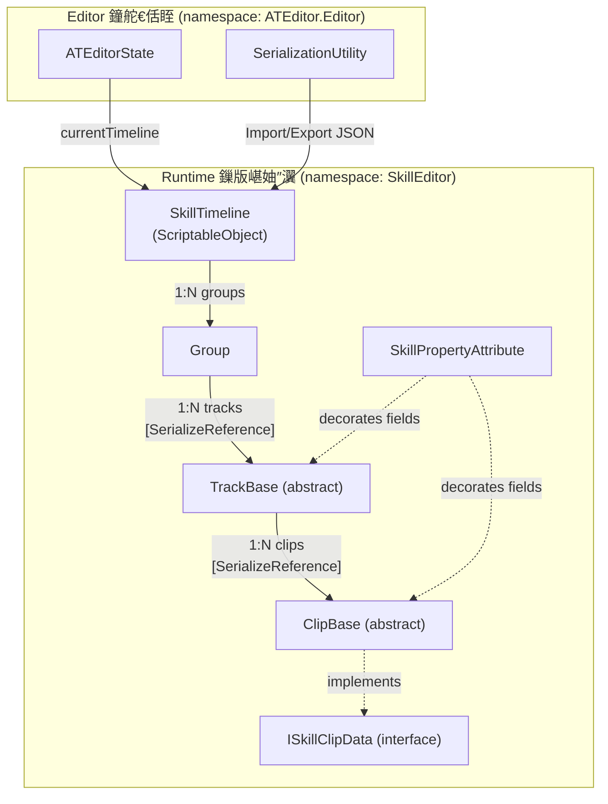
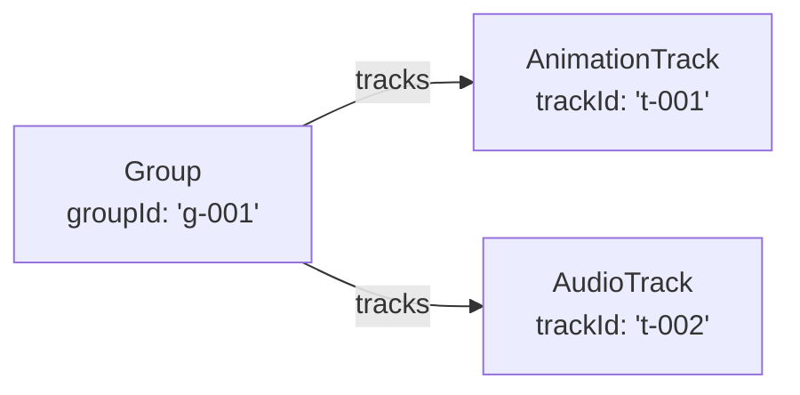
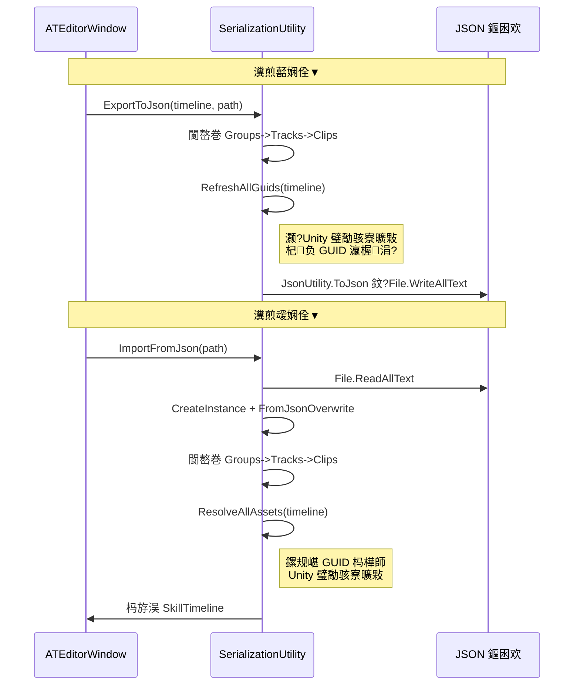
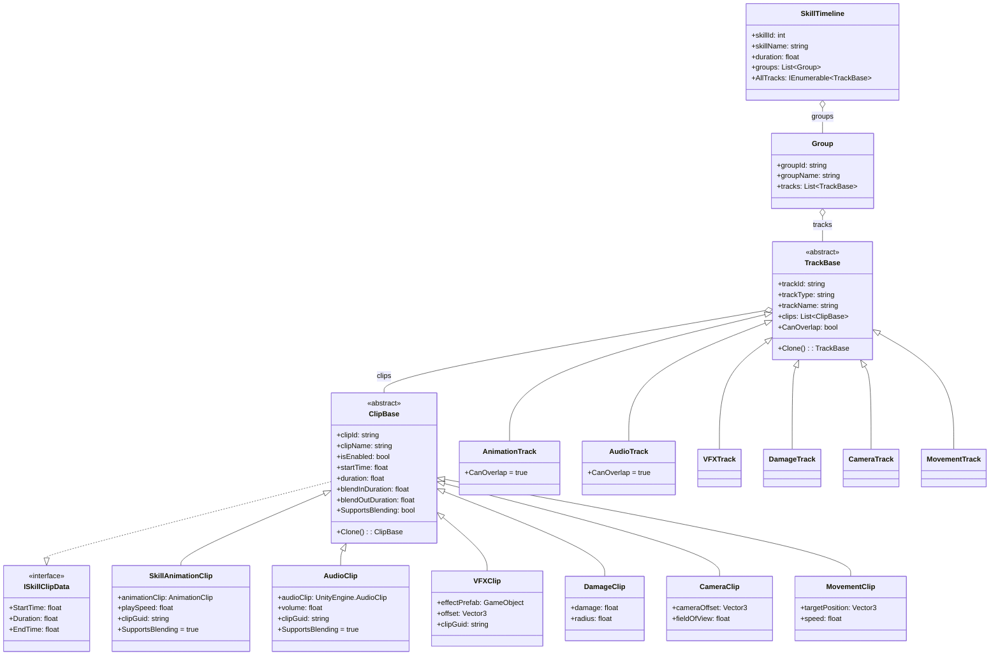

# 鎶€鑳界紪杈戝櫒鏁版嵁灞傛灦鏋?

## 1. 鏁翠綋姒傝

鎶€鑳界紪杈戝櫒鐨勬暟鎹眰閲囩敤 **灞傛鍖栫殑 ScriptableObject + 澶氭€佸簭鍒楀寲** 鏋舵瀯锛屽垎涓?**Runtime 鏁版嵁妯″瀷**锛堢函鏁版嵁锛屽彲鑴辩缂栬緫鍣ㄨ繍琛岋級鍜?**Editor 鐘舵€?搴忓垪鍖?*锛堜粎闄愮紪杈戝櫒浣跨敤锛変袱涓眰闈€?

閲嶆瀯鍚庨噰鐢ㄤ簡 **涓ユ牸鏍戠姸缁撴瀯**锛?



---

## 2. 鏍稿績鏁版嵁妯″瀷

### 2.1 SkillTimeline锛堥《灞傚鍣級

| 瀛楁 | 绫诲瀷 | 璇存槑 |
|------|------|------|
| `skillId` | `int` | 鎶€鑳藉敮涓€ ID |
| `skillName` | `string` | 鎶€鑳藉悕绉帮紙榛樿 "鏂版妧鑳?锛?|
| `version` | `string` | 鏁版嵁鐗堟湰鍙?|
| `duration` | `float` | Timeline 鎬绘椂闀匡紙绉掞級 |
| `playbackSpeed` | `float` | 鎾斁閫熷害鍊嶇巼 |
| `isLoop` | `bool` | 鏄惁寰幆 |
| `groups` | `List<Group>` | 鍒嗙粍鍒楄〃锛堟爲鐘剁粨鏋勭殑鏍硅妭鐐癸級 |

**鍏抽敭鐗瑰緛**锛?
- 缁ф壙鑷?`ScriptableObject`锛屽彲浠ヤ綔涓?Unity 璧勪骇瀛樺偍
- **涓嶅啀鐩存帴鎸佹湁 tracks**锛屾墍鏈夎建閬撻兘蹇呴』鍖呭惈鍦ㄦ煇涓?`Group` 涓?
- 鎻愪緵 `AllTracks` 鍙灞炴€э紙閬嶅巻鎵€鏈夊垎缁勮幏鍙栨墎骞冲寲杞ㄩ亾鍒楄〃锛?
- 鎻愪緵 `FindGroupContainingTrack(track)` 绛夎緟鍔╂煡璇㈡柟娉?

> [!IMPORTANT]
> `SkillTimeline` 鏄暟鎹爲鐨勬牴銆傞亶鍘嗚建閬撻渶閫氳繃 `groups` 杩涜锛屾垨鑰呬娇鐢?`AllTracks` 渚挎嵎璁块棶鍣ㄣ€?

---

### 2.2 Group锛堝垎缁勶級

| 瀛楁 | 绫诲瀷 | 璇存槑 |
|------|------|------|
| `groupId` | `string` | GUID 鍞竴鏍囪瘑 |
| `groupName` | `string` | 鍒嗙粍鏄剧ず鍚嶇О |
| `isCollapsed` | `bool` | 鎶樺彔/灞曞紑鐘舵€?|
| `isEnabled` | `bool` | 鏄惁鍚敤 |
| `isLocked` | `bool` | 鏄惁閿佸畾 |
| `tracks` | `List<TrackBase>` | 鍖呭惈鐨勮建閬撳璞″垪琛紙`[SerializeReference]` 澶氭€侊級 |

**鍏宠仈鏂瑰紡**锛歚Group` 鐩存帴鎸佹湁 `TrackBase` 瀵硅薄鍒楄〃锛屽舰鎴愪簡鐗╃悊涓婄殑鐖跺瓙鍏崇郴銆?



---

### 2.3 TrackBase锛堣建閬撳熀绫伙級

| 瀛楁 | 绫诲瀷 | 璇存槑 |
|------|------|------|
| `trackId` | `string` | GUID 鍞竴鏍囪瘑 |
| `trackType` | `string` | 杞ㄩ亾绫诲瀷鍚嶏紙濡?"AnimationTrack"锛?|
| `trackName` | `string` | 鏄剧ず鍚嶇О |
| `isMuted` | `bool` | 闈欓煶 |
| `isLocked` | `bool` | 閿佸畾 |
| `isHidden` | `bool` | 闅愯棌 |
| `isCollapsed` | `bool` | 鎶樺彔 |
| `isEnabled` | `bool` | 鍚敤 |
| `clips` | `List<ClipBase>` | 鐗囨鍒楄〃锛坄[SerializeReference]` 澶氭€侊級 |

**鍏抽敭鍙樻洿**锛?
- 绉婚櫎浜?`parentGroupId` 瀛楁锛岀埗瀛愬叧绯荤敱瀵硅薄寮曠敤缁撴瀯闅愬紡鍐冲畾銆?

**鎶借薄鏂规硶**锛?
- `Clone()` 鈫?娣辨嫹璐濓紙瀛愮被瀹炵幇锛?
- `CloneBaseProperties(clone)` 鈫?澶嶅埗鍩虹灞炴€у拰娣辨嫹璐濇墍鏈?clips

**铏氬睘鎬?*锛?
- `CanOverlap` 鈫?鏄惁鍏佽鐗囨閲嶅彔锛堥粯璁?`false`锛?

#### Track 瀛愮被涓€瑙?

| 瀛愮被 | 榛樿鍚嶇О | CanOverlap | 瀵瑰簲 Clip |
|------|----------|------------|-----------|
| `AnimationTrack` | "鍔ㄧ敾杞ㄩ亾" | 鉁?`true` | `SkillAnimationClip` |
| `AudioTrack` | "闊虫晥杞ㄩ亾" | 鉁?`true` | `AudioClip` |
| `VFXTrack` | "鐗规晥杞ㄩ亾" | 鉂?`false` | `VFXClip` |
| `DamageTrack` | "浼ゅ鍒ゅ畾杞ㄩ亾" | 鉂?`false` | `DamageClip` |
| `CameraTrack` | "鎽勫儚鏈鸿建閬? | 鉂?`false` | `CameraClip` |
| `MovementTrack` | "绉诲姩杞ㄩ亾" | 鉂?`false` | `MovementClip` |

> [!NOTE]
> Track 瀛愮被鏈韩**涓嶅寘鍚澶栨暟鎹瓧娈?*锛屼粎閫氳繃鏋勯€犲嚱鏁拌缃粯璁ゅ悕绉?绫诲瀷銆佽鍐?`CanOverlap` 鍜屽疄鐜?`Clone()`銆傜湡姝ｇ殑涓氬姟鏁版嵁鍦ㄥ搴旂殑 Clip 瀛愮被涓€?

---

### 2.4 ClipBase锛堢墖娈靛熀绫伙級

| 瀛楁 | 绫诲瀷 | 璇存槑 |
|------|------|------|
| `clipId` | `string` | GUID 鍞竴鏍囪瘑 |
| `clipName` | `string` | 鏄剧ず鍚嶇О |
| `isEnabled` | `bool` | 鏄惁鍚敤 |
| `startTime` | `float` | 寮€濮嬫椂闂达紙绉掞級 |
| `duration` | `float` | 鎸佺画鏃堕棿锛堢锛?|
| `blendInDuration` | `float` | 娓愬叆鏃堕暱 |
| `blendOutDuration` | `float` | 娓愬嚭鏃堕暱 |

**璁＄畻灞炴€?*锛歚StartTime` / `Duration` / `EndTime`锛堝疄鐜?`ISkillClipData` 鎺ュ彛锛?
**铏氬睘鎬?*锛歚SupportsBlending`锛堥粯璁?`false`锛宍SkillAnimationClip` 鍜?`AudioClip` 瑕嗗啓涓?`true`锛?
**鎶借薄鏂规硶**锛歚Clone()` 鈫?娣辨嫹璐?

#### Clip 瀛愮被涓€瑙?

| 瀛愮被 | 榛樿鍚嶇О | Blending | 鐗规湁瀛楁 |
|------|----------|----------|----------|
| `SkillAnimationClip` | "鍔ㄧ敾鐗囨" | 鉁?| `animationClip` (AnimationClip), `playSpeed`, `clipGuid` |
| `AudioClip` | "Audio Clip" | 鉁?| `audioClip` (UnityEngine.AudioClip), `volume`, `clipGuid` |
| `VFXClip` | "VFX Clip" | 鉂?| `effectPrefab` (GameObject), `offset` (Vector3), `clipGuid` |
| `DamageClip` | "Damage Clip" | 鉂?| `damage`, `radius` |
| `CameraClip` | "Camera Clip" | 鉂?| `cameraOffset` (Vector3), `fieldOfView` |
| `MovementClip` | "Movement Clip" | 鉂?| `targetPosition` (Vector3), `speed` |

> [!IMPORTANT]
> 寮曠敤 Unity 璧勪骇鐨?Clip锛圓nimation/Audio/VFX锛夐兘鏈変竴涓?`clipGuid` 瀛楁銆傝瀛楁鍦?**JSON 瀵煎嚭鏃?* 鐢?`SerializationUtility.RefreshAllGuids()` 濉厖锛?*JSON 瀵煎叆鏃?* 鐢?`ResolveAllAssets()` 鏍规嵁 GUID 杩樺師 `UnityEngine.Object` 寮曠敤銆?

---

### 2.5 ISkillClipData锛堟帴鍙ｏ級

```csharp
public interface ISkillClipData
{
    float StartTime { get; }
    float Duration { get; }
    float EndTime { get; }
}
```

鎻愪緵缁熶竴鐨勬椂闂村尯闂存煡璇㈠绾︼紝`ClipBase` 瀹炵幇姝ゆ帴鍙ｃ€?

---

### 2.6 SkillPropertyAttribute锛堣嚜瀹氫箟鐗规€э級

```csharp
[AttributeUsage(AttributeTargets.Field)]
public class SkillPropertyAttribute : Attribute
{
    public string Name { get; }
}
```

鐢ㄤ簬鍦?Inspector 鑷畾涔夐潰鏉夸腑涓哄瓧娈垫寚瀹?*涓枃鏄剧ず鍚嶇О**锛屼緥濡?`[SkillProperty("鐗囨鍚嶇О")]`銆?

---

## 3. 搴忓垪鍖栨満鍒?

### 3.1 鍐呭瓨涓紙ScriptableObject锛?

```mermaid
graph LR
    SO["ScriptableObject<br/>(SkillTimeline)"] -->|"1:N"| GRP["Group"]
    GRP -->|"[SerializeReference]"| TB["TrackBase 澶氭€?]
    TB -->|"[SerializeReference]"| CB["ClipBase 澶氭€?]
```

- 缂栬緫鍣ㄥ唴閫氳繃 `ScriptableObject.CreateInstance<SkillTimeline>()` 鍒涘缓
- 杞ㄩ亾鍜岀墖娈电殑澶氭€佸垪琛ㄤ娇鐢?`[SerializeReference]` 瀹炵幇
- Undo/Redo 閫氳繃 `Undo.RecordObject(timeline, label)` 鏀寔

### 3.2 JSON 鎸佷箙鍖?



**GUID 妗ユ帴**锛氱敱浜?`JsonUtility` 鏃犳硶鐩存帴搴忓垪鍖?`UnityEngine.Object` 寮曠敤锛岀郴缁熼噰鐢?`AssetDatabase.AssetPathToGUID()` / `GUIDToAssetPath()` 鍦ㄥ鍑?瀵煎叆鏃惰嚜鍔ㄨ浆鎹€?

娑夊強 GUID 鐨?Clip 绫诲瀷锛?
- `SkillAnimationClip.clipGuid` 鈫?`animationClip`
- `VFXClip.clipGuid` 鈫?`effectPrefab`
- `AudioClip.clipGuid` 鈫?`audioClip`

---

## 4. 缂栬緫鍣ㄧ姸鎬佸眰

### 4.1 ATEditorState

**鏍稿績鏁版嵁寮曠敤**锛?
| 瀛楁 | 绫诲瀷 | 璇存槑 |
|------|------|------|
| `currentTimeline` | `SkillTimeline` | 褰撳墠缂栬緫鐨?Timeline |
| `currentFilePath` | `string` | 褰撳墠 JSON 鏂囦欢璺緞 |

**瑙嗗彛鐘舵€?*锛堜笉鎸佷箙鍖栵級锛?
| 瀛楁 | 璇存槑 |
|------|------|
| `zoom` | 缂╂斁绾у埆 (px/s) |
| `scrollOffset` | 姘村钩婊氬姩鍋忕Щ |
| `verticalScrollOffset` | 鍨傜洿婊氬姩鍋忕Щ |
| `timeIndicator` | 鏃堕棿鎸囩ず鍣ㄤ綅缃?|
| `isPlaying` / `isStopped` / `isPreviewing` | 鎾斁鐘舵€?|

**鎸佷箙鍖栬缃?*锛坄EditorPrefs`锛夛細
| 瀛楁 | EditorPrefs Key | 璇存槑 |
|------|-----------------|------|
| `snapEnabled` | `SkillEditor_SnapEnabled` | 纾佹€у惛闄?|
| `frameRate` | `SkillEditor_FrameRate` | 閫昏緫甯х巼 |
| `timeStepMode` | `SkillEditor_TimeStepMode` | 鏃堕棿姝ヨ繘妯″紡 |
| `Language` | `SkillEditor_Language` | 璇█璁剧疆锛堝鎵?Lan 绫伙級 |

**閫変腑椤圭姸鎬?*锛堜笉鎸佷箙鍖栵級锛?
| 瀛楁 | 璇存槑 |
|------|------|
| `selectedGroup` | 褰撳墠閫変腑鐨勫垎缁?|
| `selectedTrack` | 褰撳墠閫変腑鐨勮建閬?|
| `selectedClips` | 褰撳墠閫変腑鐨勭墖娈靛垪琛紙鏀寔澶氶€夛級 |
| `isTimelineSelected` | 鏄惁閫変腑浜?Timeline 瀵硅薄鏈韩 |

**杞ㄩ亾缂撳瓨**锛坄Dictionary<string, TrackBase>`锛夛細
- `RebuildTrackCache()` / `AddTrackToCache()` / `RemoveTrackFromCache()` / `GetTrackById()`
- **瀹炵幇鏂瑰紡**锛氶亶鍘?`AllTracks` 鏋勫缓 ID 鍒板璞＄殑鏄犲皠
- 鎻愪緵 O(1) 鐨勮建閬撴煡鎵捐兘鍔?

---

## 5. 瀹屾暣绫荤户鎵垮叧绯?



---

## 6. 鏁版嵁娴佹€荤粨

```mermaid
flowchart LR
    subgraph "鎸佷箙鍖栧瓨鍌?
        JSON["JSON 鏂囦欢"]
        EP["EditorPrefs"]
    end
    
    subgraph "鍐呭瓨妯″瀷"
        ST["SkillTimeline<br/>(ScriptableObject)"]
        SES["ATEditorState"]
    end
    
    subgraph "UI 灞?
        TV["TimelineView"]
        TLV["TrackListView"]
        TBV["ToolbarView"]
        INS["Inspector"]
    end
    
    JSON -->|"ImportFromJson<br/>+ ResolveAssets"| ST
    ST -->|"ExportToJson<br/>+ RefreshGuids"| JSON
    EP -->|"璇诲彇璁剧疆"| SES
    SES -->|"鍐欏叆璁剧疆"| EP
    
    SES -->|"currentTimeline"| ST
    ST --> TV
    ST --> TLV
    SES --> TBV
    ST --> INS
```

| 鏁版嵁娴佸悜 | 瑙﹀彂鏃舵満 | 鏈哄埗 |
|----------|----------|------|
| JSON 鈫?鍐呭瓨 | 鐢ㄦ埛鐐瑰嚮"瀵煎叆" | `SerializationUtility.ImportFromJson()` |
| 鍐呭瓨 鈫?JSON | 鐢ㄦ埛鐐瑰嚮"瀵煎嚭/淇濆瓨" | `SerializationUtility.ExportToJson()` |
| EditorPrefs 鈫?鍐呭瓨 | 缂栬緫鍣ㄧ獥鍙?`OnEnable` | 鍚勫睘鎬?getter 鑷姩璇诲彇 |
| 鍐呭瓨 鈫?EditorPrefs | 鐢ㄦ埛鏇存敼璁剧疆 | 鍚勫睘鎬?setter 鑷姩鍐欏叆 |
| 鍐呭瓨 鈫?UI | 姣忓抚 `OnGUI` | 鐩存帴璇诲彇 `state.currentTimeline` |
| UI 鈫?鍐呭瓨 | 鐢ㄦ埛浜や簰锛堟嫋鎷?缂栬緫锛?| 鐩存帴淇敼 `ClipBase`/`TrackBase` 瀛楁 |
