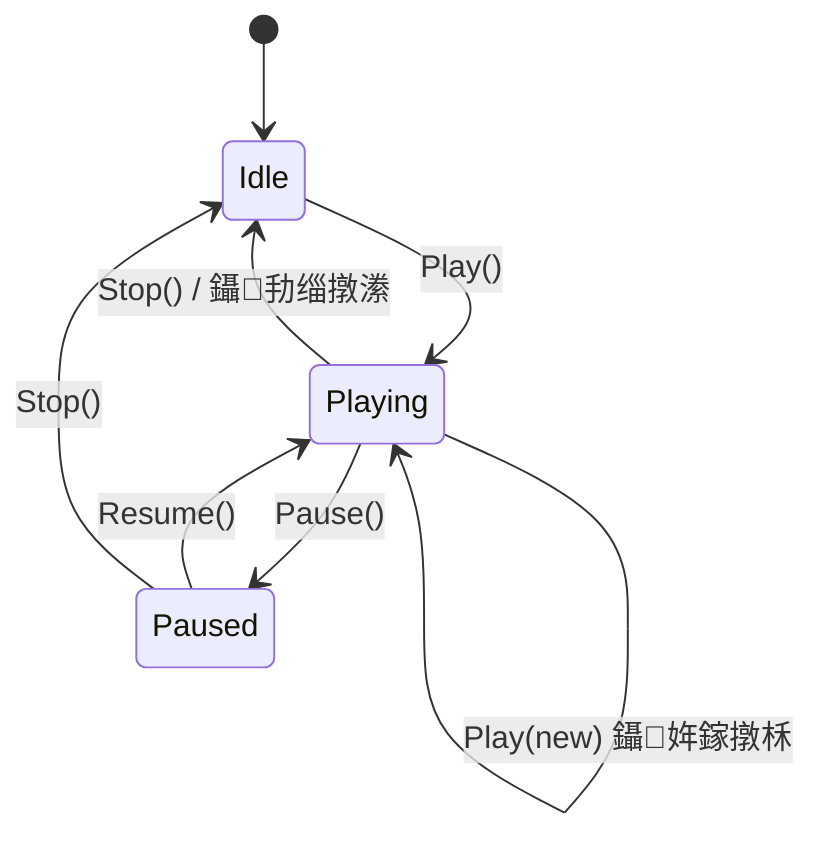

# 鎶€鑳界紪杈戝櫒鎾斁鍣ㄧ郴缁?鈥?鏋舵瀯鏂规锛堟渶缁堢増锛?

## 姒傝堪

鏁版嵁锛圕lip/Track锛変笌鎵ц閫昏緫锛圥rocess锛夊垎绂伙紝閫氳繃 Runner 椹卞姩 Process 鐢熷懡鍛ㄦ湡銆傛敮鎸佺紪杈戝櫒棰勮涓庤繍琛屾椂鎵ц銆?

---

## 1. 鏁翠綋鏋舵瀯

```mermaid
graph TB
    subgraph "澶栭儴椹卞姩婧?
        MONO["SkillLifecycleManager<br/>(MonoBehaviour 鍗曚緥)"]
        ED["EditorApplication.update<br/>TimeStepMode 鍐冲畾 dt"]
        FS["甯у悓姝ユ鏋跺洖璋?]
    end
    
    subgraph "Runner 灞?
        R["SkillRunner<br/>(绾?C#, 姣忚鑹蹭竴涓?"]
    end
    
    subgraph "Process 灞?
        PF["ProcessFactory<br/>(鍙嶅皠娉ㄥ唽 + 瀵硅薄姹?"]
        IP["IProcess 鈫?ProcessBase&lt;TClip&gt;"]
    end
    
    subgraph "缂栬緫鍣ㄧ鐞嗗櫒"
        EAM["EditorAudioManager"]
        EVM["EditorVFXManager"]
    end
    
    subgraph "鏁版嵁灞?(宸叉湁)"
        ST["SkillTimeline 鈫?Group 鈫?Track 鈫?Clip"]
    end
    
    MONO & ED & FS -->|"Tick(dt)"| R
    R <-->|"Create/Return"| PF --> IP
    IP -->|"璇诲彇"| ST
    IP -->|"璋冪敤"| EAM & EVM
```

---

## 2. 鏍稿績璁捐鍐崇瓥姹囨€?

| 鍐崇瓥 | 鏂规 | 鍘熷垯 |
|------|------|------|
| 娓呯悊鑱岃矗 | 涓夊眰锛歄nExit(瀹炰緥) / OnDisable(杩涚▼) / RegisterCleanup(绯荤粺) | SRP, 淇℃伅涓撳 |
| 鏃堕棿椹卞姩 | Tick(dt) 鐢辫皟鐢ㄦ柟鍐冲畾锛堟棤 ITimeProvider锛?| DIP |
| 缂栬緫鍣?杩愯鏃跺鎬?| 鐙珛瀛愮被 + [ProcessBinding] 宸ュ巶 | OCP, LSP |
| Process 鍐呭瓨 | ProcessFactory 鍐呴儴姹犲寲 + Reset() | 鈥?|
| 鐢熷懡鍛ㄦ湡 | 浜旈樁娈碉細Enable/Enter/Update/Exit/Disable | ISP |
| 浜嬩欢妯″瀷 | Runner 浜嬩欢璁㈤槄閾撅紝Interrupt 鏃?ClearEvents | OCP |

---

## 3. 妯″潡璇︾粏璁捐

### 3.1 IProcess + ProcessBase

```csharp
public interface IProcess
{
    void Initialize(ClipBase clipData, ProcessContext context);
    void Reset();       // 瀵硅薄姹犲鐢ㄥ墠璋冪敤
    void OnEnable();
    void OnEnter();
    void OnUpdate(float currentTime, float deltaTime);
    void OnExit();
    void OnDisable();
}

public abstract class ProcessBase<TClip> : IProcess where TClip : ClipBase
{
    protected TClip clip;
    protected ProcessContext context;
    
    public void Initialize(ClipBase clipData, ProcessContext context)
    {
        this.clip = (TClip)clipData;
        this.context = context;
    }
    
    public virtual void Reset() { clip = default; context = null; }
    public virtual void OnEnable() { }
    public virtual void OnEnter() { }
    public abstract void OnUpdate(float currentTime, float deltaTime);
    public virtual void OnExit() { }
    public virtual void OnDisable() { }
}
```

---

### 3.2 ProcessContext

```csharp
public class ProcessContext
{
    public GameObject Owner { get; }
    public Transform OwnerTransform { get; }
    public PlayMode PlayMode { get; }
    public object UserData { get; set; }
    
    // 缁勪欢缂撳瓨
    private Dictionary<Type, Component> componentCache = new Dictionary<Type, Component>();
    public T GetComponent<T>() where T : Component { /* 鎯版€ф煡鎵?缂撳瓨 */ }
    
    // 绯荤粺绾ф竻鐞嗘敞鍐岋紙鍚?key 鍘婚噸锛?
    private Dictionary<string, Action> cleanupActions = new Dictionary<string, Action>();
    public void RegisterCleanup(string key, Action cleanup) => cleanupActions[key] = cleanup;
    internal void ExecuteCleanups()
    {
        foreach (var a in cleanupActions.Values) a.Invoke();
        cleanupActions.Clear();
    }
}

public enum PlayMode { EditorPreview, Runtime }
```

---

### 3.3 ProcessFactory锛堝弽灏勬敞鍐?+ 瀵硅薄姹狅級

```csharp
[AttributeUsage(AttributeTargets.Class, AllowMultiple = true)]
public class ProcessBindingAttribute : Attribute
{
    public Type ClipType { get; }
    public PlayMode Mode { get; }
    public ProcessBindingAttribute(Type clipType, PlayMode mode) { ... }
}

public static class ProcessFactory
{
    private static Dictionary<(Type, PlayMode), Type> registry;
    private static Dictionary<Type, Queue<IProcess>> pools = new();
    
    static ProcessFactory()
    {
        registry = new Dictionary<(Type, PlayMode), Type>();
        foreach (var asm in AppDomain.CurrentDomain.GetAssemblies())
            foreach (var type in asm.GetTypes())
                foreach (var attr in type.GetCustomAttributes<ProcessBindingAttribute>())
                    registry[(attr.ClipType, attr.Mode)] = type;
    }
    
    public static IProcess Create(ClipBase clip, PlayMode mode)
    {
        if (!registry.TryGetValue((clip.GetType(), mode), out var pType)) return null;
        if (pools.TryGetValue(pType, out var pool) && pool.Count > 0)
        {
            var reused = pool.Dequeue();
            reused.Reset();
            return reused;
        }
        return (IProcess)Activator.CreateInstance(pType);
    }
    
    public static void Return(IProcess process)
    {
        if (process == null) return;
        var t = process.GetType();
        if (!pools.ContainsKey(t)) pools[t] = new Queue<IProcess>();
        pools[t].Enqueue(process);
    }
    
    public static void ClearPools() => pools.Clear();
}
```

---

### 3.4 SkillRunner

#### 鐘舵€佹満



#### 浜嬩欢

```csharp
public event Action OnStart;
public event Action OnEnd;          // 鑷劧缁撴潫鎴?Stop
public event Action OnInterrupt;    // 琚柊鎶€鑳芥墦鏂?
public event Action OnPause;
public event Action OnResume;
public event Action OnLoopComplete; // 寰幆涓€杞?
public event Action<float> OnTick;  // 姣忓抚 (currentTime)
```

#### 鏍稿績鏂规硶

```csharp
public class SkillRunner
{
    public enum State { Idle, Playing, Paused }
    
    public State CurrentState { get; private set; } = State.Idle;
    public float CurrentTime { get; private set; }
    public SkillTimeline Timeline { get; private set; }
    
    private PlayMode playMode;
    private ProcessContext context;
    private List<ProcessInstance> processes = new List<ProcessInstance>();
    
    private struct ProcessInstance
    {
        public IProcess process;
        public ClipBase clip;
        public bool isActive;
    }
    
    public SkillRunner(PlayMode mode) { playMode = mode; }
    
    // 鈹€鈹€鈹€ 鎾斁鎺у埗 鈹€鈹€鈹€
    
    public void Play(SkillTimeline timeline, ProcessContext context) { /* ... */ }
    public void Pause()  { /* Playing鈫扨aused */ }
    public void Resume() { /* Paused鈫扨laying */ }
    public void Stop()   { /* FullCleanup 鈫?OnEnd 鈫?ClearEvents */ }
    public void Seek(float targetTime) { /* 璺宠浆锛欵xit 鑴辩鍖洪棿銆丒nter 杩涘叆鍖洪棿 */ }
    
    // 鈹€鈹€鈹€ 姣忓抚椹卞姩 鈹€鈹€鈹€
    
    public void Tick(float deltaTime)
    {
        if (CurrentState != State.Playing) return;
        CurrentTime += deltaTime * (Timeline?.playbackSpeed ?? 1f);
        
        // 鍖洪棿鎵弿锛圗nter/Update/Exit锛?
        for (int i = 0; i < processes.Count; i++) { /* ... */ }
        
        OnTick?.Invoke(CurrentTime);
        
        if (CurrentTime >= Timeline.duration)
        {
            if (Timeline.isLoop)
                { ResetActiveProcesses(); CurrentTime = 0f; OnLoopComplete?.Invoke(); }
            else
                { FullCleanup(); CurrentState = State.Idle; OnEnd?.Invoke(); ClearEvents(); }
        }
    }
    
    // 鈹€鈹€鈹€ 娓呯悊锛堜笁灞?+ 姹犲綊杩橈級鈹€鈹€鈹€
    
    private void FullCleanup()
    {
        foreach (var inst in processes)
            if (inst.isActive) inst.process.OnExit();        // 绾у埆1: 瀹炰緥
        foreach (var inst in processes)
            inst.process.OnDisable();                         // 绾у埆2: 杩涚▼
        foreach (var inst in processes)
            ProcessFactory.Return(inst.process);              // 褰掕繕姹?
        processes.Clear();
        context?.ExecuteCleanups();                            // 绾у埆3: 绯荤粺
    }
}
```

---

### 3.5 SkillLifecycleManager

```csharp
public class SkillLifecycleManager : MonoBehaviour
{
    public static SkillLifecycleManager Instance { get; private set; }
    private List<SkillRunner> activeRunners = new List<SkillRunner>();
    
    private void Awake() { /* 鍗曚緥, DontDestroyOnLoad */ }
    private void Update()
    {
        float dt = Time.deltaTime;
        for (int i = activeRunners.Count - 1; i >= 0; i--)
            activeRunners[i].Tick(dt);
    }
    public void Register(SkillRunner runner) => activeRunners.Add(runner);
    public void Unregister(SkillRunner runner) => activeRunners.Remove(runner);
}
```

---

### 3.6 EditorVFXManager

```csharp
/// <summary>
/// 缂栬緫鍣ㄩ瑙?VFX 绠＄悊鍣細瀹炰緥姹?+ ParticleSystem 閲囨牱
/// </summary>
public class EditorVFXManager
{
    private static EditorVFXManager instance;
    public static EditorVFXManager Instance => instance ??= new EditorVFXManager();
    
    private GameObject vfxRoot;
    // 鎸夐鍒朵綋 InstanceID 鍒嗘睜
    private Dictionary<int, Queue<GameObject>> pools = new();
    // 娲昏穬瀹炰緥 鈫?棰勫埗浣?ID锛堝綊杩樻椂瀹氫綅姹狅級
    private Dictionary<GameObject, int> activeInstances = new();
    
    /// 浠庢睜鍙栨垨鏂板缓 VFX 瀹炰緥
    public GameObject Spawn(GameObject prefab, Vector3 position, Quaternion rotation)
    {
        EnsureRoot();
        int prefabId = prefab.GetInstanceID();
        GameObject inst;
        
        if (pools.TryGetValue(prefabId, out var pool) && pool.Count > 0)
        {
            inst = pool.Dequeue();
            inst.transform.SetPositionAndRotation(position, rotation);
            inst.SetActive(true);
        }
        else
        {
            inst = Object.Instantiate(prefab, position, rotation, vfxRoot.transform);
            inst.hideFlags = HideFlags.HideAndDontSave;
        }
        activeInstances[inst] = prefabId;
        RestartParticles(inst);
        return inst;
    }
    
    /// ParticleSystem 閲囨牱鍒版寚瀹氭椂闂达紙Seek 鏃朵娇鐢級
    public void Sample(GameObject instance, float time)
    {
        if (instance == null) return;
        foreach (var ps in instance.GetComponentsInChildren<ParticleSystem>())
        {
            ps.Stop(true, ParticleSystemStopBehavior.StopEmittingAndClear);
            ps.Simulate(time, true, true, false);
        }
    }
    
    /// 鍥炴敹瀹炰緥鍒版睜
    public void Return(GameObject instance)
    {
        if (instance == null || !activeInstances.TryGetValue(instance, out int prefabId)) return;
        StopParticles(instance);
        instance.SetActive(false);
        activeInstances.Remove(instance);
        if (!pools.ContainsKey(prefabId)) pools[prefabId] = new Queue<GameObject>();
        pools[prefabId].Enqueue(instance);
    }
    
    public void ReturnAll() { foreach (var inst in new List<GameObject>(activeInstances.Keys)) Return(inst); }
    public void Dispose() { if (vfxRoot) Object.DestroyImmediate(vfxRoot); pools.Clear(); activeInstances.Clear(); instance = null; }
    
    private void EnsureRoot() { if (!vfxRoot) { vfxRoot = new GameObject("[EditorVFXPreview]"); vfxRoot.hideFlags = HideFlags.HideAndDontSave; } }
    private void RestartParticles(GameObject inst) { foreach (var ps in inst.GetComponentsInChildren<ParticleSystem>()) { ps.Clear(true); ps.Play(true); } }
    private void StopParticles(GameObject inst) { foreach (var ps in inst.GetComponentsInChildren<ParticleSystem>()) ps.Stop(true, ParticleSystemStopBehavior.StopEmittingAndClear); }
}
```

---

### 3.7 EditorAudioManager

```csharp
public class EditorAudioManager
{
    private static EditorAudioManager instance;
    public static EditorAudioManager Instance => instance ??= new EditorAudioManager();
    
    private GameObject audioRoot;
    private Queue<AudioSource> pool = new();
    private List<AudioSource> active = new();
    
    public AudioSource Get() { /* 浠庢睜鍙栨垨鏂板缓 AudioSource */ }
    public void Return(AudioSource src) { /* 鍋滄 鈫?褰掓睜 */ }
    public void Dispose() { /* DestroyImmediate root */ }
}
```

---

## 4. 缂栬緫鍣ㄩ瑙堥泦鎴?

### 4.1 TimeStepMode 椹卞姩

缂栬緫鍣ㄩ瑙堢殑 deltaTime 鏍规嵁 `ATEditorState.timeStepMode` 鍐冲畾锛?

| TimeStepMode | deltaTime | 璇存槑 |
|-------------|-----------|------|
| `Variable` | `EditorApplication.timeSinceStartup` 宸€硷紙瀹炴椂锛?| 涓嶅仛甯х害鏉?|
| `Fixed` | `1f / state.frameRate`锛堝浐瀹氭闀匡紝濡?1/30锛?| 妯℃嫙甯у悓姝?|

### 4.2 ATEditorWindow.Preview.cs

```csharp
public partial class ATEditorWindow
{
    private SkillRunner previewRunner;
    private double lastPreviewTime;
    
    private void InitPreview()
    {
        previewRunner = new SkillRunner(PlayMode.EditorPreview);
    }
    
    public void StartPreview()
    {
        if (state.currentTimeline == null || state.previewTarget == null) return;
        var ctx = new ProcessContext(state.previewTarget, PlayMode.EditorPreview);
        lastPreviewTime = EditorApplication.timeSinceStartup;
        previewRunner.Play(state.currentTimeline, ctx);
    }
    
    public void StopPreview() => previewRunner?.Stop();
    
    /// <summary>
    /// EditorApplication.update 鍥炶皟涓皟鐢?
    /// </summary>
    private void OnPreviewUpdate()
    {
        if (previewRunner?.CurrentState != SkillRunner.State.Playing) return;
        
        float dt;
        if (state.timeStepMode == TimeStepMode.Fixed)
        {
            // Fixed 妯″紡锛氬浐瀹氭闀匡紝妯℃嫙甯у悓姝?
            dt = 1f / state.frameRate;
        }
        else
        {
            // Variable 妯″紡锛氬疄鏃?delta
            double now = EditorApplication.timeSinceStartup;
            dt = Mathf.Min((float)(now - lastPreviewTime), 0.1f);
            lastPreviewTime = now;
        }
        
        previewRunner.Tick(dt);
        // 鍚屾鏃堕棿鎸囬拡鍒?state锛堜緵 UI 鏄剧ず锛?
        state.timeIndicator = previewRunner.CurrentTime;
        Repaint();
    }
}
```

### 4.3 棰勮瑙掕壊閫夋嫨鍣?

`ATEditorState` 鏂板瀛楁锛?

```csharp
// ATEditorState 涓?
public GameObject previewTarget;  // 棰勮瑙掕壊
```

`ToolbarView` 涓仮澶嶉€夋嫨鍣?UI锛?

```csharp
// ToolbarView 涓?
state.previewTarget = (GameObject)EditorGUILayout.ObjectField(
    Lan.PreviewTarget, state.previewTarget, typeof(GameObject), true);

if (state.previewTarget == null)
{
    if (GUILayout.Button(Lan.CreateDefaultCharacter))
    {
        var prefab = AssetDatabase.LoadAssetAtPath<GameObject>(
            "Assets/ATEditor/Editor/Resources/DefaultPreviewCharacter.prefab");
        if (prefab != null)
            state.previewTarget = Object.Instantiate(prefab);
    }
}
```

---

## 5. 杩愯鏃朵娇鐢ㄧず渚?

```csharp
// 闈炲抚鍚屾
public class CharacterSkillController : MonoBehaviour
{
    private SkillRunner runner;
    private ProcessContext context;
    
    private void Start()
    {
        runner = new SkillRunner(PlayMode.Runtime);
        context = new ProcessContext(gameObject, PlayMode.Runtime);
        SkillLifecycleManager.Instance.Register(runner);
    }
    
    public void CastSkill(SkillTimeline skill)
    {
        runner.OnEnd += () => animComponent.PlayIdle();
        runner.OnInterrupt += () => animComponent.PlayIdle();
        runner.Play(skill, context);
    }
}

// 甯у悓姝?
public class FrameSyncSkillController
{
    private SkillRunner runner;
    public void OnLogicFrame(float fixedDelta) => runner.Tick(fixedDelta);
}
```

---

## 6. 鐩綍缁撴瀯

```
Assets/ATEditor/
鈹溾攢鈹€ Runtime/Playback/
鈹?  鈹溾攢鈹€ Core/
鈹?  鈹?  鈹溾攢鈹€ IProcess.cs
鈹?  鈹?  鈹溾攢鈹€ ProcessBase.cs
鈹?  鈹?  鈹溾攢鈹€ ProcessContext.cs
鈹?  鈹?  鈹溾攢鈹€ ProcessBindingAttribute.cs
鈹?  鈹?  鈹溾攢鈹€ ProcessFactory.cs
鈹?  鈹?  鈹斺攢鈹€ SkillRunner.cs
鈹?  鈹溾攢鈹€ Lifecycle/
鈹?  鈹?  鈹斺攢鈹€ SkillLifecycleManager.cs
鈹?  鈹斺攢鈹€ Processes/
鈹?      鈹斺攢鈹€ Runtime[Type]Process.cs 脳 6
鈹溾攢鈹€ Editor/
鈹?  鈹溾攢鈹€ Resources/
鈹?  鈹?  鈹斺攢鈹€ DefaultPreviewCharacter.prefab
鈹?  鈹斺攢鈹€ Playback/
鈹?      鈹溾攢鈹€ Editor[Type]Process.cs 脳 3+
鈹?      鈹溾攢鈹€ EditorAudioManager.cs
鈹?      鈹溾攢鈹€ EditorVFXManager.cs
鈹?      鈹斺攢鈹€ ATEditorWindow.Preview.cs
```

---

## 7. 闇€姹傚鐓?

| # | 闇€姹?| 鏂规 |
|---|------|------|
| 1 | Mono 鍗曚緥 | SkillLifecycleManager |
| 2 | Process 浜旈樁娈?| IProcess + ProcessBase + Reset |
| 3 | 璺ㄨ建閬撳苟琛?| 鎵佸钩鍒楄〃 + 鍖洪棿鎵弿 |
| 4 | 澶氭挱鏀炬ā寮?| Tick(dt)锛岀紪杈戝櫒鎸?TimeStepMode 椹卞姩 |
| 5 | 澶氭€佸疄鐜?| 鐙珛瀛愮被 + 宸ュ巶 |
| 6 | 渚濊禆娉ㄥ叆 | ProcessContext |
| 7 | 鍙墿灞曞伐鍘?| [ProcessBinding] + 鍙嶅皠 |
| 8 | Runner 闈?Mono | 绾?C# |
| 9 | 澶?Runner 骞惰 | 绠＄悊鍣ㄥ垪琛?|
| 10 | 灞傞棿闅旂 | 鐩綍 + partial |
| 馃啎 | 涓夊眰娓呯悊 | OnExit / OnDisable / RegisterCleanup |
| 馃啎 | Process 瀵硅薄姹?| ProcessFactory 鍐呴儴鎵樼 |
| 馃啎 | EditorVFXManager | 瀹炰緥姹?+ Simulate 閲囨牱 |
| 馃啎 | EditorAudioManager | AudioSource 姹?|
| 馃啎 | 瑙掕壊閫夋嫨鍣?| ToolbarView + previewTarget |
| 馃啎 | TimeStepMode | Variable(瀹炴椂) / Fixed(1/fps) |
| 馃啎 | 鎾斁鎺у埗 | 鐘舵€佹満 + Pause/Resume/Interrupt |
| 馃啎 | 浜嬩欢璁㈤槄 | OnEnd/OnInterrupt/OnLoopComplete... |
| 馃啎 | Seek | 鐩存帴璺宠浆 + Exit/Enter |

---

## 8. 瀹炴柦椤哄簭

| 闃舵 | 浜у嚭 |
|------|------|
| **Phase 1** | `IProcess`, `ProcessBase`, `ProcessContext`, `ProcessBindingAttribute`, `ProcessFactory` |
| **Phase 2** | `SkillRunner` |
| **Phase 3** | `EditorAudioManager`, `EditorVFXManager` |
| **Phase 4** | EditorProcess 楠ㄦ灦 + `ATEditorWindow.Preview.cs` + 瑙掕壊閫夋嫨鍣?|
| **Phase 5** | RuntimeProcess 楠ㄦ灦 + `SkillLifecycleManager` |
