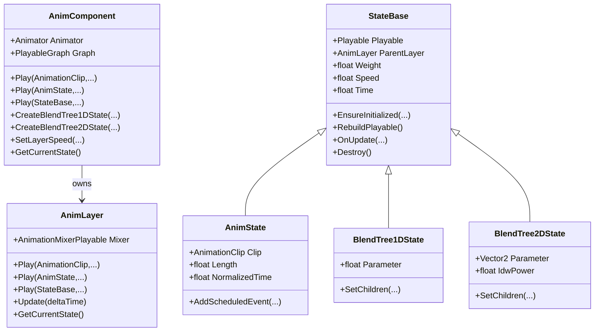

# MAnimSystem 设计架构与流程说明

- 文档版本: v2.0
- 更新日期: 2026-03-02
- 代码基线: `Assets/GameClient/MAnimSystem`

## 1. 文档范围

本文描述当前 MAnimSystem 的运行时架构与调用方式，覆盖：

1. 分层设计与核心职责
2. 状态体系（单状态/1D/2D）
3. 播放与过渡流程
4. 对外 API 与建议用法
5. 自动化测试覆盖
6. 已知注意事项
7. 2D 混合树待实现拓展方向

当前相关文件：

- `AnimComponent.cs`
- `AnimLayer.cs`
- `StateBase.cs`
- `AnimState.cs`
- `BlendTree1DState.cs`
- `BlendTree2DState.cs`
- `Test_Auto.cs`

## 2. 架构总览

### 2.1 三层结构

1. `AnimComponent`
- `PlayableGraph` 生命周期管理
- 对外播放入口（`Play/CrossFade`）
- 层管理、层速度控制、查询与池化指标汇总

2. `AnimLayer`
- 单层 `AnimationMixerPlayable` 混合管理
- 统一处理跨状态过渡（target/fading）
- 统一处理状态连接、清理与回收

3. `StateBase` 及其派生
- `StateBase`: 通用状态基类（Playable、Weight、Speed、Time、生命周期）
- `AnimState`: 单 `AnimationClip` 状态（含 `OnEnd`、定时事件）
- `BlendTree1DState`: 1D 参数混合状态
- `BlendTree2DState`: 2D 参数混合状态（当前算法为 IDW）

### 2.2 类关系



## 3. 状态体系说明

### 3.1 StateBase（通用基类）

职责：

- 管理状态的底层 Playable 引用
- 提供统一的 `Weight/Speed/Time/Pause/Resume`
- 提供可重建生命周期：`EnsureInitialized -> RebuildPlayable -> Destroy`
- 提供过渡事件 `OnFadeComplete`

设计要点：

- `EnsureInitialized(AnimLayer, PlayableGraph)` 支持“销毁后再播放”重新创建 playable。
- 限制状态 owner：已绑定到其他 layer 的状态不能跨 layer 直接复用。

### 3.2 AnimState（单状态）

职责：

- 绑定单个 `AnimationClip`
- 提供 `Length/IsLooping/NormalizedTime/IsDone`
- 提供 `OnEnd` 与 `AddScheduledEvent` 事件机制

### 3.3 BlendTree1DState（1D 混合）

职责：

- 内部维护子 `AnimationClipPlayable` 列表
- 按参数与阈值区间做线性插值
- 只激活相邻两点（边界 one-hot）

### 3.4 BlendTree2DState（2D 混合）

职责：

- 内部维护二维采样点与子 `AnimationClipPlayable`
- 参数点命中采样点时 one-hot
- 其余场景按 IDW 权重归一混合

当前算法：

- `w_i = 1 / distance^IdwPower`
- 默认 `IdwPower = 2`

## 4. 播放与过渡流程

### 4.1 统一播放入口

`AnimLayer.Play(StateBase state, fadeDuration, forceResetTime)`

流程：

1. `PrepareStateForPlay` 校验 owner 并确保 initialized
2. 若重播当前 target：仅按 `forceResetTime` 决定是否重置
3. 必要时连接到 layer mixer
4. 切换 target / 管理 fading 列表
5. 按 `fadeDuration` 推进权重
6. 淡出完成进入清理队列

### 4.2 权重归一化

`NormalizeWeights(totalFadeOutWeight)` 目标：

- 保持同层权重守恒，避免“失重帧”
- 支持频繁中断切换时的稳定过渡

### 4.3 清理与回收策略

- `AnimState`: 走对象池（高复用）
- `BlendTree1D/2D`: 不进入对象池，淡出后直接销毁（再次播放可自动重建 playable）

## 5. 对外 API（当前可用）

### 5.1 单状态

```csharp
animComponent.Play(clip, 0.15f, true);
```

### 5.2 1D 混合树

```csharp
var st1D = animComponent.CreateBlendTree1DState(new[]
{
    new BlendTree1DChild(idle, 0f),
    new BlendTree1DChild(walk, 0.5f),
    new BlendTree1DChild(run, 1f),
}, 0f);

animComponent.Play(st1D, 0.15f, true);
st1D.Parameter = 0.7f;
```

### 5.3 2D 混合树（IDW）

```csharp
var st2D = animComponent.CreateBlendTree2DState(new[]
{
    new BlendTree2DChild(left,  new Vector2(-1f, 0f)),
    new BlendTree2DChild(right, new Vector2( 1f, 0f)),
    new BlendTree2DChild(fwd,   new Vector2( 0f, 1f)),
    new BlendTree2DChild(back,  new Vector2( 0f,-1f)),
}, Vector2.zero);

animComponent.Play(st2D, 0.15f, true);
st2D.Parameter = new Vector2(0.3f, 0.8f);
```

### 5.4 通用状态入口

- `Play(StateBase state, ...)`
- `CrossFade(StateBase state, ...)`

可直接接入业务侧状态机，无需区分具体状态类型。

## 6. 自动化测试覆盖

当前自动回归脚本：`Test_Auto.cs`

覆盖项：

1. 基础播放/过渡
2. ScheduledEvent 链式触发
3. 低频/高频切换压力
4. 同 Clip 高频重入
5. 多 Clip 压力与随机扰动
6. 静置泄漏检查
7. 层速度控制（暂停/恢复/加速）
8. BlendTree1D / BlendTree2D 播放与切出清理
9. 运行期 Error/Exception 捕获

## 7. 已知注意事项

1. `GetCurrentClip()` 仅在当前状态是 `AnimState` 时返回非空。
2. 当当前为 `BlendTree1D/2D` 时，应使用 `GetCurrentState()` 判断状态类型。
3. 2D 当前为 IDW 基础实现，面向通用稳定性，不等价于 Mecanim 全部 2D 模式语义。

## 8. 2D 混合树待实现拓展方向

> 以下是后续建议方向，当前版本尚未实现。

### 8.1 混合模式拓展

1. `Simple Directional`
2. `Freeform Directional`
3. `Freeform Cartesian`
4. 可配置混合策略（按状态或按层级切换）

### 8.2 数值与性能优化

1. 参数变化阈值更新（减少每帧重算）
2. 采样点邻域加速（KD-Tree / 网格桶）
3. 权重平滑与阻尼（避免参数抖动导致闪烁）
4. 边界稳定策略（远点衰减裁剪、最小贡献阈值）

### 8.3 工具链与可视化

1. Scene 视图 2D 采样点与实时权重可视化
2. 参数轨迹回放与录制
3. 离线权重热力图导出

### 8.4 数据与序列化

1. BlendTree2D 配置资产化（可复用）
2. 运行时与编辑器统一序列化格式
3. 与技能编辑器时间轴参数曲线联动

### 8.5 测试拓展

1. 不同 2D 模式一致性快照测试
2. 角点/边界/稀疏采样点鲁棒性测试
3. 大规模采样点性能基准测试
