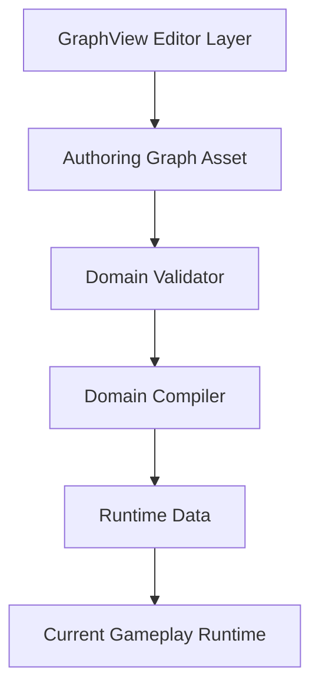
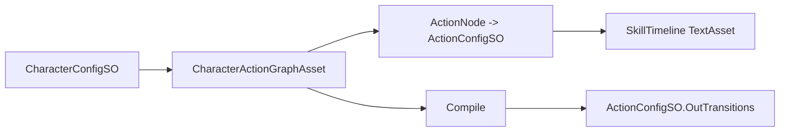
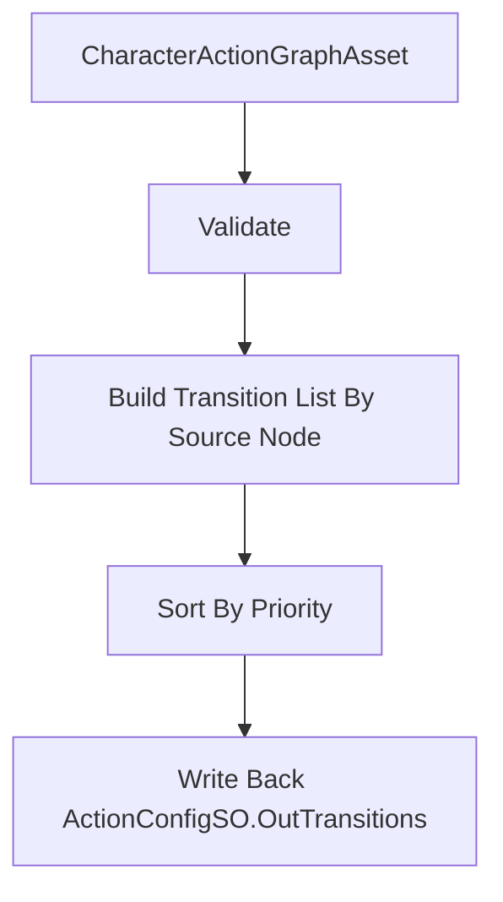

# GraphView 结点编辑器落地方案

## 1. 文档目标

本文档用于把上一轮需求分析收敛成一份可直接开工的实现方案，覆盖：

- 通用图编辑底座的边界
- `ComboGraph`、`BehaviorTreeGraph`、`DialogueGraph` 三类编辑器的拆分方式
- 作者态资产与运行时数据的保存/编译方案
- 第一阶段 `ComboGraph` 的详细字段设计、校验规则、编译规则与实施顺序

---

## 2. 核心结论

### 2.1 推荐路线

推荐采用：

`GraphView 编辑层适配器 + 通用图数据底座 + 领域专用图模型/编译器`

而不是：

- 一个“万能统一数据结构”的编辑器
- 三套彼此独立、完全不共享底座的编辑器

### 2.2 原因

三类图的共性很强：

- 节点创建/删除
- 端口连接
- 复制粘贴
- 缩放平移
- 分组与注释
- 黑板/变量面板
- Inspector 属性编辑
- 校验与错误提示
- 资产保存/加载

但运行时语义完全不同：

- `ComboGraph` 是“动作节点 + 条件边”的有向状态图
- `BehaviorTreeGraph` 是“单根树 + 有序子节点 + Decorator/Service/Blackboard”的事件驱动树
- `DialogueGraph` 是“内容节点 + 选项/条件边 + 事件/变量修改”的分支对话图

因此，共享“编辑器底座”是对的，共享“运行时数据模型”是不对的。

---

## 3. 本地现状与设计约束

### 3.1 可直接复用的现有基础

当前项目已经具备以下基础能力：

- `ActionConfigSO` 同时挂载 `TimelineAsset` 和 `OutTransitions`
- `SkillEditor` 已经具备树状时间轴数据模型、JSON 导入导出与资源引用恢复链路
- `ComboWindowTrack/Clip` 已经可以在技能时间轴内表达派生窗口与标签
- `ComboController` 已经按 `RequiredWindowTag` + 输入指令去消费 `OutTransitions`
- `TrackRegistry` 已经证明了“注册表 + Attribute 扫描”的扩展思路在本项目内是可行的

### 3.2 当前明确存在的领域缺口

在进入图编辑器开发前，必须承认以下事实：

1. `ComboTransition.ExtraConditions` 当前还没有真正参与运行时判定，只是预留了入口。
2. `ComboTriggerMode` 当前语义没有完全闭合，`Buffered` 与 `BufferedAndInstant` 的行为仍需统一。
3. `ComboController.HandleFallbackWindow()` 仍然包含一部分硬编码入口逻辑，意味着第一阶段 `ComboGraph` 不能宣称“完全接管战斗派生流”。
4. `Evade` 的目标动作当前仍由运行时按方向动态决策，而不是纯数据驱动选择目标节点。

### 3.3 GraphView 技术约束

当前项目 Unity 版本为 `2022.3.44f1c1`，可以使用 `UnityEditor.Experimental.GraphView`，但官方明确将其标记为 `Experimental`。

因此必须遵守以下约束：

- `GraphView` 只能存在于 `Editor` 层
- 作者态资产中不能保存 `GraphView` 对象引用
- 运行时绝不能依赖 `GraphView`
- 要为未来替换为别的图编辑框架保留适配层

---

## 4. 目标架构

### 4.1 目录结构建议

建议新增独立模块，而不是塞进现有 `SkillEditor`：

```text
Assets/GameClient/GraphTools/
  Runtime/
    Core/
      GraphAssetBase.cs
      GraphMetadata.cs
      GraphNodeModelBase.cs
      GraphEdgeModelBase.cs
      GraphPortModel.cs
      GraphGroupModel.cs
      GraphCommentModel.cs
      BlackboardEntryBase.cs
      GraphValidationResult.cs
    Compilation/
      IGraphCompiler.cs
      GraphCompileContext.cs
      GraphCompileReport.cs
    Registry/
      GraphNodeDefinitionAttribute.cs
      GraphConditionDefinitionAttribute.cs
      GraphNodeRegistry.cs
      GraphConditionRegistry.cs
    Combo/
      CharacterActionGraphAsset.cs
      ComboActionNodeModel.cs
      ComboTransitionEdgeModel.cs
      ComboEntryNodeModel.cs
      ComboGraphCompiler.cs
      ComboGraphValidator.cs
    BehaviorTree/
      BehaviorTreeGraphAsset.cs
      BTNodeModelBase.cs
      BTCompositeNodeModel.cs
      BTDecoratorNodeModel.cs
      BTTaskNodeModel.cs
      BTBlackboardKeyEntry.cs
      BehaviorTreeCompiler.cs
      BehaviorTreeValidator.cs
    Dialogue/
      DialogueGraphAsset.cs
      DialogueNodeModelBase.cs
      DialogueLineNodeModel.cs
      DialogueChoiceEdgeModel.cs
      DialogueVariableEntry.cs
      DialogueGraphCompiler.cs
      DialogueGraphValidator.cs
  Editor/
    Core/
      BaseGraphWindow.cs
      BaseGraphView.cs
      BaseNodeView.cs
      BaseEdgeView.cs
      GraphSearchWindowProvider.cs
      GraphInspectorPanel.cs
      GraphBlackboardPanel.cs
      GraphValidationPanel.cs
      GraphClipboardUtility.cs
      GraphViewStateSerializer.cs
    Combo/
      CharacterActionGraphWindow.cs
      ComboActionNodeView.cs
      ComboTransitionEdgeView.cs
      ComboGraphInspector.cs
    BehaviorTree/
      BehaviorTreeGraphWindow.cs
    Dialogue/
      DialogueGraphWindow.cs
```

### 4.2 分层原则



说明：

- `GraphView Editor Layer` 只负责交互与可视化
- `Authoring Graph Asset` 才是策划真正保存的源数据
- `Validator` 负责发现数据错误，不做运行时逻辑
- `Compiler` 负责把作者态图编译成运行时可消费的数据
- 运行时只认编译结果，不认 GraphView

---

## 5. 通用图底座设计

### 5.1 作者态根资产

```csharp
public abstract class GraphAssetBase : ScriptableObject
{
    public string GraphId;
    public int Version = 1;
    public string DisplayName;
    public GraphMetadata Metadata;

    [SerializeReference] public List<GraphNodeModelBase> Nodes = new();
    [SerializeReference] public List<GraphEdgeModelBase> Edges = new();
    [SerializeReference] public List<BlackboardEntryBase> Blackboard = new();

    public List<GraphGroupModel> Groups = new();
    public List<GraphCommentModel> Comments = new();
}
```

### 5.2 通用节点模型

```csharp
public abstract class GraphNodeModelBase
{
    public string NodeId;
    public string Title;
    public Vector2 Position;
    public bool IsEnabled = true;
    public bool IsCollapsed;
    public string Note;
}
```

### 5.3 通用边模型

边模型必须允许领域自定义负载，因为 `ComboGraph` 和 `DialogueGraph` 的“业务语义”主要在边上：

```csharp
public abstract class GraphEdgeModelBase
{
    public string EdgeId;
    public string OutputNodeId;
    public string OutputPortId;
    public string InputNodeId;
    public string InputPortId;
    public int SortOrder;
    public bool IsEnabled = true;
}
```

### 5.4 黑板与变量

黑板能力保留在通用层，但只提供“类型化变量存储”能力，不在通用层定义具体业务语义。

建议第一版支持：

- `bool`
- `int`
- `float`
- `string`
- `Vector3`
- `UnityEngine.Object`

### 5.5 注册表扩展机制

参考现有 `TrackRegistry` 的成功经验，建议新增：

- `GraphNodeDefinitionAttribute`
- `GraphConditionDefinitionAttribute`
- `GraphNodeRegistry`
- `GraphConditionRegistry`

用途：

- 节点搜索面板生成
- Inspector 类型选择
- 条件/动作扩展
- 校验器按类型执行

---

## 6. 资产关系设计

### 6.1 ComboGraph

建议新增字段：

```csharp
public CharacterActionGraphAsset ActionGraph;
```

挂在 `CharacterConfigSO` 上，而不是挂在单个 `SkillConfigSO` 上。

原因：

- 当前角色动作入口本身就由 `CharacterConfigSO` 聚合管理
- 连段关系天然是“一个角色的动作网络”，不是“某个技能的孤立列表”
- 如果还是单技能一张图，仍然无法解决全局连段关系难以总览的问题

资产关系如下：



### 6.2 BehaviorTreeGraph

建议由敌人/NPC 配置持有：

- `EnemyAIConfigSO`
- 或 `CharacterConfigSO` 的 AI 子字段

运行时不要直接序列化 NPBehave 原生节点对象，而是：

- 作者态保存为 `BehaviorTreeGraphAsset`
- 编译为 `BehaviorTreeDefinition`
- 运行时通过 `NpBehaveBuilder` 转成真正的 NPBehave 树

这样可以避免把代码型 NPBehave 结构硬塞进 Unity 序列化系统。

### 6.3 DialogueGraph

建议由对话资源集合持有：

- `DialogueGraphAsset`
- `DialogueDefinitionAsset`

如果后续要做 NPC 复用，可以再加一层：

- `DialogueSetSO`

---

## 7. ComboGraph 第一阶段详细设计

## 7.1 第一阶段目标

第一阶段只解决一个明确问题：

`把 ActionConfigSO.OutTransitions 从 Inspector 列表迁移到角色级图编辑器中统一管理，并编译回现有运行时`

第一阶段不做：

- 替代当前 `SkillEditor` 时间轴
- 接管 `Fallback` 全部硬编码入口
- 完整重构 `Evade` 决策逻辑
- 完整 AI 行为树运行时
- 完整对话运行时

### 7.2 节点类型

第一阶段建议只做 3 类节点：

1. `ComboActionNode`
   - 引用 `ActionConfigSO`
   - 主要展示名称、类别、时间轴引用、出边数量、警告状态

2. `ComboEntryNode`
   - 只做作者态辅助入口
   - 例如：`LightAttackEntry`、`SpecialEntry`
   - 第一阶段可选，不参与编译

3. `Relay/Comment`
   - 纯可视化整理用
   - 不参与编译

### 7.3 端口规则

- `ComboActionNode`
  - 输入端口：`Incoming`，多连接
  - 输出端口：`Transitions`，多连接
- `ComboEntryNode`
  - 输出端口：`Start`
- `Relay`
  - 输入/输出各一个，多连接

### 7.4 边模型

第一阶段核心数据放在边上：

```csharp
public sealed class ComboTransitionEdgeModel : GraphEdgeModelBase
{
    public BufferedInputType RequiredCommand;
    public string RequiredWindowTag;
    public ComboTriggerMode TriggerMode;

    [SerializeReference]
    public List<ITransitionCondition> ExtraConditions = new();

    public int Priority;
    public bool IsMuted;
    public string Note;
}
```

### 7.5 节点模型

```csharp
public sealed class ComboActionNodeModel : GraphNodeModelBase
{
    public ActionConfigSO Action;
    public bool AutoLoadTagsFromTimeline = true;
    public List<string> CachedWindowTags = new();
}
```

### 7.6 Inspector 设计

节点 Inspector：

- `ActionConfigSO` 引用
- 只读显示动作分类/ID
- 打开关联 `SkillEditor`
- 从 `TimelineAsset` 刷新窗口标签缓存

边 Inspector：

- `RequiredCommand`
- `RequiredWindowTag`
- `TriggerMode`
- `Priority`
- `ExtraConditions`
- `Note`

### 7.7 标签来源策略

第一阶段建议采用“双来源”：

1. 优先从源动作 `TimelineAsset` 解析 `ComboWindowClip.comboTag`
2. 若解析失败，回退到全局标签表 `ComboTagCatalog`

这样可以避免纯手填标签导致的拼写错误，同时也不阻塞尚未补全时间轴的动作。

### 7.8 编译规则

编译器输入：

- `CharacterActionGraphAsset`

编译器输出：

- 回写所有 `ComboActionNodeModel.Action.OutTransitions`

规则：

1. 编译前清空图中所有参与编译的 `ActionConfigSO.OutTransitions`
2. 遍历所有 `ComboTransitionEdgeModel`
3. 以 `OutputNodeId` 找到源动作节点
4. 以 `InputNodeId` 找到目标动作节点
5. 生成 `ComboTransition`
6. 按 `Priority` 和 `SortOrder` 排序后回写到源动作的 `OutTransitions`



### 7.9 与现有运行时兼容策略

第一阶段坚持“不动现有消费入口”：

- `ComboController` 继续读取 `currentSkill.OutTransitions`
- 图编辑器只负责生成/同步 `OutTransitions`

这样能把第一阶段风险控制在编辑器和数据编译层，不影响已有技能播放链路。

### 7.10 第一阶段已知限制

以下逻辑保留在运行时，不纳入第一阶段图编译：

- `Fallback` 期间的硬编码输入入口
- `Evade` 的方向分支动态选择
- 非 `OutTransitions` 驱动的状态机入口

文档结论：

第一阶段的 `ComboGraph` 是“全局可视化管理器 + 编译器”，还不是“完整战斗状态图编辑器”。

---

## 8. ComboGraph 校验规则

建议在保存前和编译前统一执行校验。

### 8.1 错误级

- 边的源节点不是 `ComboActionNode`
- 边的目标节点不是 `ComboActionNode`
- 源/目标动作为空
- `RequiredCommand == None`
- `RequiredWindowTag` 为空且该边被配置为必须窗口触发
- `ExtraConditions` 存在未知类型
- 同一源动作下出现完全重复的转移签名

### 8.2 警告级

- `RequiredWindowTag` 不存在于源动作 Timeline
- 目标动作不属于当前角色动作集合
- 自环转移
- 动作节点没有任何出边
- 动作节点没有被任何边指向
- 图中存在孤立节点

### 8.3 体验级建议

- 节点右上角显示错误/警告角标
- 保存时允许带警告保存，不允许带错误编译
- 提供 `Validate All` 按钮与底部消息面板

---

## 9. BehaviorTreeGraph 设计原则

## 9.1 目标风格

以 NPBehave 的事件驱动风格为参考，而不是传统每帧从根 tick 全树的朴素行为树。

第一阶段建议支持：

- `Root`
- `Sequence`
- `Selector`
- `Parallel`
- `Service`
- `Condition`
- `BlackboardCondition`
- `Action`
- `Wait`
- `SubTree`（可后置）

### 9.2 必须具备的能力

- 单根约束
- 子节点顺序
- Decorator 单子节点约束
- 黑板键定义与类型约束
- `Stops/Abort` 策略
- 运行时状态可视化预留

### 9.3 数据建模原则

- 不直接序列化 NPBehave 原生节点对象
- 用自定义 Definition 表达：
  - 节点类型
  - 子节点顺序
  - 黑板键引用
  - 条件参数
  - Service 周期
  - Abort/Stops 策略
- 运行时再由 `NpBehaveBuilder` 构造真正树实例

---

## 10. DialogueGraph 设计原则

### 10.1 第一阶段建议节点

- `Start`
- `Line`
- `Event`
- `Jump`
- `End`

建议把“选项文本、分支条件、触发行为”建在边上，而不是强行拆成额外节点。

### 10.2 Dialogue 边模型建议

```csharp
public sealed class DialogueChoiceEdgeModel : GraphEdgeModelBase
{
    public string ChoiceText;
    public string LocalizationKey;

    [SerializeReference]
    public List<IDialogueCondition> Conditions = new();

    [SerializeReference]
    public List<IDialogueAction> Actions = new();

    public int Priority;
}
```

### 10.3 第一阶段保存策略

- 作者态：`DialogueGraphAsset`
- 编译态：`DialogueDefinitionAsset`
- 文本：第一阶段允许直接存 `rawText`
- 兼容未来：预留 `LocalizationKey`

---

## 11. UI 布局建议

建议所有图编辑器共用一套窗口布局：

- 左侧：节点搜索/黑板/图层
- 中间：GraphView 画布
- 右侧：Inspector + Validation
- 底部：消息/编译结果

Toolbar 通用按钮建议：

- Save
- Validate
- Compile / Apply
- Recenter
- Show Minimap

`ComboGraph` 专属按钮建议：

- Open Selected Action Timeline
- Sync Tags From Timeline
- Rebuild From Existing OutTransitions

---

## 12. 第一阶段实施顺序

### Phase 0：领域模型清理

- 修复 `ComboTriggerMode` 语义
- 让 `ExtraConditions` 真正参与运行时判定
- 建立 `GraphConditionRegistry`
- 定义 `ComboTagCatalog`

### Phase 1：GraphFramework MVP

- `GraphAssetBase`
- `BaseGraphWindow`
- `BaseGraphView`
- 节点搜索
- Inspector
- 分组/注释
- 复制粘贴
- 保存/加载
- 校验面板

### Phase 2：ComboGraph MVP

- `CharacterActionGraphAsset`
- `ComboActionNode`
- `ComboTransitionEdge`
- 从图编译回 `OutTransitions`
- 从 `OutTransitions` 重建图
- 与 `SkillEditor` 联动

### Phase 3：BehaviorTreeGraph

- 黑板
- Root/Composite/Decorator/Task
- Definition 编译
- 运行时构树适配

### Phase 4：DialogueGraph

- Line/Event/Jump/End
- ChoiceEdge
- 条件/动作注册
- Definition 编译

### Phase 5：增强项

- 运行时节点高亮
- 断点/单步
- 子图/SubGraph
- 差异比较
- 版本迁移器

---

## 13. 第一阶段验收标准

`ComboGraph MVP` 完成时，至少要满足：

1. 一个角色可以在单张图中管理全部动作节点和它们之间的 `ComboTransition`
2. 图保存后重新打开，节点位置、分组、边、Inspector 数据完全回读
3. 编译后，各 `ActionConfigSO.OutTransitions` 与图内容一致
4. 现有运行时无需修改消费入口即可继续工作
5. 可以从动作节点一键打开对应 `TimelineAsset`
6. 无效窗口标签、空目标、重复边可以被明确报错
7. 不在运行时程序集引入任何 `UnityEditor.Experimental.GraphView` 依赖

---

## 14. 默认决策

若无额外业务约束，建议按以下默认决策开工：

- `ComboGraph` 归属 `CharacterConfigSO`
- `BehaviorTreeGraph` 编译到自定义 Definition，再转 NPBehave
- `DialogueGraph` 第一阶段允许原始文本和本地化 Key 并存
- `GraphView` 仅作为 Editor 适配层
- 第一阶段不触碰现有 `SkillEditor` 时间轴结构

---

## 15. 参考设计

- Unity GraphView API
  - https://docs.unity3d.com/ScriptReference/Experimental.GraphView.GraphView.html
- NPBehave
  - https://github.com/meniku/NPBehave
- NodeGraphProcessor
  - https://github.com/alelievr/NodeGraphProcessor
- UniBT
  - https://github.com/yoshidan/UniBT
- UnityDialogueSystem
  - https://github.com/oykuyamakov/UnityDialogueSystem

---

## 16. 下一步建议

如果继续往实现推进，建议直接进入以下产出：

1. `GraphTools` 目录与基础类骨架
2. `CharacterConfigSO` 增加 `ActionGraph` 引用
3. `ComboTriggerMode` 语义修正
4. `ComboTransition` 运行时条件执行补全
5. `CharacterActionGraphAsset` + `ComboGraphCompiler` MVP

